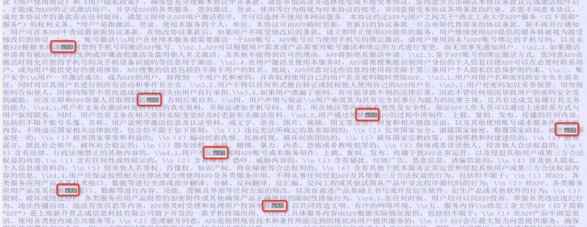
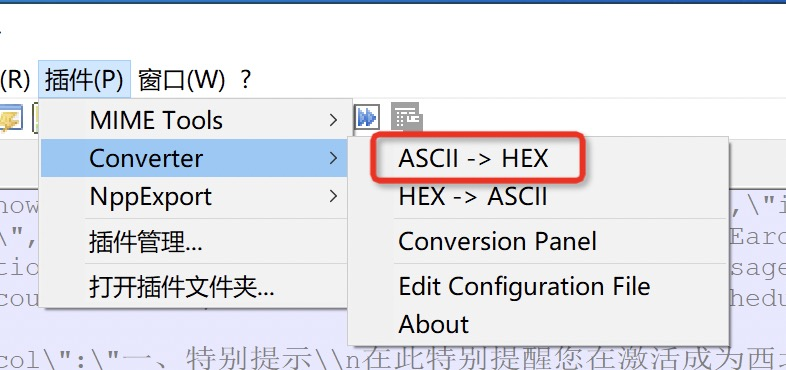
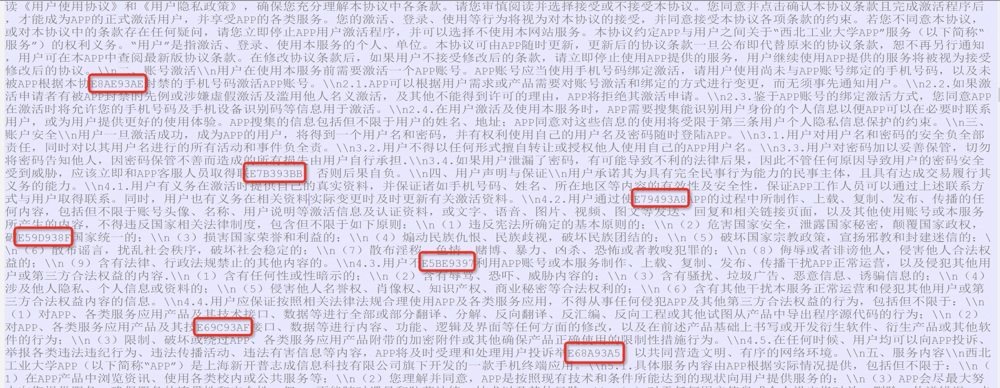
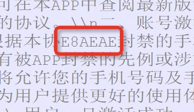
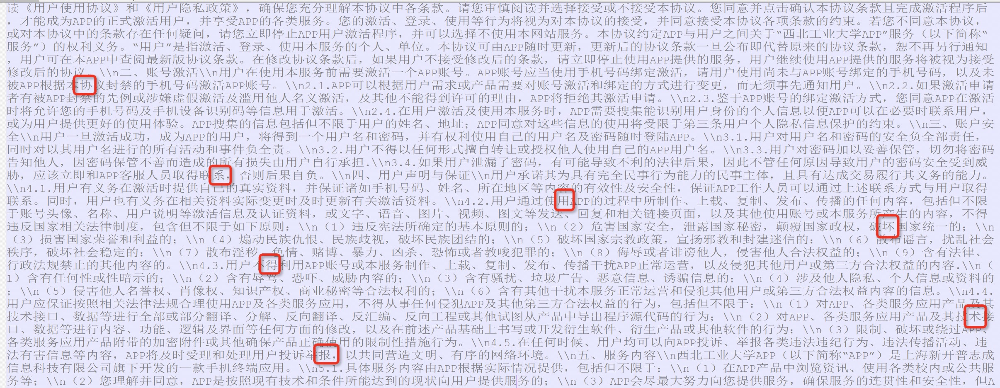
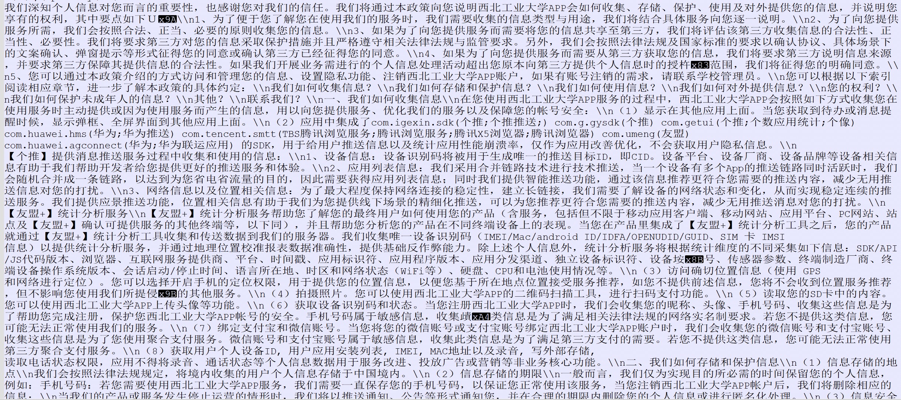
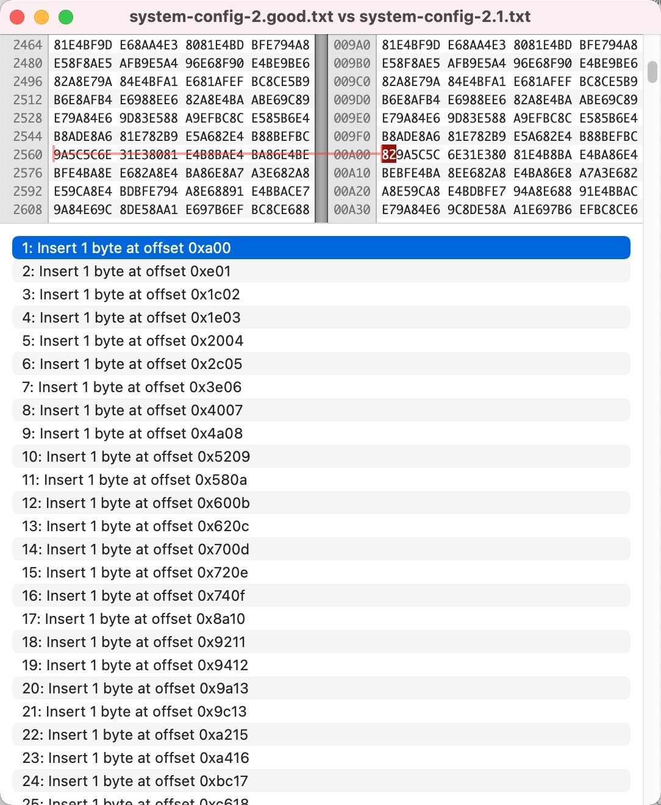
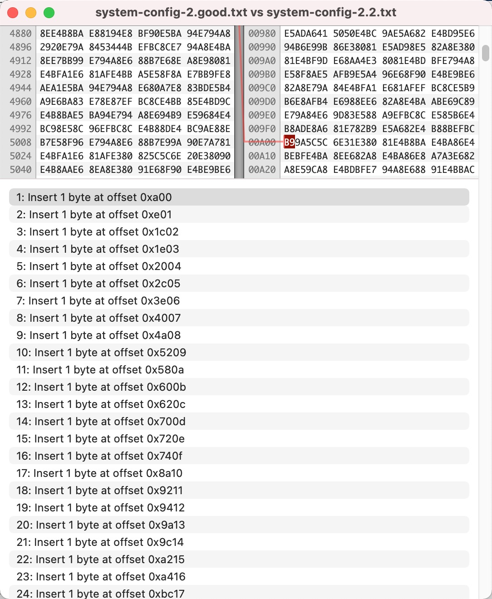

<!--more-->

## 现象

容器中有一个文件 `agreement.js` 发现其内容**有时候**存在对于 UTF8 来说非法的字符，导致App启动闪退。

打开这个文件可以看到以下位置存在乱码：



## 分析乱码来源

可以看到乱码位置前一个字符虽然能够显示，但是也不正常，选乱码位置及其前一个字符，中使用Notepad++的ASCII转换HEX功能：



把这些乱码位置全部都转换后得到这样一个结果：



可以看到共同点都是多了一个hex `93`，把所有`93`去掉，



然后使用Notepad++ HEX转换ASCII功能：


发现结果正常：



可以得到结论，就是文件在某些位置被插入了Hex `93`（对应ASCII `147`）字节，导致文件渲染异常。


## 分析乱码位置是否有规律

因为这个文件实际上是通过环境变量 + `envsubst` 渲染模板文件形成的，而这段文本就是来源于一个环境变量。

把 `agreement.js` 中的这段文本截取出来，然后用16进制编辑器看看出现 `93` 的位置上是否存在共同点。

| Hex           | offset  | delta  | delta - 1 | 512 x |
|---------------|---------|--------|-----------|-------|
| `E8 AE 93 AE` | 1535    | 0      |           |       |
| `E7 B3 93 BB` | 3072    | 1537   | 1536      |   3   |
| `E7 94 93 A8` | 3585    | 513    | 512       |   1   |
| `E5 9D 93 8F` | 4098    | 513    | 512       |   1   |
| `E5 BE 93 97` | 4611    | 513    | 512       |   1   |
| `E6 9C 93 AF` | 5636    | 1025   | 1024      |   2   |
| `E6 8A 93 A5` | 6149    | 513    | 512       |   1   |

可以看见首次出现 Hex `93` 的位置，以及两个 Hex `93` offset 相差的是 512 字节的倍数，


## 更新的脚本

开发人员后来调整了脚本，得到的文件不一样了，但是依然存在相同问题：



通过同样的方法，发现被插入的字节是 Hex `B5`（对应ASCII `181`），而且插入位置同样是 512 的倍数：

| Hex           | offset  | delta  | delta - 1 | 512 x |
|---------------|---------|--------|-----------|-------|
| `EF BC B5 9A` | 2560    | 0      |           |       |
| `E6 9D B5 83` | 3585    | 1025   | 1024      |   2   |
| `E5 9E B5 8B` | 7170    | 3585   | 3584      |   7   |
| `E4 BE B5 9B` | 7683    | 513    | 512       |   1   |
| `E6 AD B5 A4` | 8196    | 513    | 512       |   1   |
| `E4 BD B5 93` | 11269   | 3073   | 3072      |   6   |
| `E6 BF B5 80` | 15878   | 4609   | 4608      |   9   |
| `E5 B0 B5 86` | 16391   | 513    | 512       |   1   |

而更新后的脚本（简化后）是：

```bash
echo $FOO > foo-1.txt
export FOO=`echo ${FOO} | gojq tostring`
echo $FOO > foo-2.txt
```

环境变量 `FOO` 是容器运行时外部给的，脚本先把值写到 `foo-1.txt` ，然后执行一些脚本，更新了这个环境变量，然后把结果写到 `foo-2.txt` ，而问题就出在 `foo-2.txt` 上，说明问题出在第二行。

## 插入字节的位置

回顾本问题，本问题是有一定概率会出现，而不是每次都会出现，因此使用Hex Friend（Mac上的软件）打开“好的文件”和几个“坏的文件”，对比插入的字节的位置有何不同。

和第一个坏的文件对比，可以看到字节插入位置，以及插入的值是`0x82`：



和第二个坏的文件对比，可以看到字节插入位置，以及插入的值是`0xB9`：



可以发现：

* 只要出现问题，那么插入的字节位置是固定的
* 每次出现问题所插入的字节是随机的，但是对同一个文件来说这个值是相同的。


## 推理

先总结一下：

* 环境变量值存在汉字，而且长度超出了 512 字节，
* 有一定概率会出现脚本执行结果文件里，插入了随机字节
* 随机字节插入的位置是固定的
* 出现问题的文件里，随机字节的值是相同的
* 不同的问题文件，随机字节的值不相同

那么推理：

* 汉字 UTF-8 编码占用 3 个字节，在脚本执行过程是 512 字节 一块一块读取的，那么就会有概率正好截断在汉字 UTF-8 3 字节的中间，导致了这个问题。


到这里可以先排除`gojq`的问题，理由有二：

* 和开发人员沟通，脚本之前使用的是 `jq`，而现在使用的是 `gojq`，不同工具，遇到相同问题，两个工具都有BUG的概率不大。
* 另外，经测试`nginx:1.21.5-alpine`会发生问题，而`nginx:1.21.5`不会发生问题，而且`gojq`这个工具都是同一个二进制，因此`gojq`有BUG可能性排除。

## 测试脚本

测试脚本在：https://github.com/chanjarster/bash-5_1_8_long_var_corrupt/tree/pre-digging

因为这个问题出现存在一定概率，因此写一个测试脚本循环跑以下几个测试：

1）测试变量 output 到文件，是否会损坏（md5sum检查）：

```bash
echo $FOO > /tmp/foo.txt
if ! md5sum -c /foo.txt.md5 > /dev/null; then
    echo "$msg_prefix failed: case 1"
    fail=true
fi
```

2）测试 `|` 管道符读取变量时，是否会损坏（md5sum 字符模式）：

```bash
got_md5=$(echo $FOO | md5sum -b | cut -d ' ' -f 1)
if [[ "$got_md5" != "$want_md5" ]]; then
  echo "$msg_prefix failed: case 2"
  fail=true
fi
```

3）测试 `|` 管道符读取变量时，是否会损坏（md5sum 二进制模式）：

```bash
  got_md5=$(echo $FOO | md5sum | cut -d ' ' -f 1)
  if [[ "$got_md5" != "$want_md5" ]]; then
    echo "$msg_prefix failed: case 3"
    fail=true
  fi
```

4）测试 `gojq` 结果赋予新变量，新变量输出到文件，是否损坏（md5检查）：

```bash
  FOO_MOD=$(echo $FOO | gojq tostring)
  echo $FOO_MOD > /tmp/foo-mod.txt
  if ! md5sum -c /foo-mod.txt.md5 > /dev/null ; then
    echo "$msg_prefix failed: case 4"
    fail=true
  fi
```

5）测试 `gojq` 结果赋予新变量，直接检查新变量值，是否损坏（md5检查）：

```bash
  FOO_MOD=$(echo $FOO | gojq tostring)
  got_md5=$(echo $FOO_MOD | md5sum -b | cut -d ' ' -f 1)
  if [[ "$got_md5" != "$want_mod_md5" ]]; then
    echo "$msg_prefix failed: case 5"
    fail=true
  fi
```

6）测试 `gojq` 结果赋予新变量，新变量输出到文件，是否损坏（md5检查），使用[double quote 变量的方式][2]：

```bash
  FOO_MOD=$(echo "$FOO" | gojq tostring)
  echo "$FOO_MOD" > /tmp/foo-mod-q.txt
  if ! md5sum -c /foo-mod-q.txt.md5 > /dev/null ; then
    echo "$msg_prefix failed: case 6"
    fail=true
  fi
```

7）测试 `gojq` 结果赋予新变量，直接检查新变量值，是否损坏（md5检查），使用[double quote 变量的方式][2]：

```bash
  FOO_MOD=$(echo "$FOO" | gojq tostring)
  got_md5=$(echo "$FOO_MOD" | md5sum -b | cut -d ' ' -f 1)
  if [[ "$got_md5" != "$want_mod_q_md5" ]]; then
    echo "$msg_prefix failed: case 7"
    fail=true
  fi
```

8）测试 `gojq` ，跳过变量赋值，直接检查结果是否损坏（md5检查）：

```bash
  got_md5=$(echo "$FOO" | gojq tostring | md5sum | cut -d ' ' -f 1)
  if [[ "$got_md5" != "$want_mod_q_md5" ]]; then
    echo "$msg_prefix failed: case 8"
    fail=true
  fi
```

脚本执行结果（例子）：

```bash
...
Docker run round xxx
md5sum: WARNING: 1 of 1 computed checksums did NOT match
 failed: case 4
 failed: case 5
md5sum: WARNING: 1 of 1 computed checksums did NOT match
 failed: case 6
 failed: case 7
...
```

运行一段时间后，发现只要出错，case 4, 5, 6, 7 是一起出错的。

* 4、5 和 6、7 的差别在于是否使用了 [double quote 变量的方式][2] ，都有错说明 double quote 变量不能解决这个问题
* 4、6 和 5、7 的差别在于是输出到文件检查，还是直接检查变量，都有错说明 输出文件不是关键，而是变量的值本身就损坏了

同时注意到，case 8 虽然在逻辑上和 case 4、5、6、7 一样，但是却不出错。两者的区别在于是否使用新变量来接收`gojq`的返回值。
这就说明，问题出在新变量赋值上。

所以问题出在，在bash脚本中给一个变量赋值一个很长的包含中文的值，就会有概率出错。

而且测试脚本的执行方式有两种：

* 循环创建容器执行测试脚本
* 创建单个容器，脚本内循环执行

发现，前一种方式，概率出现问题。而后一种方式如果一开始没有问题，就一直没有问题，如果一开始有问题，就一直有问题。

## 测试脚本2

现在有了一个强有力的推测：在bash脚本中给一个变量赋值一个很长的包含中文的值，就会有概率出错。

那么就新写一个测试脚本：https://github.com/chanjarster/bash-5_1_8_long_var_corrupt

也不需要`gojq`了，直接把一个文件的内容赋值给一个变量：

```bash
FOO=$(cat /tmp/foo.txt)
want_q_md5=$(cat /tmp/foo.txt.md5 | cut -d ' ' -f 1)
got_md5=$(echo "$FOO" | md5sum -b | cut -d ' ' -f 1)
if [[ "$got_md5" != "$want_q_md5" ]]; then
  echo "failed"
  echo "$FOO" > /tmp/foo-corrupt.txt
  fail=true
else
  echo "succeed"
fi
```

测试结果：

```bash
Docker run round 1
succeed

Docker run round 2
failed

Docker run round 3
succeed

Docker run round 4
succeed

Docker run round 5
failed

...
```

到这里就可以证实这个猜测了。

## 后续跟踪

到GNU Bash的邮件列表中搜索到这个BUG：

* [Corrupted multibyte characters in command substitutions][3]，符合我们遇到的问题，[提到][5]在 5.1.16 版本里修复了这个问题
* [Long variable value get corrupted sometimes][4]，我这里也提了一个issue（提之前没有好好搜索）
* 关于这个 BUG 的 patch 见 [这里][bug-1]、[这里][bug-2] 和 [这里][bug-3]
* 我在 Alpine Linux 提议更新 Bash 版本，见 [issue][6]
* 我在 Debian 邮件列表 提议更新 Bash 版本，见[这里][7]

[1]: https://github.com/koalaman/shellcheck/wiki/SC2006
[2]: https://github.com/koalaman/shellcheck/wiki/SC2086
[3]: https://lists.gnu.org/archive/html/bug-bash/2022-01/msg00000.html
[4]: https://lists.gnu.org/archive/html/bug-bash/2022-02/msg00145.html
[5]: https://lists.gnu.org/archive/html/bug-bash/2022-01/msg00020.html
[6]: https://gitlab.alpinelinux.org/alpine/aports/-/issues/13526
[7]: https://lists.debian.org/debian-user/2022/02/msg00573.html
[bug-1]: https://savannah.gnu.org/patch/?10035
[bug-2]: https://ftp.gnu.org/gnu/bash/bash-5.1-patches/bash51-014
[bug-3]: https://lists.gnu.org/archive/html/bug-bash/2022-01/msg00009.html