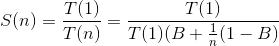
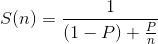

<!--more-->

Amdahl定律讲的是当用多CPU核心来处理一个任务时，这个任务所能获得的最大理论加速。

先看下面的公式：

* n代表CPU核心数
* S(n)，代表采用n个CPU核心时所能获得的理论加速（倍数）
* T(1)，任务采用单CPU核心时的耗时
* T(n)，任务采用n个CPU核心时的耗时
* B，任务无法中平行化的代码的比率
* 1 - B，任务中可以平行化的代码的比率

这个公式等价于下面的公式：

* n代表CPU核心数
* S(n)，代表采用n个CPU核心时所能获得的理论加速（倍数）
* P，任务中可以平行化的代码的比率

其实这个公式告诉我们，随着CPU核心数的增加，你所能获得的加速边际效应是递减的，看下面这张图：

