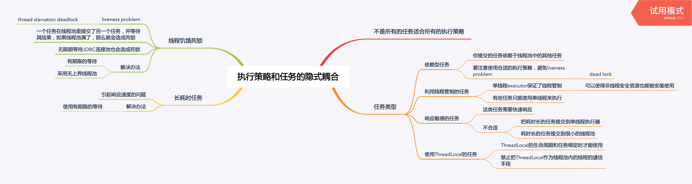
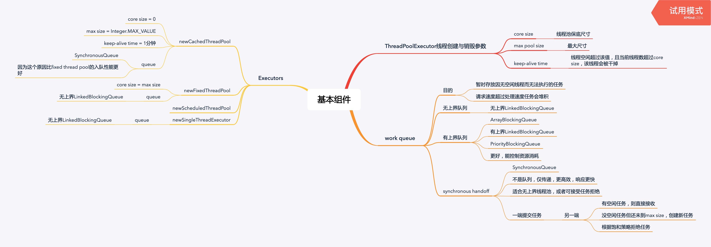
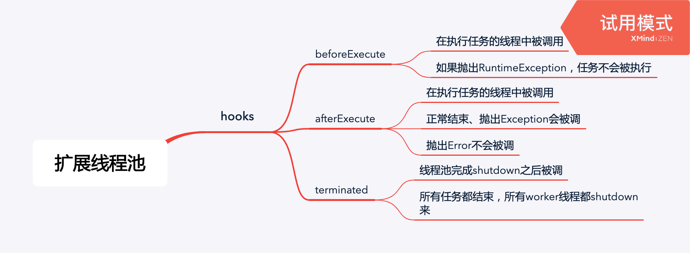
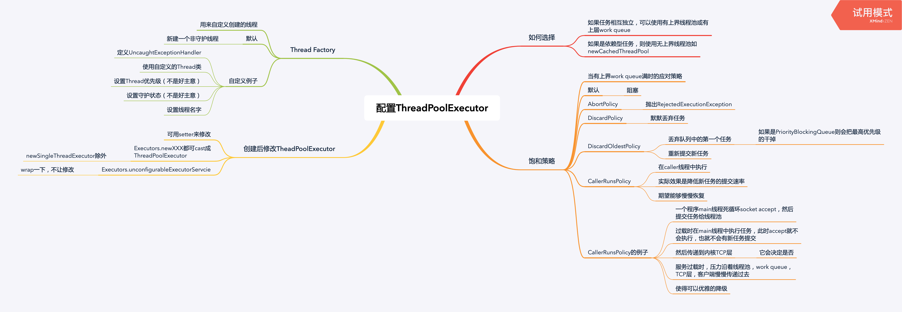

<!--more-->

## 执行策略和任务的隐式耦合



## 认识基础组件



## 扩展线程池



## 配置线程池



## 递归算法平行化


### 循环平行化

```java
void processCollection(List<Element> elements) {
  for (Element e : elements) {
    process(e);
  }
}

void processCollectionParallel(Executor exec, List<Element> elements) {
  for (final Element e : elements) {
    exec.execute(() -> process(e));
  }
}
```

### 递归平行化

```java
public void sequencialRecursive(List<Node> nodes, Collection results) {
  for (Node n : nodes) {
    results.add(node.compute());
    sequencialRecursive(n.getChildren(), results);
  }
}

public void parallelRecursive(final Executor exec, 
                              List<Node> nodes,
                              final Collection results) {
  for (Node n : nodes) {
    exec.submit(() -> results.add(n.compute()));
    parallelRecursive(exec, n.getChildren(), results);
  }
}

public Collection getParallelResults(List<Node> nodes) throws InterruptedException {
  ExecutorService exec = Executors.newCachedThreadPool();
  Queue resultQueue = new ConcurrentLinkedQueue();
  parallelRecursive(exec, nodes, resultQueue);
  exec.shutdown();
  // 等到所有任务执行完毕
  exec.awaitTermination(Long.MAX_VALUE, TimeUnits.SECONDS);
  return resultQueue;
}
```

