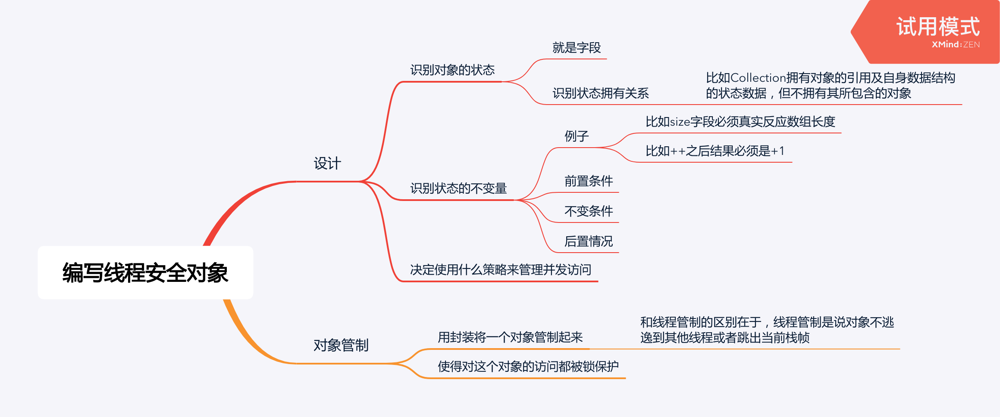

<!--more-->



### 对象管制

例子1：

```java
@ThreadSafe
public class PersonSet {
  private final Set<Person> mySet = new HashSet<>();
  public synchronized void addPerson(Person p) { ... }
  public synchronized boolean containsPerson(Person p) { ... }
}
```

例子2：

```java
@ThreadSafe
public class PersonSet {
  private final Set<Person> mySet = new HashSet<>();
  private final Object mylock = new Object();
  public void addPerson(Person p) {
    synchronized(mylock) {
      ...
    }
  }
}
```

例子3：

```java
@TreadSafe
public class MonitorVehicleTracker {
  private final Map<String, MutablePoint> locations;
  public MonitorVehicleTracker(Map<String, MutablePoint> locations) {
    // 深copyMap，防止MutablePoint被共享
    this.locations = deepCopy(locations);
  }
  public synchronized Map<String, MutablePoint> getLocations() {
    // 深copyMap，防止MutablePoint逃逸
    return deepCopy(this.locations);
  }
  // 用monitor lock保护访问
  public synchronized void setLocation(String id, int x, int y) { ... }
}
```

## 代理线程安全

把线程安全的工作代理给其他能提供线程安全的类：

例子：

```java
@ThreadSafe class DelegatingVehicleTracker {
  private final ConcurrentMap<String, ImmutablePoint> locations;
  private final Map<String, ImmutablePoint> unmodifiableMap;
  public DelegatingVehicleTracker(Map<String, ImmutablePoint> points) {
    // 把Map浅copy过来
    locations = new ConcurrentHashMap<>(points);
    // 这个比较妙，把线程安全代理给了并发Map
    unmodifiableMap = Collections.unmodifiableMap(locations);
  }
  // 就算逃逸出去也无所谓，反正只能只读，而且因为底层是并发Map，所以不用担心可见性、原子性等问题
  public Map<String, MutablePoint> getLocations() {
    return unmodifiableMap;
  }
  public void setLocation(String id, int x, int y) {
    locations.put(...)
  }
}
```

## 给线程安全类添加功能

给线程安全的类添加功能的时候要注意不要破坏线程安全。

### 客户方加锁

**下面就是个反面例子：**

```java
public class ListHelper {
  public List list = Collections.synchronizedList(new ArrayList());
  public synchronized boolean putIfAbsent(Object v) { ... }
}
```

这是因为`putIfAbsent`使用的monitor lock和`synchronizedList`自身使用的monitor lock不是同一个，这就破坏了线程安全。

**正确的做法：**

```java
public class ListHelper {
  public List list = Collections.synchronizedList(new ArrayList());
  public boolean putIfAbsent(Object v) {
    synchronized (list) {
      ...
    }
  }
}
```

### 组合

可以这么干：

```java
public class ImprovedList implents List {
  private final List list;
  public synchronized boolean putIfAbsent(Object v) {
    ...
    list.add(v);
  }
  public synchronized void clear() {
    list.clear();
  }
  ...
}
```

