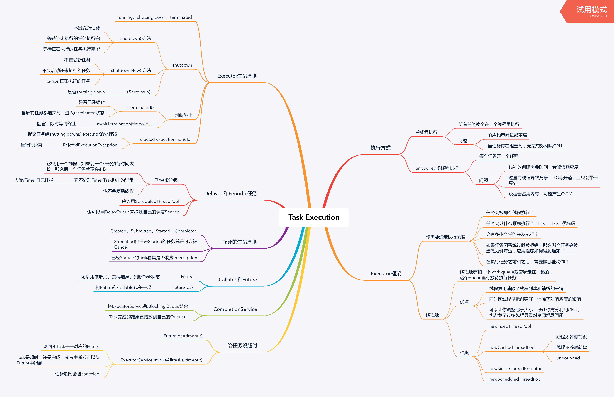

<!--more-->



## Executor框架

```java
public interface Executor {
  void execute(Runnable command);
}
public interface ExecutorService {
  <T> List<Future<T>> invokeAll(Collection<? extends Callable<T>> tasks)
      throws InterruptedException;
  <T> List<Future<T>> invokeAll(Collection<? extends Callable<T>> tasks
                                long timeout,
                                TimeUnit unit)
      throws InterruptedException;
}
```

### Shutting down

一种关闭ExecutorServic的方法：

```java
ExecutorService exec = ...;
exec.shutdown();
exec.awaitTermination(5, TimeUnit.SECOND);
```

另一种方法：

```java
private ExecutorService exec = ...;
public void handleRequest() {
  if (!exec.isShutdown()) {
    try {
      exec.submit(...);      
    } catch(RejctedExecutionException e) {
      if (!exec.isShutdown()) {
        log("task submission rejected", e);
      }
    }

  }
}
```

### Callable和Future和FutureTask

```java
public interface Callable<V> {
  V call() throws Exception;
}

public interface Future<V> {
  boolean cancel(boolean mayInterruptIfRunning);
  boolean isCanceled();
  boolean isDone();
  V get() throws InterruptedException, ExecutionException, CancellationException;
  V get(long timeout, TimeUnit unit) throws InterruptedException, ExecutionException,
                                            CancellationException, TimeoutException;
}

public abstract AbstractExecutorService implements ExecutorService {
  protected <T> RunnableFuture<T> newTaskFor(Callable<T> task) {
    return new FutureTask<T>(task);
  }
}
```

### CompletionService

```java
void solve(Executor e, Collection<Callable<Result>> solvers)
  throws InterruptedException, ExecutionException {
  CompletionService<Result> ecs = new ExecutorCompletionService<Result>(e);
  for (Callable<Result> s : solvers)
    ecs.submit(s);
  int n = solvers.size();
  for (int i = 0; i < n; ++i) {
    Result r = ecs.take().get();
    if (r != null)
      use(r);
  }
}
```

### 给任务设定超时

```java
public void someMethod() throws InterruptedException {
  List<Future<Result>> futures = exec.invokeAll(tasks, time, unit);
  for (Future<Result> f : futures) {
    try {
      Result r = f.get();    
    } catch (ExecutionException e) {
      // task failed with throwing exception
    } catch (CancellationException e) {
      // task is timeout
    }
  }  
}
```

