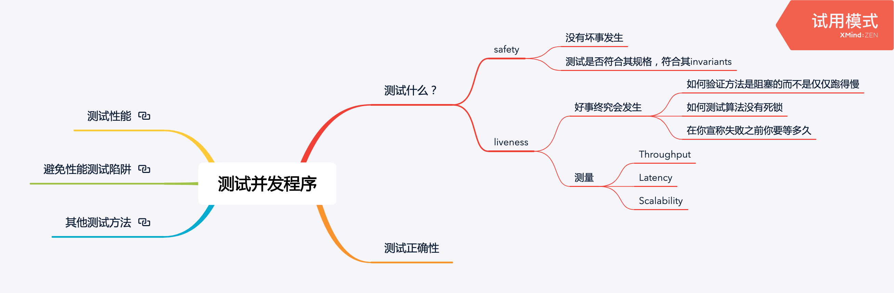
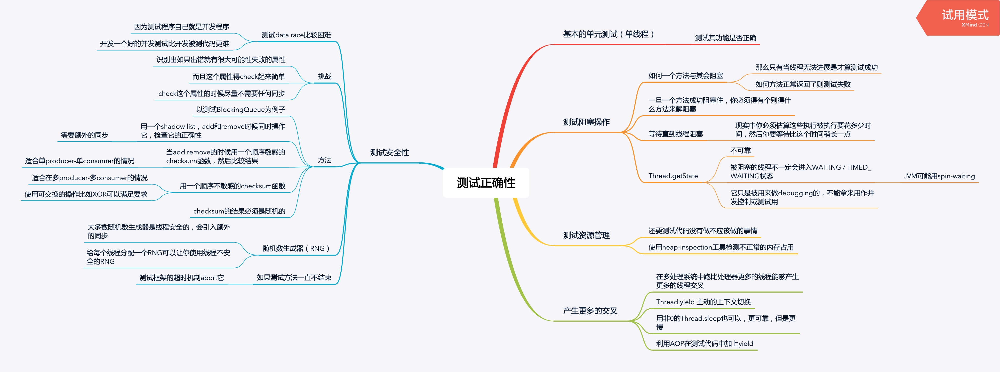
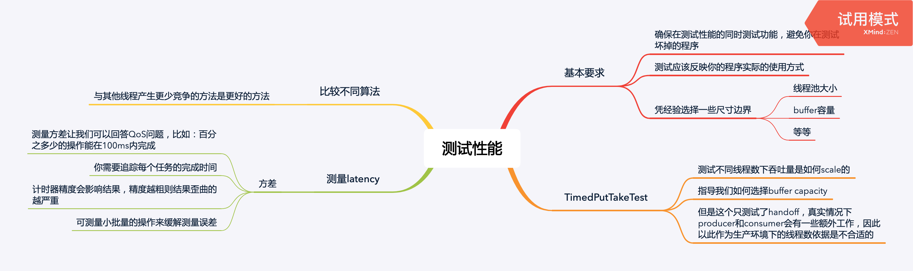
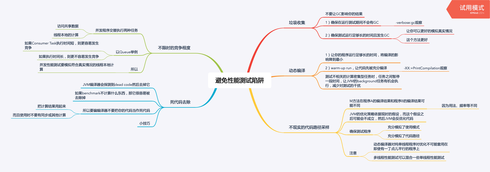
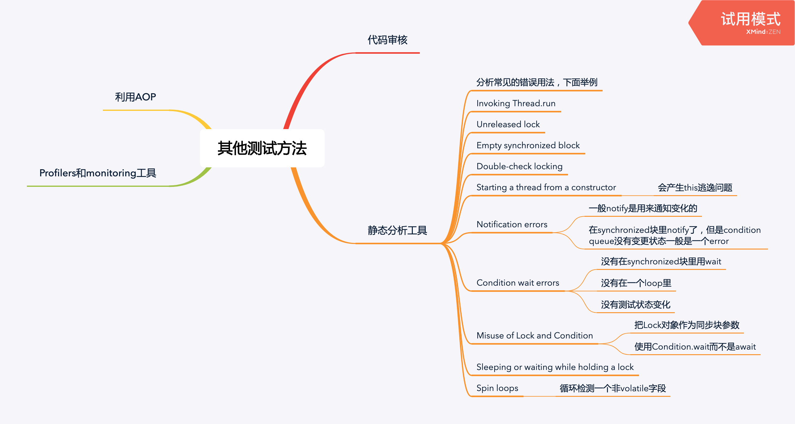

<!--more-->



## 测试正确性



### 测试阻塞方法

```java
void testTakeBlocksWhenEmpty() {
  final BoundedBuffer<Integer> bb = new BoundedBuffer<>(10);
  Thread taker = new Thread() {
    public void run() {
    try {
    int unused = bb.take();
    fail(); // if we get here, it's an error
    } catch (InterruptedException success) {}
  }
  try {
  	take.start();
  	Thread.sleep(LOCKUP_DETECT_TIMEOUT);
  	taker.interrupt();
  	taker.join(LOCKUP_DETECT_TIMEOUT);
  	assertFalse(taker.isAlive());
  } catch (Exception unexpected) {
    fail();
  }
  }
}
```

### 测试安全性

一种简易的中等质量的随机数生成器：

```java
// 用hashcode / nanoTime 作为种子可以得到中等质量的随机数
static int xorShift(int y) {
  y ^= (y << 6);
  y ^= (y >>> 21);
  y ^= (y << 7);
  return y;
}
```

下面是测试线程安全的代码：

```java
public class PutTakeTest extends TestCase {
  protected static final ExecutorService pool = Executors.newCachedThreadPool();
  protected CyclicBarrier barrier;
  protected final SemaphoreBoundedBuffer<Integer> bb;
  protected final int nTrials, nPairs;
  protected final AtomicInteger putSum = new AtomicInteger(0);
  protected final AtomicInteger takeSum = new AtomicInteger(0);

  public static void main(String[] args) throws Exception {
   new PutTakeTest(10, 10, 100000).test(); // sample parameters
   pool.shutdown();
  }

  public PutTakeTest(int capacity, int npairs, int ntrials) {
   this.bb = new SemaphoreBoundedBuffer<Integer>(capacity);
   this.nTrials = ntrials;
   this.nPairs = npairs;
   // n个producer + n个consumer + 1个main thread
   this.barrier = new CyclicBarrier(npairs * 2 + 1); main thread    
  }

  void test() {
   try {
     for (int i = 0; i < nPairs; i++) {
     pool.execute(new Producer());
     pool.execute(new Consumer());
     }
     barrier.await(); // wait for all threads to be ready
     barrier.await(); // wait for all threads to finish
     assertEquals(putSum.get(), takeSum.get());
  } catch (Exception e) {
    throw new RuntimeException(e);
  }
  }

  static int xorShift(int y) {
  y ^= (y << 6);
  y ^= (y >>> 21);
  y ^= (y << 7);
  return y;
  }

  class Producer implements Runnable {
  public void run() {
    try {
    int seed = (this.hashCode() ^ (int) System.nanoTime());
    int sum = 0;
    barrier.await();
    for (int i = nTrials; i > 0; --i) {
      bb.put(seed);
      sum += seed;
      seed = xorShift(seed);
    }
    // 在最后汇总sum可以减少snc
    putSum.getAndAdd(sum);
    barrier.await();
    } catch (Exception e) {
    throw new RuntimeException(e);
    }
  }
  }

  class Consumer implements Runnable {
  public void run() {
    try {
    barrier.await();
    int sum = 0;
    for (int i = nTrials; i > 0; --i) {
      sum += bb.take();
    }
    takeSum.getAndAdd(sum);
    barrier.await();
    } catch (Exception e) {
    throw new RuntimeException(e);
    }
  }
  }
}
```

被测代码：

```java
@ThreadSafe
public class SemaphoreBoundedBuffer <E> {
  private final Semaphore availableItems, availableSpaces;
  @GuardedBy("this") private final E[] items;
  @GuardedBy("this") private int putPosition = 0, takePosition = 0;

  public SemaphoreBoundedBuffer(int capacity) {
    if (capacity <= 0)
      throw new IllegalArgumentException();
    availableItems = new Semaphore(0);
    availableSpaces = new Semaphore(capacity);
    items = (E[]) new Object[capacity];
  }

  public boolean isEmpty() {
    return availableItems.availablePermits() == 0;
  }

  public boolean isFull() {
    return availableSpaces.availablePermits() == 0;
  }

  public void put(E x) throws InterruptedException {
    availableSpaces.acquire();
    doInsert(x);
    availableItems.release();
  }

  public E take() throws InterruptedException {
    availableItems.acquire();
    E item = doExtract();
    availableSpaces.release();
    return item;
  }
  // 这里的synchronized很重要，如果没有就线程不安全了
  private synchronized void doInsert(E x) {
    int i = putPosition;
    items[i] = x;
    putPosition = (++i == items.length) ? 0 : i;
  }
  // 这里的synchronized很重要，如果没有就线程不安全了
  private synchronized E doExtract() {
    int i = takePosition;
    E x = items[i];
    items[i] = null;
    takePosition = (++i == items.length) ? 0 : i;
    return x;
  }
}
```

### 测试资源管理

测试`SemaphoreBoundedBuffer`是否正确释放了空间：

```java
class Big {
  double[] data = new double[100000];
}

void testLeak() throws InterruptedException {
  SemaphoreBoundedBuffer<Big> bb = new SemaphoreBoundedBuffer<Big>(CAPACITY);
  int heapSize1 = snapshotHeap();
  for (int i = 0; i < CAPACITY; i++)
    bb.put(new Big());
  for (int i = 0; i < CAPACITY; i++)
    bb.take();
  int heapSize2 = snapshotHeap();
  assertTrue(Math.abs(heapSize1 - heapSize2) < THRESHOLD);
}

private int snapshotHeap() {
  /* Snapshot heap and return heap size */
  return 0;
}
```

测试线程池扩展策略：

```java
public class TestThreadPool extends TestCase {

  private final TestingThreadFactory threadFactory = new TestingThreadFactory();

  public void testPoolExpansion() throws InterruptedException {
  int MAX_SIZE = 10;
  // newFixedThreadPool 最多创建10个线程
  ExecutorService exec = Executors.newFixedThreadPool(MAX_SIZE);

  for (int i = 0; i < 10 * MAX_SIZE; i++)
    exec.execute(new Runnable() {
    public void run() {
      try {
      Thread.sleep(Long.MAX_VALUE);
      } catch (InterruptedException e) {
      Thread.currentThread().interrupt();
      }
    }
    });
  // 等待确保创建了至少10个线程
  for (int i = 0;
     i < 20 && threadFactory.numCreated.get() < MAX_SIZE;
     i++)
    Thread.sleep(100);
  assertEquals(threadFactory.numCreated.get(), MAX_SIZE);
  exec.shutdownNow();
  }
}

class TestingThreadFactory implements ThreadFactory {
  public final AtomicInteger numCreated = new AtomicInteger();
  private final ThreadFactory factory = Executors.defaultThreadFactory();

  public Thread newThread(Runnable r) {
  numCreated.incrementAndGet();
  return factory.newThread(r);
  }
}
```


## 测试性能



### Barrier-based timer

利用Barrier的callback来做计时：

```java
this.timer = new Barrierimer();
this.barrier = new CyclicBarrier(nparis * 2 + 1, timer);

// 会在Barrier放行的时候执行
public class BarrierTimer implements Runnable {
  private boolean started;
  private long startTime, endTime;

  public synchronized void run() {
    long t = System.nanoTime();
    if (!started) {
      started = true;
      startTime = t;
    } else
      endTime = t;
  }

  public synchronized void clear() {
    started = false;
  }

  public synchronized long getTime() {
    return endTime - startTime;
  }
}
```

利用BarrierTimer测试【不同线程数，不同Buffer capacity】的吞吐量：

```java
public class TimedPutTakeTest extends PutTakeTest {
  private BarrierTimer timer = new BarrierTimer();

  public TimedPutTakeTest(int cap, int pairs, int trials) {
    super(cap, pairs, trials);
    barrier = new CyclicBarrier(nPairs * 2 + 1, timer);
  }

  public void test() {
    try {
      timer.clear();
      for (int i = 0; i < nPairs; i++) {
        pool.execute(new PutTakeTest.Producer());
        pool.execute(new PutTakeTest.Consumer());
      }
      barrier.await();
      barrier.await();
      long nsPerItem = timer.getTime() / (nPairs * (long) nTrials);
      System.out.print("Throughput: " + nsPerItem + " ns/item");
      assertEquals(putSum.get(), takeSum.get());
    } catch (Exception e) {
      throw new RuntimeException(e);
    }
  }

  public static void main(String[] args) throws Exception {
    int tpt = 100000; // trials per thread
    for (int cap = 1; cap <= 1000; cap *= 10) {
      System.out.println("Capacity: " + cap);
      for (int pairs = 1; pairs <= 128; pairs *= 2) {
        TimedPutTakeTest t = new TimedPutTakeTest(cap, pairs, tpt);
        System.out.print("Pairs: " + pairs + "\t");
        t.test();
        System.out.print("\t");
        Thread.sleep(1000);
        t.test();
        System.out.println();
        Thread.sleep(1000);
      }
    }
    PutTakeTest.pool.shutdown();
  }
}
```

## 避免性能测试陷阱



### 去除死代码

一个避免被编译器当作是死代码的技巧：

```java
if (foo.x.hashCode() == System.nanoTime()) {
  System.out.print(" ");
}
```

## 其他测试方法

