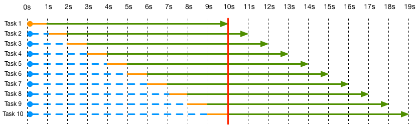
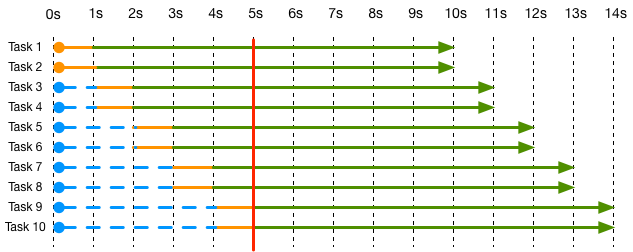
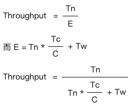
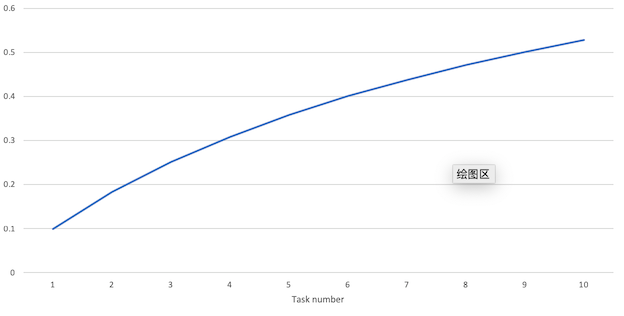
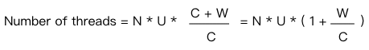

<!--more-->

## 估算吞吐量

现在有一个task，它的执行时间分为2部分，第一部分做数学运算，第二部分等待IO。这两部分就是所谓的计算操作与等待操作。

那么现在要求估算在CPU火力全开的情况下，执行这个task能够达到的吞吐量峰值是多少？

那么我们要先知道执行这个task总共需要多少时间，计算部分花费多少时间，等待部分花费多少时间。

假设这个task的计算部分花费1秒，等待部分花费9秒，并且开了10个线程执行10个task，在单核CPU的情况下可以得到下面的执行图：



图中的蓝色线条是等待调度，橙色线条是执行计算任务，绿色线条是CPU等待花费的时间。

可以得益于开了10个线程，每个task可以利用其他task的等待时间里执行自己的计算操作，同时使得CPU始终处于忙碌状态，即利用率100%。这也告诉你，就算你开11个线程也不会得到更多好处。

上面这个图的计算任务是按顺序执行的，这只是一个假想情况，实际中操作系统会将这10个线程交替运行，见图中的红色线，操作系统可以在这个范围内对这10个task的计算任务做任意调度。如果去除线程调度的开销，花费的总时间其实还是等于10秒的。

这个图的吞吐量就显而易见了：

```txt
throughput = 10 tasks / (10 * computing time + wait time) 
           = 10 tasks / (10 * 1s + 9s) 
           = 10 / 19s = 0.526 tasks/s
```

如果我们现在有一个双核CPU，那么会怎样呢？



可以看到因为有了2个CPU核心，计算任务可以重叠，进而花费的时间减半，吞吐量为：

```txt
throughput = 10 tasks / (10 * computing time / 2 + wait time) 
           = 10 tasks / (10 * 1s / 2 + 9s) 
           = 10 / 14s = 0.7142 tasks/s
```

那么总结一下吞吐量计算公式：

* Throughput：吞吐量。
* Tn：task数量。
* C：CPU数量。可以有小数，比如0.5，代表只提供一半的算力。
* Tc：task计算所花费的时间。
* Tw：task等待花费的时间。
* E：最后一个task完成所消耗的时间。



公式中C=1的意思是CPU 100%的全速工作，如果C=0.5那么意思就是CPU有50%的空闲时间，如果C=2则代表启动了两颗CPU全速运行。

可以看到想要提升吞吐量有：

* 提高C，这个下面会讲。
* 降低Tc
* 降低Tw

总的来说就是使用更多的CPU核，让task运行时间更短。

也许你觉得还可以通过提升Tn来提高吞吐量，比如下面这个图：



可以看到吞吐量随着任务数量的上升而上升，那么是不是会一直长呢？答案是不会的，当Tn越来越大的时候，Tn * Tc / C 也会越来越大，那么可以忽略掉Tw，公式就变成了 C / Tc，这值就是理论上的吞吐量上界，增加Tn只会无限趋近于这个值。

## 估算线程池大小

那么问题来了，如何知道要开多少个线程能够让CPU达到目标利用率？

这个要看下面的公式：

* N：CPU数量。
* U：CPU利用率，0.1代表10%，1代表100%。
* C：用到CPU的时间。
* W：等待时间。



注：本公式里的 N * U = 吞吐量公式中的C。

如果U=1（利用率100%），决定线程数量的是W与C的比，当W越高时则需要越多的线程，当W=0时，只需要与N同样的线程即可。

这个公式也告诉我们开启更多的线程不会带来额外的好处，还会造成反效果（增加的线程调度开销），所以在实践中都会使用具有上界的线程池。

而且在实际做性能调优的时候，会在计算得到的数字左右调整线程池大小，以达到最好效果。

## 参考资料

* [How to decide pool size for Thread Pools?][1]

[1]: http://yuanhsh.blogspot.com/2015/07/how-to-decide-pool-size-for-thread-pools.html