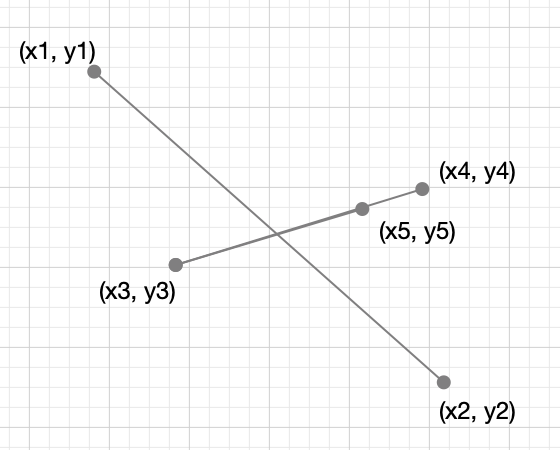

<!--more-->

**Intersection**: Given two straight line segments (represented as a start point and an end point), compute the point of intersection, if any.

Hints: #465, #472, #497, #517, #527

## 解法1

看下图：

两个线段，分别是S1（x1, y1) - (x2, y2)，S2 (x3, y3) - (x4, y4)，求两个线段的交点。

其实可以知道，存在一个交点，那么肯定存在图中S2的一个点(x5, y5)，这个点到交点到距离等于(x3, y3)到交点的距离。

也如果我们知道(x5, y5)的坐标，那么它与(x3, y3)的中点就是那个交点。

这个数学题不会做。