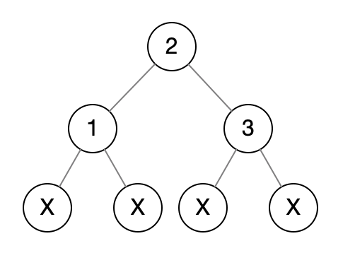
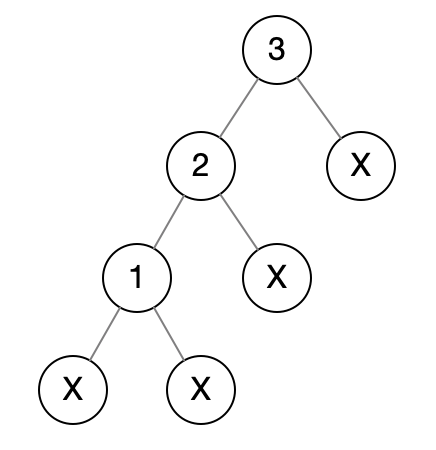

<!--more-->

**Check Subtree**: T1 and T2 are two very large binary trees, with T1 much bigger than T2. Create an algorithm to determine if T2 is a subtree of T1.

A tree T2 is a subtree of T1 if there exists a node n in T1 such that the subtree of n is identical to T2. That is, if you cut off the tree at node n, the two trees would be identical.

Hints:#4, #11, #18, #31, #37

## 解法

看这个题目意思好像是，不能说T2的root node出现在T1中就能认定T2是T1的子树。而是说两棵树看上去一模一样。

第一个想到的如果T2是T1的子树，那么是不是说T2的遍历字符串是T1遍历字符串的子串？

看下面这张图（图中的X代表NULL，如果没有这个的话即使遍历字符串一样也不代表两颗树就一样）：



它的前、中、后序遍历结果是：

```txt
pre-order:  2 1 X X 3 X X
in-order:   X 1 X 2 X 3 X
post-order: X X 1 X X 3 2
```

其中中序遍历结果不能唯一的用来标示一颗树，看下面这张图的：



它的前、中、后序遍历结果是：

```txt
pre-order:  3 2 1 X X X X
in-order:   X 1 X 2 X 3 X
post-order: X X 1 X 2 X 3
```

可以发现中序遍历结果是一样的，这是为什么呢？因为中序遍历一般都用在BST中，用它来得到从小到大都有序数组。中序遍历本身只表达了大小关系，并没有办法表达结构关系。

可以使用前序、后序遍历来判断T2是否T1的子树。这里用前序：

```java
public void preOrderString(Node node, StringBuilder sb) {
  if (node == null) {
    sb.append('X');
    return;
  }
  sb.append(node.value + " ");
  preOrderString(node.left, sb);
  preOrderString(node.right, sb);
}

public boolean checkSubtree(Node t1, Node t2) {
  StringBuilder s1 = new StringBuilder();
  StringBuilder s2 = new StringBuilder();
  preOrderString(t1, s1);
  preOrderString(t2, s2);
  
  return t1Order.indexOf(t2) != -1;
}
```

时间复杂度：O(m + n)，m是T1节点数量，n是T2节点数量

空间复杂度：O(m + n)

## 解法2

解法1空间复杂度比较高，希望能够节省空间。

解法2采用的方式是，在T1中找到匹配T2根的节点，然后从这个节点开始判断其子树是否和T2相等。

```java
public boolean checkSubtree(Node t1, Node t2) {
  if (t1 == null) {
    return false;
  }
  if (t2 == null) {
    // 空树肯定是子树
    return true;
  }
  if (t1.data == t2.data && matchTree(t1, t2)) {
    return true;
  }
  return checkSubtree(t1.left, t2) || checkSubtree(t1.right, t2);
}

boolean matchTree(Node a, Node b) {
  if (a == null && b == null) {
    return true;
  } else if (a == null || b == null) {
    return false;
  } else if (a.data != b.data) {
    return false;
  }
  return matchTree(a.left, b.left) && matchTree(a.right, b.right);
}
```


时间复杂度：O(m + k * n)，m是T1节点数量，n是T2节点数量，k是T1中data==T2根data的节点数量

空间复杂度：O(1)

如果节点里都是数字，取值范围是 [0, p]，那么T1中data==T2根data的节点数量概率是多少？答案是m/p。

因为T2根data的概率是1/p，而T1有m个节点，那么概率就是m/p。

假设p=10,000，m=100,000，n=100，那么时间复杂度则是 O(100,000 + 100,000 / 10,000 * 100)=O(101,000)。

而且k * n中的n不是每次都会用足的，当在检查过程中发现节点不对的话就会中断掉的。

最坏情况是 O(m + m * n) 也就是 T1中的每个节点都和T2根节点匹配。不过这个是不太可能的。

**补充思考**：这个方法用到了递归，如果T1有大量节点，那么递归层次会很深，可以采用BFS（广度优先）的方法来做。