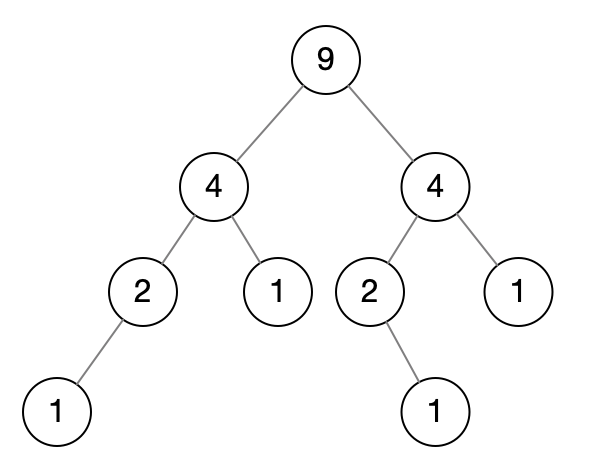

<!--more-->

**Random Node**: You are implementing a binary search tree class from scratch which, in addition to `insert`, `find`, and `delete`, has a method `getRandomNode()` which returns a random node from the tree. All nodes should be equally likely to be chosen. Design and implement an algorithm for `getRandomNode`, and explain how you would implement the rest of the methods.

Hints: #42, #54, #62, #75, #89, #99, #112, #119

## 解法1

如果我们在一个数组里随机取一个元素，那么可以用`array[random(0, array.length)]`来获取。

而现在是二叉树，那么我们可以在二叉树里额外存一个node数组来实现这个。

但是这个数组在insert和delete下会存在额外开销：

1. 如果是ArrayList，insert的时候均摊时间复杂度是O(1)（扩容的时候），delete的时候则是O(n)，因为牵涉到移动元素。
2. 如果是LinkedList，insert的时候时间复杂度是O(1)，delete的时候则是O(n)，因为要搜索

而且占用额外的空间。

## 解法2

如果我们记录整棵树的节点数量，随机从[1, TREE_SIZE]中取一个数kth，然后通过pre-order来找到kth的节点。

```java
public BinaryTree {
  private Node root;
  
  public Node getRandomNode() {
    if (size == 0) {
      return null;
    }
    int kth = random.nextInt(1, root.size);
    return root.getKth(kth);
  }
  
}
public Node {
  private int size = 1;
  private int data;
  private Node left;
  private Node right;
  public void insertPreOrder(int data) {
    if (this.left == null) {
      this.left = new Node(data);
    } else if (this.right == null) {
      this.right = new Node(data);
    }
    this.left.insertPreOrder(data);
    size++;
  }
  public Node getKth(kth) {
    if (kth == 1) {
      return this;
    }
    if (node.left != null) {
      return getKth(node.left, --kth);
    }
    if (node.right != null) {
      return getKth(node.right, --kth);
    }
    return null;
  }
}
```

时间复杂度：O(n)，虽然kth的随机范围在[1, TREE_SIZE]之间，但是实际上还是O(n)。

## 解法3

题目中提到的是BST：

```java
public class Node {
  private int size = 1;
  private int data;
  private Node left;
  private Node right;
  public Node(int data) {
    // ...
  }
  public void insert(int data) {
    if (data <= this.data) {
      if (this.left == null) {
        this.left = new Node(data);
      } else {
        this.left.insert(data);
      }
    } else {
      if (this.right == null) {
        this.right = new Node(data);
      } else {
        this.right.insert(data);
      }
    }
    size++;
  }
  public Node find(int data) {
    if (this.data == data) {
      return this;
    }
    if (data < this.data) {
      if (this.left != null) {
        return this.left.find(data);
      }
      return null;
    }
    if (this.right != null) {
      return this.right.find(data);
    }
    return null;
  }
}
```

看下面这张图：



每个节点都记录自己+子树的节点数量，root的size就是整棵树的size，我们随机从[1, TREE_SIZE]得到一个kth，作为第k个节点，我们要返回第k个节点。可以利用中序遍历来做。

```java
public class Node {
  public Node getKth(int kth) {
    int leftSize = this.left == null ? 0 : this.left.size;
    if (kth <= leftSize) {
      // 说明在左子树中
      return this.left.getKth(kth);
    } else if (kth == leftSize + 1) {
      // 说明就是自己
      return this;
    } else {
      // 跳过了左子树和自己的节点数量，然后在右子树中找
      return this.right.getKth(kth - (leftSize + 1));
    }
  }
}
```

