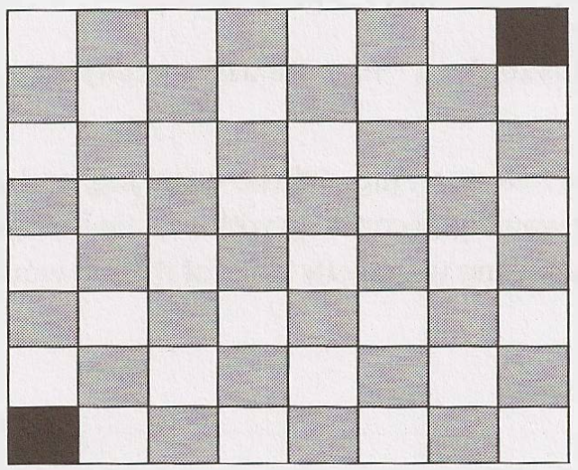

<!--more-->

**Dominos**: There is an 8x8 chessboard in which two diagonally opposite corners have been cut off.You are given 31 dominos, and a single domino can cover exactly two squares. Can you use the 31 dominos to cover the entire board? Prove your answer (by providing an example or showing why it's impossible).

Hints: #367, #397

## 解法1（不好）

意思是一个8x8的棋盘，选任意一条对角线，把这个对角线两端的方块扣掉，那么剩下的格子就有64 - 2 = 62个。现在有31个骨牌，每个骨牌是1x2，问是否能够用这些骨牌把整个棋盘填满（骨牌不重叠）。实际上是不能的，你要证明。

注意扣掉的两个格子形成了4条边都是奇数个格子。

如果我们线不铺4条边，而是先把中间的铺了（6x6），那么最终留下的格子数是26个，也就是最外侧有26个格子。按照上左下右的顺序排列，上边7个，左边6个，下边7个，右边6个。

可以看到无论怎样都有奇数个格子，因此无法在不重叠骨牌的情况下排满。

## 解法2

如果这样描述这个棋盘，第一行7个，第二行8个，第三行8个，。。。，第8行7个。

我们从第一行来放骨牌，你会发现会有一个骨牌串到第二行去，然后在第二行放骨牌回发现有一个骨牌会串到下一行去。然后总是有一个骨牌串到下一行，所以放不了。

## 解法3

把棋盘用间隔地涂上黑白，得到然后再扣掉两个格子：

会发现原本是32个黑格子，32个白格子，扣掉之后就变成30个黑格子、32个白格子（或者32个黑格子、30个白格子）。一个骨牌必定会占用一个黑格子一个白格子，你有31个骨牌就意味着会占据31个黑格子和31个白格子。所以你没法占满整个格子。