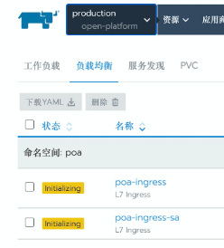
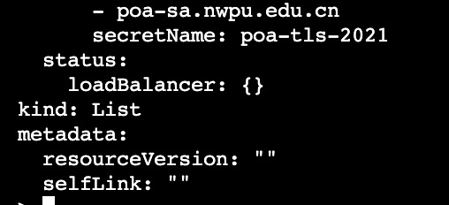
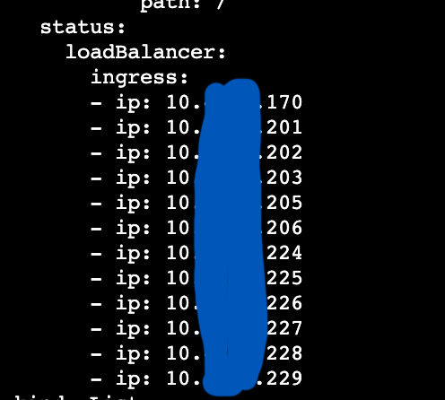
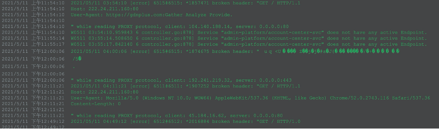
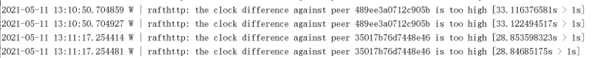
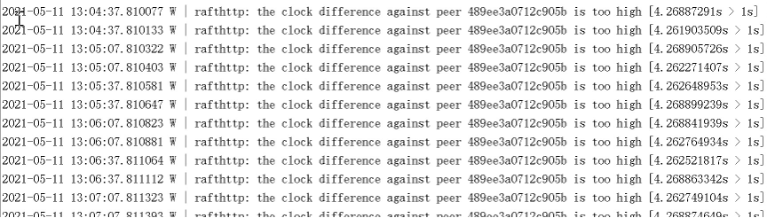

<!--more-->

## 现象

在rancher中发现所有的Ingress都是黄色的Initializing状态，但是访问应用没有问题。



## 检查ingress对象

查看ingress的status，会看到status.loadBalancer 字段是空的：



对比一个正常：



## 查看Nginx ingress的日志

在三个Pod（共10个）上看到了以下日志：



怀疑受到攻击，导致nginx-ingress-controller异常。

## 尝试重启Ingress controller

删掉这三个Pod重启，没用。

重启所有ingress-controller，也没用。

## 观察master服务器上etcd的日志

在master-1上看到如下内容：



在master-2上看到如下内容：



master-3上没有这些warning。

因为K8S对象都保存在etcd中的，怀疑如果etcd出了问题，那么对象的状态是过时的，也会造成无法更新的问题。

校准服务器时间，问题依旧。

## 检查Ingress Controller和kube apiserver的通信

K8S的Controller模型告诉我们，都必须和Apiserver通信，那么是不是Ingress Controller和Apiserver的通信出了问题呢？

进入某个ingress controller容器，执行下列命令：

```bash
TOKEN=`cat /var/run/secrets/kubernetes.io/serviceaccount/token`
curl -k https://10.43.0.1:443/api --header "Authorization: Bearer $TOKEN"
```

发现和API Server的通信是OK的。

## 检查Ingress Controller的Service Account的权限是否足够

因为调用Kube ApiServer需要权限，检查一下：

```bash
> kubectl -n ingress-nginx get sa
NAME                           SECRETS   AGE
default                        1         440d
nginx-ingress-serviceaccount   1         440d

> kubectl -n ingress-nginx get rolebinding
NAME                              AGE
clusterrolebinding-2ltlc          440d
clusterrolebinding-6sk8h          440d
clusterrolebinding-964mz          440d
clusterrolebinding-znvvl          440d
nginx-ingress-role-nisa-binding   440d

> kubectl -n ingress-nginx get rolebinding nginx-ingress-role-nisa-binding
…
roleRef:
  apiGroup: rbac.authorization.k8s.io
  kind: Role
  name: nginx-ingress-role
subjects:
- kind: ServiceAccount
  name: nginx-ingress-serviceaccount
  namespace: ingress-nginx

> kubectl -n ingress-nginx get role nginx-ingress-role -o yaml
…
rules:
- apiGroups:
  - ""
  resources:
  - configmaps
  - pods
  - secrets
  - namespaces
  verbs:
  - get
- apiGroups:
  - ""
  resourceNames:
  - ingress-controller-leader-nginx
  resources:
  - configmaps
  verbs:
  - get
  - update
- apiGroups:
  - ""
  resources:
  - configmaps
  verbs:
  - create
- apiGroups:
  - ""
  resources:
  - endpoints
  verbs:
  - get
```

发现权限是足够的，而且和一个正常的集群对比，结果也是一样的。

## 再次观察ingress controller的日志

调整ingress controller的参数，[把access log关掉](https://kubernetes.github.io/ingress-nginx/user-guide/nginx-configuration/configmap/#disable-access-log)，能够更清楚的看到controller的日志。

发现这么一条：

```bash
I0512 03:52:31.256060 6 status.go:86] new  leader elected: nginx-ingress-controller-qxlt8  
```

所有ingress-controller推举leader为 nginx-ingress-controller-qxlt8。

但是在K8S里根本就不存在名字是这个的Pod。

阅读[源码](https://github.com/kubernetes/ingress-nginx/blob/nginx-0.25.1/internal/ingress/controller/nginx.go#L290)得知，只有leader才会负责更新Ingress对象的status字段。

## 查找 nginx-ingress-controller-qxlt8

怀疑是不是etcd里有，但是这个没有K8S查不到，于是到etcd上查询。

```bash
> docker exec -it etcd etcdctl get / --prefix --keys-only | grep ingress-controller

/registry/configmaps/ingress-nginx/ingress-controller-leader-nginx
/registry/configmaps/kube-system/rke-ingress-controller
/registry/controllerrevisions/ingress-nginx/nginx-ingress-controller-544c7854f8
/registry/controllerrevisions/ingress-nginx/nginx-ingress-controller-668ccb87b6
/registry/controllerrevisions/ingress-nginx/nginx-ingress-controller-678b59dd78
/registry/controllerrevisions/ingress-nginx/nginx-ingress-controller-6c4d466577
/registry/controllerrevisions/ingress-nginx/nginx-ingress-controller-7577d75bc9
/registry/controllerrevisions/ingress-nginx/nginx-ingress-controller-767b694845
/registry/controllerrevisions/ingress-nginx/nginx-ingress-controller-779b9c5dc8
/registry/controllerrevisions/ingress-nginx/nginx-ingress-controller-7854ff6b8d
/registry/controllerrevisions/ingress-nginx/nginx-ingress-controller-7f8fdf4c75
/registry/controllerrevisions/ingress-nginx/nginx-ingress-controller-8446bfc58
/registry/controllerrevisions/ingress-nginx/nginx-ingress-controller-9cc858b66
/registry/daemonsets/ingress-nginx/nginx-ingress-controller
/registry/jobs/kube-system/rke-ingress-controller-deploy-job
/registry/pods/ingress-nginx/nginx-ingress-controller-2f6nf
/registry/pods/ingress-nginx/nginx-ingress-controller-2zk9s
/registry/pods/ingress-nginx/nginx-ingress-controller-6lzr4
/registry/pods/ingress-nginx/nginx-ingress-controller-c9gxl
/registry/pods/ingress-nginx/nginx-ingress-controller-fj94z
/registry/pods/ingress-nginx/nginx-ingress-controller-gstz8
/registry/pods/ingress-nginx/nginx-ingress-controller-kks2w
/registry/pods/ingress-nginx/nginx-ingress-controller-ntmqm
/registry/pods/ingress-nginx/nginx-ingress-controller-qjwkw
/registry/pods/ingress-nginx/nginx-ingress-controller-rfbls
/registry/pods/ingress-nginx/nginx-ingress-controller-rt5bp
/registry/pods/ingress-nginx/nginx-ingress-controller-xjcgl
/registry/pods/kube-system/rke-ingress-controller-deploy-job-2vmwq
```

 没有 nginx-ingress-controller-qxlt8 这个Pod。

但是注意到 configmap ingress-controller-leader-nginx。

打开之后看到：

```yaml
apiVersion: v1
kind: ConfigMap
metadata:
  annotations:
    control-plane.alpha.kubernetes.io/leader: '{"holderIdentity":"nginx-ingress-controller-qxlt8","leaseDurationSeconds":30,"acquireTime":"2021-05-10T13:38:53Z","renewTime":"2021-05-12T06:28:50Z","leaderTransitions":11}'
  creationTimestamp: "2020-02-26T10:37:12Z"
  name: ingress-controller-leader-nginx
  namespace: ingress-nginx
  resourceVersion: "230445553"
  selfLink: /api/v1/namespaces/ingress-nginx/configmaps/ingress-controller-leader-nginx
  uid: 14a0deec-eab4-44d1-aff1-36979b52a1e1
```

这个configmap是ingress-controller维护的，目前的值显然是错了。

## 再次研究ingress-controller的leader推举机制

查了代码之后发现，ingress-controller其实并不是想象中的分布式共识协议推举leader，而是最简单的抢座位的方式来定leader。

只要有一个controller在其他controller之前占有锁（就是前面提到的configmap），并且在lease之前（30秒）刷新这个锁，那它就是leader。

而且只有leader才会负责更新Ingress对象的status字段。

## 手动修改configmap

手动修改configmap，把leader指向一个存在的Pod。

所有Ingress上的status字段状态都更新了。

## 排查游离在K8S集群之外的节点

现在可以推断存在游离在K8S集群之外，但是可以和K8S通信的服务器，后来果然在一台不在集群范围内的机器上找到了：

```bash
$ docker ps -a|grep ingress
...
f4c861555842        a80ffa0b898e                         "/usr/bin/dumb-init …"   5 months ago        Up 5 months                                     k8s_nginx-ingress-controller_nginx-ingress-controller-qxlt8_ingress-nginx_40487677-32c0-4936-bd1a-3e3cb99fbfa1_0
...
```

印证了之前的推断。

把这台服务器上的kubelet、kube-proxy和ingress-controller容器停掉。

## 总结

本次排查发现三个问题：

1. Ingress对象的status字段不更新的问题。

2. 问题1产生的原因可能是，存在游离在K8S集群之外，但是可以和K8S通信的服务器。

3. 集群的nginx接入点疑似收到攻击。