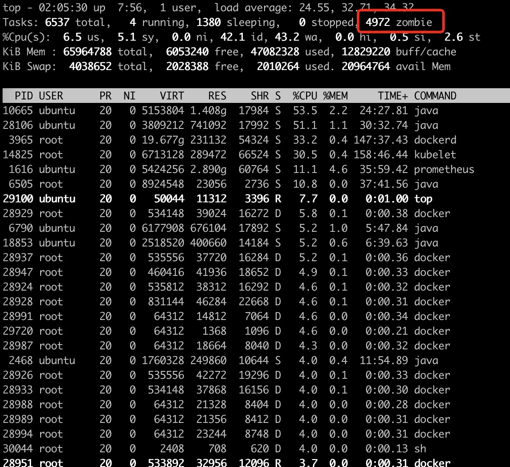

<!--more-->

最近遇到一个问题，某个Java进程使用`Runtime().exec()`执行脚本文件，创建了大量僵尸进程，而这个Java进程是运行在容器中的。

当时看到 Host 机器上是这么一个情况，可以看到有大量僵尸进程：



通过 `ps aux | grep Z` 定位到僵尸进程：

```
USER       PID %CPU %MEM    VSZ   RSS TTY      STAT START   TIME COMMAND
root      2518  0.0  0.0      0     0 ?        Z    Jan23   0:00 [docker] <defunct>
root      2521  0.0  0.0      0     0 ?        Z    Jan23   0:00 [docker] <defunct>
root      2533  0.0  0.0      0     0 ?        Z    00:19   0:00 [docker] <defunct>
root      2535  0.0  0.0      0     0 ?        Z    00:19   0:00 [docker] <defunct>
root      2539  0.0  0.0      0     0 ?        Z    Jan23   0:00 [docker] <defunct>
root      2541  0.0  0.0      0     0 ?        Z    Jan23   0:00 [docker] <defunct>
root      2546  0.0  0.0      0     0 ?        Z    Jan23   0:00 [docker] <defunct>
...
```

然后 `pstree -apscl <pid>` 找到了其是某个Java进程创建的：

```
systemd,1 maybe-ubiquity
  `-containerd-shim,6387 -namespace moby -id 4a720871cfb7fdbce7a33eb89cb723acec09bdc61f73a2de8ea81e20973f57d1 -address/run/
      `-java,6505...
          |-(docker,324)
          |-(docker,325)
          |-(docker,326)
          |-(docker,354)
          |-(docker,362)
          |-(docker,364)
          |-(docker,369)
          |-(docker,375)
          |-(docker,384)
          |-(docker,386)
          |-(docker,393)
          |-(docker,401)
```

结果中的容器 ID `4a720871cfb7fdbce7a33eb89cb723acec09bdc61f73a2de8ea81e20973f57d1` 找到对应程序镜像。然后阅读代码后发现，这个 Java 程序使用以下两种方式执行 shell 脚本：

```java
Process p = Runtime.getRuntime().exec(new String["<cmd>"]);
Process p = Runtime.getRuntime().exec(new String["sh", "-c", "<cmd>"]);
```

大致来说 [Zombie process][1] 出现在子进程上：当一个子进程执行结束了，但是其父进程没有通过`wait`系统调用读取其exit status，导致其没有在 process table 中被清除，于是它就成了僵尸进程。

而代码中的`Process`对象都在`finally`中被`destroyForcibly().waitFor()`了，也就是正常结束了。

后面通过排除法，发现问题在于`sh -c <cmd>`这种执行方式，这里提供一个最小可重现版本`DockerZombie.java`：

```java
import java.io.BufferedReader;
import java.io.IOException;
import java.io.InputStreamReader;
import java.util.concurrent.ExecutorService;
import java.util.concurrent.Executors;

public class DockerZombie {

  public static void main(String[] args) throws IOException, InterruptedException {

    ExecutorService executorService = Executors.newFixedThreadPool(10);

    String[] cmd;

    if ("sh".equals(args[0])) {
      cmd = new String[] {"sh", "-c", "ls"};
    } else if ("/bin/sh".equals(args[0])) {
      cmd = new String[] {"/bin/sh", "-c", "ls"};
    } else if ("/bin/bash".equals(args[0])) {
      cmd = new String[] {"/bin/bash", "-c", "ls"};
    } else {
      cmd = new String[] {"ls"};
    }

    while (true) {
      executorService.submit(() -> {
        try {
          runCmd(cmd);
        } catch (InterruptedException e) {
          e.printStackTrace();
        } catch (IOException e) {
          e.printStackTrace();
        }
      });
    }
  }

  private static void runCmd(String[] args) throws InterruptedException, IOException {
    BufferedReader stdout = null;
    Process process = null;
    try {
      process = Runtime.getRuntime().exec(args);
      stdout = new BufferedReader(new InputStreamReader(process.getInputStream()));
      String line = stdout.readLine();
      if (line == null) {
        return;
      }
    } catch (IOException e) {
      e.printStackTrace();
    } finally {
      process.destroyForcibly().waitFor();
      stdout.close();
    }
  }
}
```


上面的代码提供4种执行脚本的方式，下表是对应的docker命令：

| 脚本执行方式            |  docker 命令                                     |
|:----------------------|:------------------------------------------------|
| `sh -c <cmd>`         | `docker run --rm docker-zombie:latest sh`       |
| `/bin/sh -c <cmd>`    | `docker run --rm docker-zombie:latest /bin/sh`  |
| `/bin/bash -c <cmd>`  | `docker run --rm docker-zombie:latest /bin/bash` |
| `<cmd>`               | `docker run --rm docker-zombie:latest foo`       |

如果基础镜像使用的是`openjdk:8`、`openjdk:8-slim` 那么：

* 前两种肯定产生僵尸进程，且数量飙升
* 后面两种也会产生，但数量很少

对应`Dockerfile`：

```Dockerfile
FROM openjdk:8
RUN mkdir /java-app
WORKDIR /java-app
COPY DockerZombie.java .
RUN javac DockerZombie.java
ENTRYPOINT ["java", "DockerZombie"]
```

如果基础镜像使用的是`openjdk:8-alpine`那么：

* 则都会产生僵尸进程，但是数量少，且稳定在10个左右

对应`Dockerfile`：

```Dockerfile
FROM openjdk:8-alpine
RUN apk add bash
RUN mkdir /java-app
WORKDIR /java-app
COPY DockerZombie.java .
RUN javac DockerZombie.java
ENTRYPOINT ["java", "DockerZombie"]
```

具体怎么根治这个问题，目前没有头绪。

[1]: https://en.wikipedia.org/wiki/Zombie_process