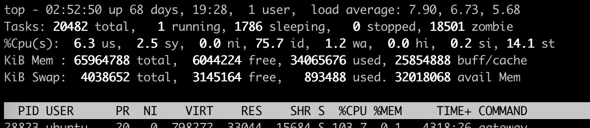
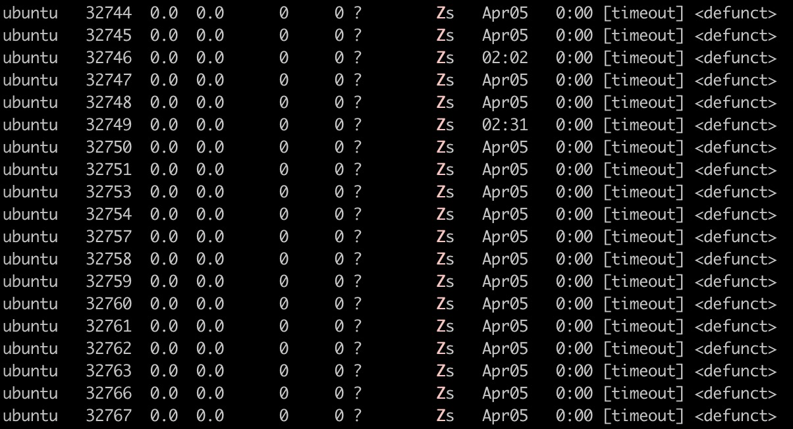
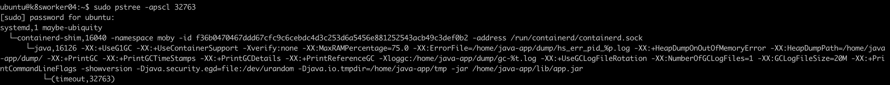
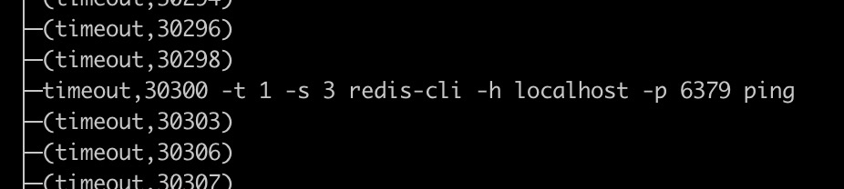

<!--more-->

在[前一篇文章][1]里，提到了 Java 程序容器产生大量僵尸进程的问题。今天又碰到了，不过是另一种情况。

产生僵尸进程的也是 bash 脚本，不过这个脚本是在 K8S readinessProbe 和 livenessProbe 里执行的，并不是 java 程序自己执行的。

先看一些故障图：










可以看到有很多 `timeout` 进程执行结束后没有被清理。

而 readinessProbe 和 livenessProbe 是这样的：

```yaml
readinessProbe:
  exec:
    command:
    - sh
    - -c
    - /health/ping_readiness_local.sh 1
    ...
livenessProbe:
  exec:
    command:
    - sh
    - -c
    - /health/ping_liveness_local.sh 5
    ...
```

在经过一系列排查之后发现，就是和镜像的 `ENTRYPOINT` 有关系。

基础镜像是 `openjdk:8-alpine`，而原来的是这样的：

```bash
ENTRYPOINT ["/home/java-app/docker-entrypoint.sh"]
```

改成：

```bash
RUN apk add --no-cache --update tini
ENTRYPOINT ["/sbin/tini", "--", "/home/java-app/docker-entrypoint.sh"]
```

[tini][2] 可以避免容器产生僵尸进程。

PS. 目前为止僵尸进程的问题常出现在 `alpine` 镜像上。

[1]: ../java-create-zombie-in-docker
[2]: https://github.com/krallin/tini