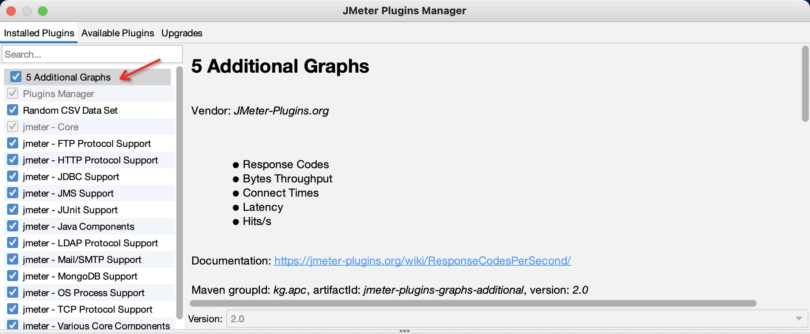
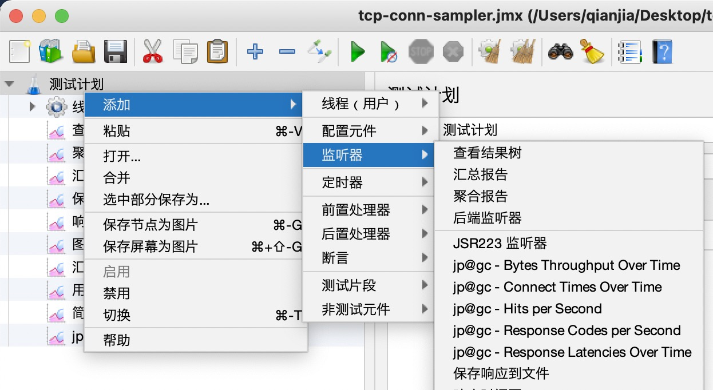

<!--more-->

打开打开 JMeter 的采样数据 xml，看到这样的数据：

```xml
...
<httpSample t="1392" lt="351" ts="1144371014619" s="true"
     lb="HTTP Request" rc="200" rm="OK"
     tn="Listen 1-1" dt="text" de="iso-8859-1" by="12407">
  <httpSample t="170" lt="170" ts="1144371015471" s="true"
        lb="http://www.apache.org/style/style.css" rc="200" rm="OK"
        tn="Listen 1-1" dt="text" de="ISO-8859-1" by="1002">
...
```

这里的 `<httpSample>` 就是单个采样数据，其中的：

* `t=` 代表请求完成所耗费时间（毫秒）
* `ts=` 代表请求发生时间戳（毫秒）
* `ct=` 代表Connect Time（毫秒）
* `rc=` 代表相应码
* 其他字段什么意思见[文档][2]

JMeter 内置的几个监听器比如【聚合报告】指针对 `t=` 做统计，【响应时间图】只针对 `ts=` 做统计。

我们需要对 `ct=` 字段做统计，下面讲方法。

你需要先安装 [JMeter Plugins Manager][jpm]。安装好之后打开它找到【5 Additional Graphs】，安装即可：



然后你就可以在监听器里看到新增的 5 个监听器：



选择【jp@gc - Connect Times Over Time】就可以分析采样数据中的 Connect Time 了。

[1]: https://jmeter.apache.org/usermanual/glossary.html
[2]: https://jmeter.apache.org/usermanual/listeners.html#xmlformat2.1
[jpm]: https://jmeter-plugins.org/wiki/PluginsManager/

