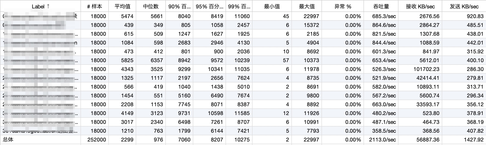

<!--more-->

最近对于 JMeter 是如何计算吞吐量产生了一些疑问。看下面这张聚合报告，可以看到：

* 每个请求都有一个吞吐量的数据
* 还有一个总体吞吐量的数据



按照 JMeter 官方文档关于[吞吐量的解释][1]：

> Throughput is calculated as requests/unit of time. 
> The time is calculated from the start of the first sample to the end of the last sample.
> This includes any intervals between samples, as it is supposed to represent the load on the server.
> The formula is: Throughput = (number of requests) / (total time).

就是说【吞吐量】计算公式的分子是【请求数】，这个很好理解，而分母则是【总时间】。

对于【总体吞吐量】来说，总时间 = 最晚结束的请求的时间戳 - 第一个请求发生的时间戳。

那么对于【单个URL】来说，它的【总时间】是怎么得来的呢？

## 分析

那么对于【单个URL】来说，因为它可以发生多次请求（如上图有 18000 次），所以总时间 = 该URL最晚结束的请求的时间戳 - 该URL第一个请求发生的时间戳。

你可以打开采样数据的 xml，看到这样的数据：

```xml
...
<httpSample t="1392" lt="351" ts="1144371014619" s="true"
     lb="HTTP Request" rc="200" rm="OK"
     tn="Listen 1-1" dt="text" de="iso-8859-1" by="12407">
  <httpSample t="170" lt="170" ts="1144371015471" s="true"
        lb="http://www.apache.org/style/style.css" rc="200" rm="OK"
        tn="Listen 1-1" dt="text" de="ISO-8859-1" by="1002">
...
```

这里的 `<httpSample>` 就是单个采样数据，其中的 `t=` 代表请求完成所耗费时间（毫秒） `ts=` 代表请求发生时间戳（毫秒）（其他字段什么意思见[文档][2]）。

那我们就可以找到【某个 URL】的第一个请求的时间戳：

```shell
grep '<根据 取样器名字 匹配>' '/path/to/report.xml' | awk '{print $6}' | sort | head -1
```

找到【某个 URL】最晚结束的请求的时间戳：

```shell
grep '<根据 取样器名字 匹配>' '/path/to/report.xml' | awk '{print $2, $6}' | sed 's/["t=s]//g' | awk '{print $1 + $2}' | sort -rn | head -1
```

后者减掉前者就是【某个 URL 的总时间】，你可以实验一下，就能够得到和【聚合报告】一样的值。

## 注意事项

某个 URL 的【总时间】容易受到一些其他因素的影响，无法精确反应程序的真实性能。

情况一：

因为你没有办法保证请求都是同时发生的（也许可以通过逻辑控制组件来保证），那么那些晚开始的请求会脱后腿，比如一共有10个请求，分别在第 1、2、3、... 、10 秒发出，那么【总时间】显然就拉长了。

情况二：

如果你设置脚本循环跑 N 遍，那么这个总时间会因为其他请求的缘故拉的特别长。
比如第一轮请求发生在第 1 秒，而第二轮请求则要等请他请求都完成后才会轮到，这就可能是 1 分钟以后了，会显著拉长【总时间】，从而显得吞吐量特比低。
当然如果脚本里只有这一个请求是不存在这个问题的。

[1]: https://jmeter.apache.org/usermanual/glossary.html
[2]: https://jmeter.apache.org/usermanual/listeners.html#xmlformat2.1