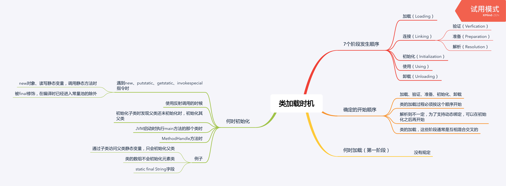

<!--more-->

### 7个阶段发生顺序

1. 加载（Loading）
1. 连接（Linking）
   1. 验证（Verfication）
   2. 准备（Preparation）
   3. 解析（Resolution）
1. 初始化（Initialization）
1. 使用（Using）
1. 卸载（Unloading）

### 确定的开始顺序

* 加载、验证、准备、初始化、卸载
* 类的加载过程必须按这个顺序开始
* 解析则不一定，为了支持动态绑定，可以在初始化之后再开始
* 类的加载，这些阶段通常是互相混合交叉的

### 何时加载（第一阶段）？

没有规定。

### 何时初始化？

* 遇到new、putstatic、getstatic、invokespecial指令时
  * new对象、读写静态变量，调用静态方法时
  * 被final修饰，在编译时已经进入常量池的除外
* 使用反射调用的时候
* 初始化子类时发现父类还未初始化时，初始化其父类
* JVM启动时执行main方法的那个类时
* MethodHandle方法时
* 例子
  * 通过子类访问父类静态变量，只会初始化父类
  * 类的数组不会初始化元素类
  * static final String字段