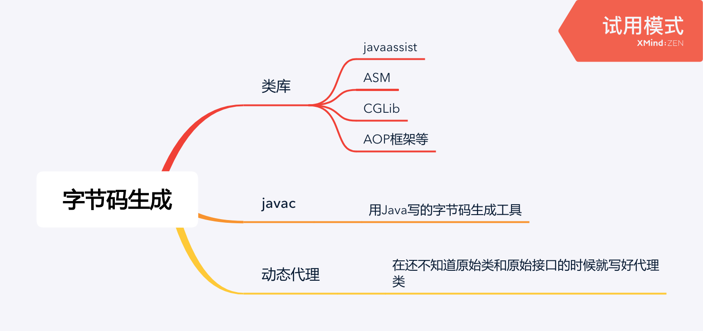

<!--more-->



## 大纲

类库：

* javaassist
* ASM
* CGLib
* AOP框架等

javac：用Java写的字节码生成工具

动态代理：在还不知道原始类和原始接口的时候就写好代理类

## 例子

例子代码，在原始逻辑之前打印"welcome"：

```java
public class DynamicProxyTest {
  interface IHello {
    void sayHello();
  }
  static class Hello implements IHello {
    @Override
    public void sayHello() {
      System.out.println("hello world");
    }
  }
  static class DynamicProxy implements InvocationHandler {
    Object originObj;
    Object bind(Object originObj) {
      this.originObj = originObj;
      return Proxy.newProxyInstance(originObj.getClass().getClassLoader(),
                                   originObj.getClass().getInterfaces(),
                                   this);
    }
    @Override
    public Object invoke(Object proxy, Method method, Object[] args) throws Throwable {
      System.out.println("welcome");
      return method.invoke(originObj, args);
    }
  }
  public static void main(String[] args) {
    IHello hello = (IHello) new DynamicProxy().bind(new Hello());
    hello.sayHello();
  }
}
```

`Proxy.newProxyInstance`会生成含有字节码的`byte[]`，系统属性`-Dsun.misc.ProxyGenerator.saveGeneratedFiles=true`可以得到class文件。反编译后结果（摘选）：

```java
public class class $Proxy0 extends Proxy implements DynamicProxyTest.IHello {
  private static Method m3;
  // method m2, method m1;
  public $Proxy0(InvocationHandler paramInvocationHandler) {
    super(paramInvocationHandler);
  }
  
  public final void sayHello() {
    try {
      // this.h 就是我们自己实现的InvocationHandler
      this.h.invoke(this, m3, null);
      return;
    } catch (...) {
      // 略
    }
  }
  
  static {
    try {
      m3 = Class.forName("DynamicProxyTest$IHello").getMethod("sayHello", new Class[0]);
      m1 = Class.forName("java.lang.Object").getMethod("equals", Class.forName("java.lang.Object"));
      ...
    }
  }
}
```

