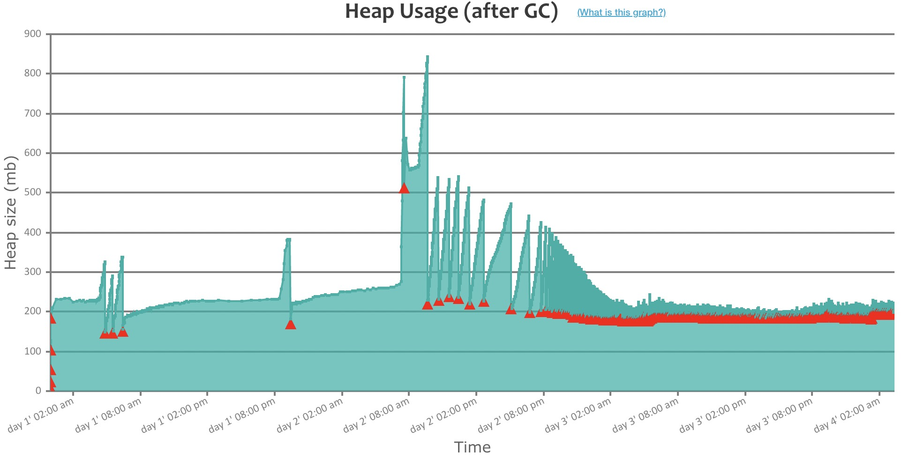
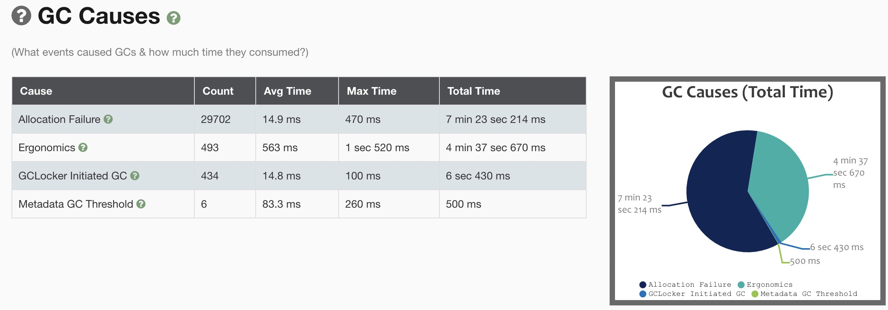

<!--more-->

## 情况

监控发现某应用频繁发生 FullGC，大约 2 分钟内超过 2 次。

这是一个容器程序，给的内存上下限是 8G。JVM 启动了 cgroup 感知，它的最大 Heap 差不多有 6.1G 左右，下面相关参数:

```shell
-XX:+UnlockExperimentalVMOptions
-XX:+UseCGroupMemoryLimitForHeap
-XX:MaxRAMPercentage=75.000000
```

而垃圾收集器参数没有特别指定，根据[Garbage Collector Ergonomics][1]，用的应该是默认的 `-XX:+UseParallelGC -XX:+UseParallelOldGC`，也可以通过下列命令证实：
```
$ java -XX:+PrintFlagsFinal -version | grep GC | grep true
openjdk version "1.8.0_212"
OpenJDK Runtime Environment (IcedTea 3.12.0) (Alpine 8.212.04-r0)
OpenJDK 64-Bit Server VM (build 25.212-b04, mixed mode)
     bool ScavengeBeforeFullGC                      = true                                {product}
     bool UseAdaptiveSizeDecayMajorGCCost           = true                                {product}
     bool UseGCOverheadLimit                        = true                                {product}
     bool UseMaximumCompactionOnSystemGC            = true                                {product}
     bool UseParallelGC                            := true                                {product}
     bool UseParallelOldGC                          = true                                {product}
```

同时也使用了默认的 `-XX:+UseAdaptiveSizePolicy`：

```shell
$ java -XX:+PrintFlagsFinal -version | grep AdaptiveSize
openjdk version "1.8.0_212"
OpenJDK Runtime Environment (IcedTea 3.12.0) (Alpine 8.212.04-r0)
OpenJDK 64-Bit Server VM (build 25.212-b04, mixed mode)
    uintx AdaptiveSizeDecrementScaleFactor          = 4                                   {product}
    uintx AdaptiveSizeMajorGCDecayTimeScale         = 10                                  {product}
    uintx AdaptiveSizePausePolicy                   = 0                                   {product}
    uintx AdaptiveSizePolicyCollectionCostMargin    = 50                                  {product}
    uintx AdaptiveSizePolicyInitializingSteps       = 20                                  {product}
    uintx AdaptiveSizePolicyOutputInterval          = 0                                   {product}
    uintx AdaptiveSizePolicyWeight                  = 10                                  {product}
    uintx AdaptiveSizeThroughPutPolicy              = 0                                   {product}
     bool PrintAdaptiveSizePolicy                   = false                               {product}
     bool UseAdaptiveSizeDecayMajorGCCost           = true                                {product}
     bool UseAdaptiveSizePolicy                     = true                                {product}
     bool UseAdaptiveSizePolicyFootprintGoal        = true                                {product}
     bool UseAdaptiveSizePolicyWithSystemGC         = false                               {product}
```

## 分析 GC 日志

把 GC 日志捞下来交给 gceasy.io 分析：



从图中可以看到这么几个奇怪的现象：

* Heap 大小最大在 850M 左右，远低于实际可用大小 6.1G。
* 在图的后半段，Heap 大小在 250M 左右。
* 同时，红色三角代表的 FullGC 开始变得非常频繁，但每次 FullGC 几乎没有什么垃圾可被清理。

同时观察 GC 原因：



发现有 493 个是 Ergonomics。

## Ergonomics

因为 gceasy 看不到 FullGC 产生的原因，所以分析一下日志文件：

```shell
$ awk '/Full GC.+Ergonomics/{print $0}' gc.log | wc -l
   493
```

发现 493 次 Ergonomics 都是 Full GC。

根据 [Garbage Collector Ergonomics][1] 的说法，当你启用 `-XX:+UseAdaptiveSizePolicy` 时，JVM 会努力达成以下 3 个 GC 的目标：

* 尽量少的 GC 停顿时间：不超过 `-XX:MaxGCPauseMillis=nnn` 所设定的 GC 停顿时间，这个我们没有设置所以不起作用。
* 尽量高的吞吐量：不超过 `-XX:GCTimeRatio=nnn` 所设定的值，默认是 99，即不超过 1 / (1 + 99) = 1% 的时间用于 GC。
* 尽量少的 footprint 即 Heap 尺寸。

以上目标的优先级顺序：

1. 先达成尽量少的 GC 停顿时间，这个通过缩小（Shrinking）分代区尺寸来实现
2. 满足上面的情况下，尽量提高吞吐量，通过扩大（Expansion）分代区尺寸来实现
3. 上面两个都满足的情况下，缩小（Shrinking）分代区尺寸
4. 无论是缩小还是扩大分代区尺寸，都会触发一次 Full GC

另，根据这个 [Issue][2]，如果你在使用 ParallelGC 的同时关掉了 Adaptive Size Policy `-XX:-UseAdaptiveSizePolicy`，那么 GC 日志中的 Ergonomics 的意思就变成了

> 根据历史的 Young 区 -> Old 区的提升速率，判断出 Old 区不够大，无法 Hold 住一下次 YC，所以做了一次 Full GC，然后做一次 Heap 扩容。

## 结论

因为 JVM 默认参数 `-XX:+UseParallelGC -XX:+UseParallelOldGC -XX:+UseAdaptiveSizePolicy` 所以 JVM 启用了 GC Ergonomics。

同时我们没有设置 GC 停顿时间目标，所以 JVM 会优先满足吞吐量目标（最多1%的时间用于GC），然后再去满足尽量小 memory footprint 目标。

现在的情况是吞吐量目标满足了，然后就会去通过缩小分代区尺寸来满足尽量小的 heap 尺寸目标。

于是就频繁触发了 Full GC（Ergonomics）。

可能的解决方案是添加启动参数 `-XX:-UseAdaptiveSizePolicyFootprintGoal` 关掉 footprint 目标。

## 参考资料

* [Java 8 - Garbage Collector Ergonomics][1]
* [Java 8 - Garbage Collection Tuning Guide](https://docs.oracle.com/javase/8/docs/technotes/guides/vm/gctuning/toc.html)
* [Java 9 - Garbage Collection Tuning Guide](https://docs.oracle.com/javase/9/gctuning/toc.htm)

[1]: https://docs.oracle.com/javase/8/docs/technotes/guides/vm/gc-ergonomics.html
[2]: https://bugs.openjdk.org/browse/JDK-8067243

