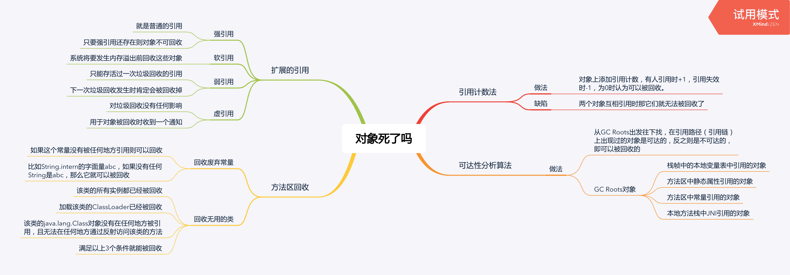

<!--more-->



## 判断垃圾的算法

#### 引用计数法

* 做法：对象上添加引用计数，有人引用时+1，引用失效时-1，为0时认为可以被回收。
* 缺陷：两个对象互相引用时那它们就无法被回收了

#### 可达性分析算法

* 做法：从GC Roots出发往下找，在引用路径（引用链）上出现过的对象是可达的，反之则是不可达的，即可以被回收的
* GC Roots对象
  * 栈帧中的本地变量表中引用的对象
  * 方法区中静态属性引用的对象
  * 方法区中常量引用的对象
  * 本地方法栈中JNI引用的对象

## 扩展的引用

* 强引用
    * 就是普通的引用
    * 只要强引用还存在则对象不可回收
* 软引用
    * 系统将要发生内存溢出前回收这些对象
* 弱引用
    * 只能存活过一次垃圾回收的引用（存疑？）
    * 下一次垃圾回收发生时肯定会被回收掉
* 虚引用
    * 对垃圾回收没有任何影响
    * 用于对象被回收时收到一个通知

## 方法区回收

* 回收废弃常量
  * 如果这个常量没有被任何地方引用则可以回收
  * 比如String.intern的字面量abc，如果没有任何String是abc，那么它就可以被回收
* 回收无用的类
  * 该类的所有实例都已经被回收
  * 加载该类的ClassLoader已经被回收
  * 该类的java.lang.Class对象没有在任何地方被引用，且无法在任何地方通过反射访问该类的方法
  * 满足以上3个条件就能被回收

### JVM诊断引用情况

```bash
-XX:+PrintGCDetails -XX:+PrintGCTimeStamps -XX:+PrintReferenceGC
```

下面是引用数量的输出：

```txt
0.403: [GC (Allocation Failure) 0.871: [SoftReference, 0 refs, 0.0000393 secs]0.871: [WeakReference, 8 refs, 0.0000138 secs]0.871: [FinalReference, 4 refs, 0.0000094 secs]0.871: [PhantomReference, 0 refs, 0 refs, 0.0000085 secs]0.871: [JNI Weak Reference, 0.0000071 secs][PSYoungGen: 76272K->10720K(141824K)] 128286K->128422K(316928K), 0.4683919 secs] [Times: user=1.17 sys=0.03, real=0.47 secs] 
```

