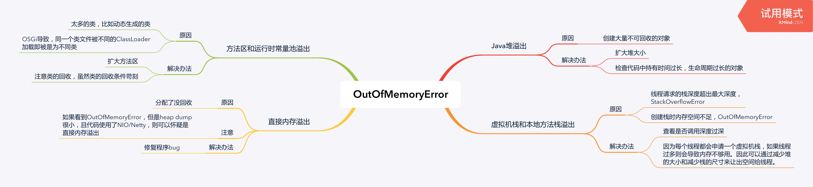

<!--more-->

## Java堆溢出

原因：创建大量不可回收的对象

解决办法：

* 扩大堆大小
* 检查代码中持有时间过长，生命周期过长的对象

## 虚拟机栈和本地方法栈溢出

原因：

* 线程请求的栈深度超出最大深度，StackOverflowError
* 创建栈时内存空间不足，OutOfMemoryError

解决办法：

* 查看是否调用深度过深
* 因为每个线程都会申请一个虚拟机栈，如果线程过多则会导致内存不够用。因此可以通过减少堆的大小和减少栈的尺寸来让出空间给线程。

## 方法区和运行时常量池溢出

原因：

* 太多的类，比如动态生成的类
* OSGi导致，同一个类文件被不同的ClassLoader加载即被是为不同类

解决办法：

* 扩大方法区
* 注意类的回收，虽然类的回收条件苛刻

## 直接内存溢出

原因：分配了没回收

注意：如果看到OutOfMemoryError，但是heap dump很小，且代码使用了NIO/Netty，则可以怀疑是直接内存溢出

解决办法：修复程序bug

## 脑图

