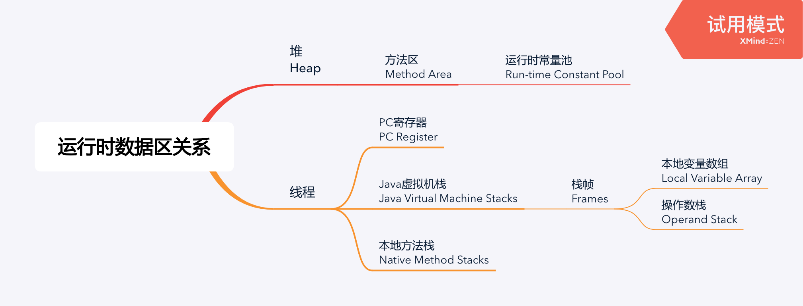
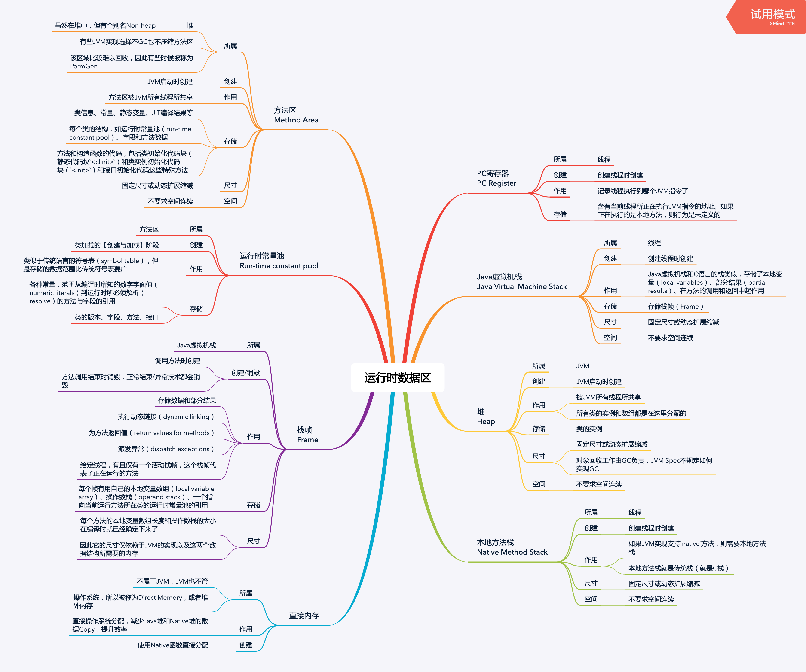

<!--more-->

## 概览

## 详细

### PC寄存器（PC Register）

所属：线程

创建：创建线程时创建

作用：记录线程执行到哪个JVM指令了

存储：含有当前线程所正在执行JVM指令的地址。如果正在执行的是本地方法，则行为是未定义的

### Java虚拟机栈（Java Virtual Machine Stack）

所属：线程

创建：创建线程时创建

作用：Java虚拟机栈和C语言的栈类似，存储了本地变量（local variables）、部分结果（partial results）、在方法的调用和返回中起作用

存储：存储栈帧（Frame）

尺寸：固定尺寸或动态扩展缩减

空间：不要求空间连续

### 本地方法栈（Native Method Stack）

所属：线程

创建：创建线程时创建

作用：如果JVM实现支持`native`方法，则需要本地方法栈；本地方法栈就是传统栈（就是C栈）

尺寸：固定尺寸或动态扩展缩减

空间：不要求空间连续

### 堆（Heap）

所属：JVM

创建：JVM启动时创建

作用：被JVM所有线程所共享；所有类的实例和数组都是在这里分配的

存储：类的实例

尺寸：固定尺寸或动态扩展缩减；对象回收工作由GC负责，JVM Spec不规定如何实现GC

空间：不要求空间连续

### 方法区（Method Area）

所属：

* 堆，虽然在堆中，但有个别名Non-heap
* 有些JVM实现选择不GC也不压缩方法区
* 该区域比较难以回收，因此有些时候被称为PermGen

创建：JVM启动时创建

作用：方法区被JVM所有线程所共享

存储：

* 类信息、常量、静态变量、JIT编译结果等
* 每个类的结构，如运行时常量池（run-time constant pool）、字段和方法数据
* 方法和构造函数的代码，包括类初始化代码块（静态代码块`<clinit>`）和类实例初始化代码块（`<init>`）和接口初始化代码这些特殊方法

尺寸：固定尺寸或动态扩展缩减

空间：不要求空间连续

### 运行时常量池（Run-time constant pool）

所属：方法区

创建：类加载的【创建与加载】阶段

作用：类似于传统语言的符号表（symbol table），但是存储的数据范围比传统符号表要广

存储：

* 各种常量，范围从编译时所知的数字字面值（numeric literals）到运行时所必须解析（resolve）的方法与字段的引用
* 类的版本、字段、方法、接口

### 栈帧（Frame）

所属：Java虚拟机栈

创建/销毁：

* 调用方法时创建
* 方法调用结束时销毁，正常结束/异常技术都会销毁

作用：

* 存储数据和部分结果
* 执行动态链接（dynamic linking）
* 为方法返回值（return values for methods）
* 派发异常（dispatch exceptions）
* 给定线程，有且仅有一个活动栈帧，这个栈帧代表了正在运行的方法

存储：每个帧有用自己的本地变量数组（local variable array）、操作数栈（operand stack）、一个指向当前运行方法所在类的运行时常量池的引用

尺寸：

* 每个方法的本地变量数组长度和操作数栈的大小在编译时就已经确定下来了
* 因此它的尺寸仅依赖于JVM的实现以及这两个数据结构所需要的内存

### 直接内存

所属：

* 不属于JVM，JVM也不管
* 操作系统，所以被称为Direct Memory，或者堆外内存

作用：直接操作系统分配，减少Java堆和Native堆的数据Copy，提升效率

创建：使用Native函数直接分配

### 脑图

## 参考资料

* [Java Virtual Machine Specification | 2.5. Run-Time Data Areas][jvms-2.5]
* [Java Virtual Machine Specification | 5.3. Creation and Loading][jvms-5.3]
* [极客时间 | 深入拆解 Java 虚拟机 | 01 | Java代码是怎么运行的？][geektime]

[jvms-2.5]: https://docs.oracle.com/javase/specs/jvms/se8/html/jvms-2.html#jvms-2.5
[geektime]: https://time.geekbang.org/column/article/11289
[jvms-5.3]: https://docs.oracle.com/javase/specs/jvms/se8/html/jvms-5.html#jvms-5.3