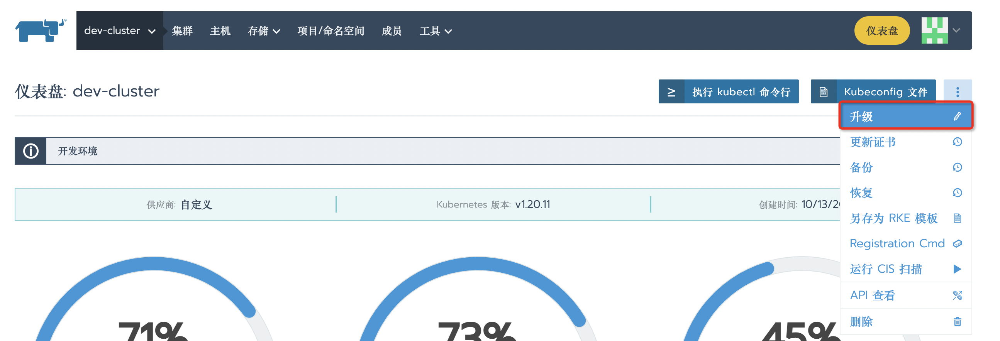
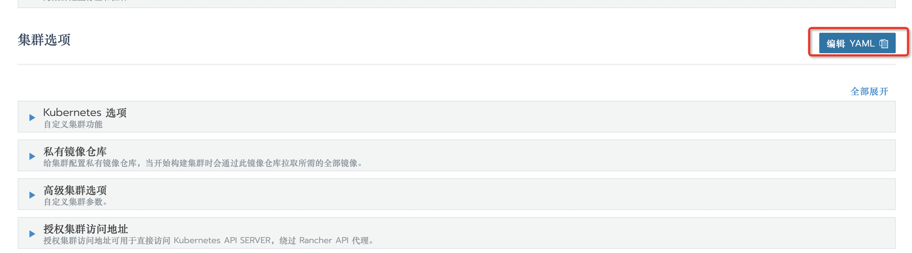
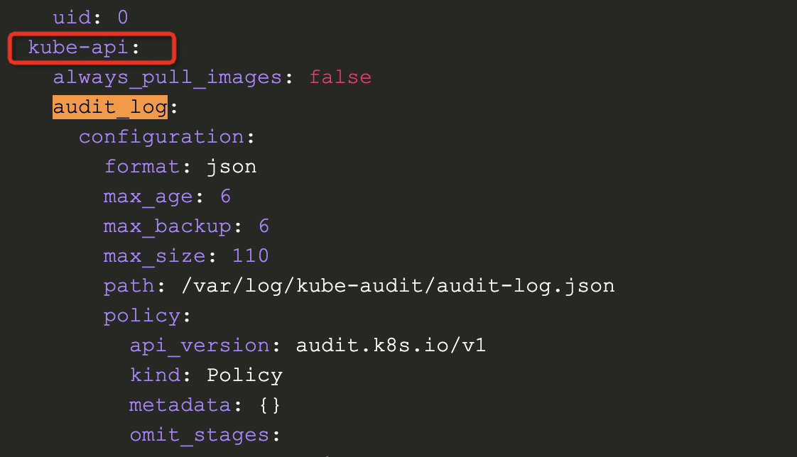

<!--more-->

开启 K8S 集群的 Audit Log（审计日志），开启之后会记录所有对 K8S 资源的变更操作，便于后续排查问题。

1）进入某个集群，点击【升级】：



2）点击【编辑YAML】：



3）找到 `kube-api` 字段，在下面添加 `audit_log`：



内容如下：

```yaml
      # Enable audit logging
      # Available as of v1.0.0
      audit_log:
        enabled: true
        configuration:
          # 最多保留 6 天
          max_age: 6
          # 最多保留 6 个文件
          max_backup: 6
          # 单个文件最大 110M
          max_size: 110
          path: /var/log/kube-audit/audit-log.json
          format: json
          policy:                  
            apiVersion: audit.k8s.io/v1
            kind: Policy
            # Don't generate audit events for all requests in RequestReceived stage.
            omitStages:
              - "RequestReceived"
            rules:
              # get list watch 不记录日志
              - level: None
                verbs: ["get","list","watch"]

              # 其他类型的只记录Metadata日志
              - level: Metadata
```

4）开启成功后等待集群更新完毕。

5）进入任意 master 服务器，查看 `/var/log/kube-audit/audit-log.json`，这就是 K8S API 的操作日志。

参考文档：

* [RKE cluster.yaml 例子](https://docs.rancher.cn/docs/rke/example-yamls/_index/)
* [K8S Auditing](https://kubernetes.io/docs/tasks/debug/debug-cluster/audit/)
* [K8S Request Verbs](https://kubernetes.io/docs/reference/access-authn-authz/authorization/#determine-the-request-verb)
* [K8S API Audit Policy](https://kubernetes.io/docs/reference/config-api/apiserver-audit.v1/#audit-k8s-io-v1-Policy)