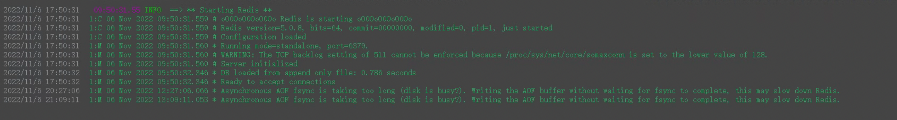
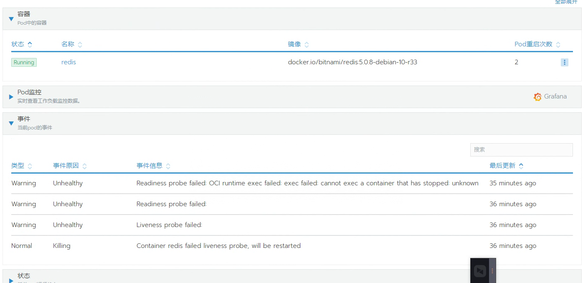
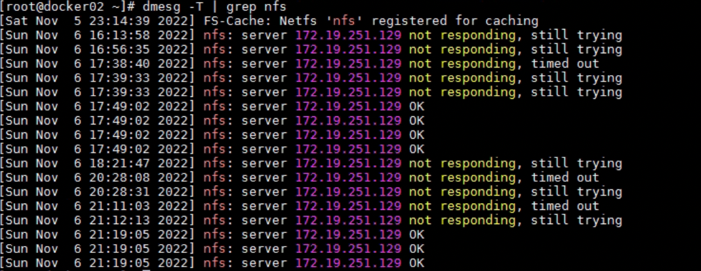
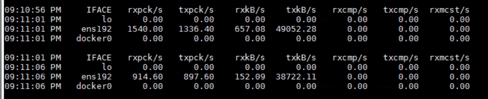
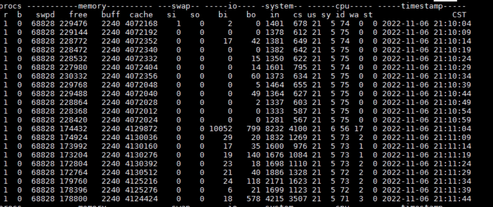
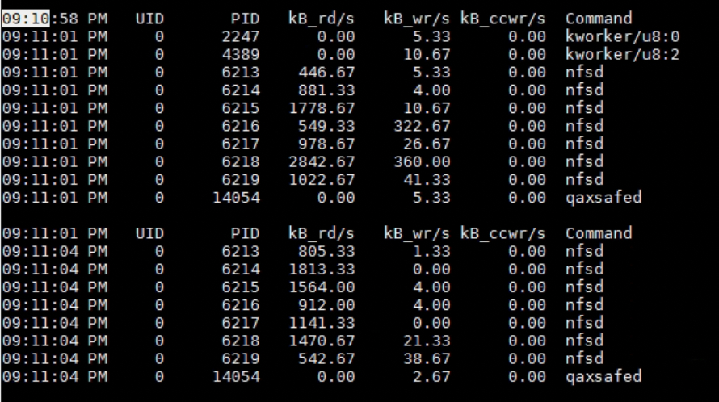
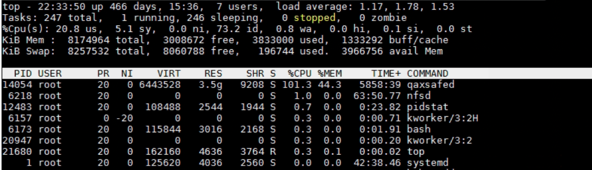
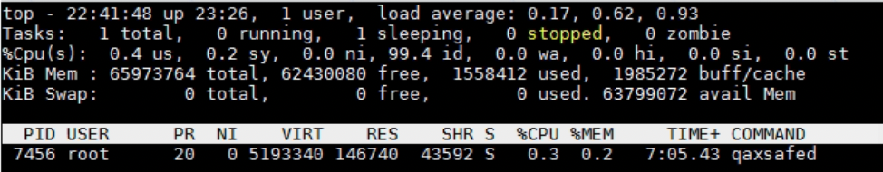
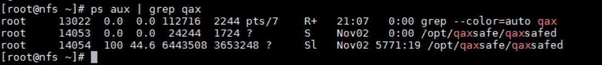

<!--more-->

## 现象

项目现场 K8S 集群上的某些应用时常出现无法访问的现象。

根据排查，发现是 redis 出现了重启，下面是 redis 挂掉之前的日志：



下面是 Pod 重启的次数：



那么基本可以断定是磁盘问题，而这个 Redis 是挂载 PVC 的，PVC 是 NFS，所以初步怀疑是 NFS 的问题。

那么究竟是 NFS 的磁盘问题，还是 NFS 的网络问题，需要进一步排查

## 排查 dmesg

进入 redis 所在服务器，`dmesg -T` 查看日志发现 nfs 服务器存在无响应或者响应超时的情况，时间和故障时间吻合：



再看 nfs 服务器的 dmesg，没有发现今日故障。

## 收集信息

在 nfs 服务器和 k8s node 上安装软件 `yum install -y sysstat nc telnet iostat iotop`

在 nfs 服务器上采集磁盘 IO、CPU 情况、网络情况：

```bash
# 网络流量统计
sar -n DEV 3 > sar.log
# 磁盘IO统计
pidstat -d 3 > pidstat-d.log
# CPU和磁盘IO统计
vmstat -t 3 > vmstat.log
```

在某个 k8s node 用 nc 测试和 nfs 是否能够建立 tcp 连接，写了个脚本，`nc-nfs.sh`：


```bash
while :
do
  date
  nc -zv <nfs-ip> 2049
  sleep 5
done
```

输出到文件：

```shell
./nc-nfs.sh > nc-nfs.log
```

## 等待故障发生

在 `21:09` 时，在 `dmesg` 中发现 nfs 服务器无响应了，故障重现了。

但是观察 k8s node 的 `nc-nfs.log`，期间网络都是通的。

再看 nfs 服务器，`sar.log`，`21:09` 时流量不高，只有几百 Kb/s，但是在 `21:11` 时流量稍高，发送流量有 38～49Mb/s。



发送流量意味着“读”的动作发生。

看 `vmstat.log`，`21:09` 没有什么特别，在`21:11` 有较高的 `bi`（读），而且 `wa`（iowait）有点高-17：



看 `pidstat-d.log`，也是，在`21:09`没有什么特别，在`21:11`发生了较高的读操作：



经检查，时间都是校准的，那么看来故障发生的时间点和流量高峰（也不算高峰只是稍微高一点）没什么关系。

## 模拟 NFS 高流量读写

进入 redis 容器，进入挂载 NFS 的目录 `/data`，在里面用 dd 模拟写操作（写 1G）：

```shell
dd if=/dev/zero of=dd.test bs=512k count=2000
```

然后再模拟读操作：

```shell
dd if=dd.test of=dd.test bs=512k
```

发现读写在 200～300Mb/s，再看 `dmesg -T`，期间也没有新的 nfs 报错。

## 僵局

网络通的、磁盘IO也没问题、高流量的 NFS 读写也没有问题，排查陷入了僵局。

偶然在 nfs 服务器上用 top，发现 `qaxsafed` 进程的 CPU 和 内存占用有点高：



对比其他 k8s node 上的这个进程，CPU 和内存占用都比较低：



发现它是 11月2号启动的：



## 奇安信

`qaxsafed` 是奇安信的服务器安全软件，死马当活马医 kill 这个进程，但是一会儿又复活了。

于是转移了它的目录，然后 kill，终于杀掉了：

```shell
mv /opt/qaxsafe /opt/qaxsafe1
pkill -9 qaxsafe
```

在所有服务器上都做了这个操作。

## 结束

之后 nfs 故障就再没出现过了。

关于安全软件，[这篇文章][1]有个清单。

## 后记

> 希望国内的安全软件厂商在把东西卖给客户之后，认证做好后续的实施培训工作。
> 
> 这个世界上不存在一套适用所有场景的安全规则和软件，也不要给客户宣传这种观念。
> 
> 安全软件的误伤导致的系统故障基本都是我们这些 ISV 背锅，因为客户比起我们更信任你们。
> 
> 要不是我水平高这锅还真是我给背了。

[1]: https://p.wpseco.cn/wiki/doc/621f2dfef6368a2f9e5c9903