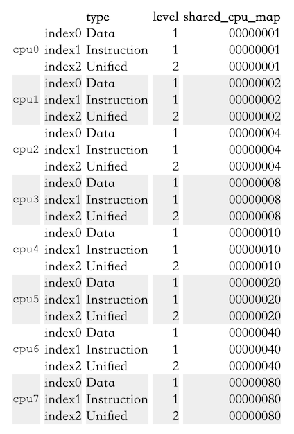
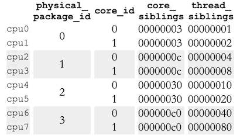

<!--more-->

原文：[What every programmer should know about memory, Part 4: NUMA support][origin]

# 5 NUMA Support

先回顾一下Section 2。

## 5.1 NUMA Hardware

Figure 2.3是最简单的NUMA形式，处理器可以有自己的本地内存，访问本地内存和其他处理器的本地内存的开销区别不大，即NUMA factor比较低。


**Figure 2.3: Integrated Memory Controller**

对于商业机器来说，所有处理器共享访问相同的内存，即所有处理器共享同一个北桥，导致所有流量都从北桥走，导致北桥成为瓶颈。虽然可以用定制化硬件代替北桥，但是内存芯片必须得支持多port才行，但是Multiport RAM很复杂很贵，所以几乎没有人会使用。


**Figure 5.1: Hypercubes**

一个高效的节点（处理器）拓扑是超立方体，它限定了节点数量为2<sup>C</sup>，C为每个节点的interconnect接口数量。超立方体拥有2<sup>n</sup>处理器系统的最小直径（两节点之间的最大距离）。看Figure 5.1，每个处理器的直径为C，这个是最小值。

*后面是已知的几种NUMA的硬件实现，这里就不写了。*

## 5.2 OS Support for NUMA

操作系统在分配内存的时候必须将NUMA考虑进去。比如一个进程运行在一个处理器上，那么为其所分配的内存应该来自于本地内存，否则所有的code和data都必须访问远程内存才可以。有一些特殊情况只有在NUMA下才需要考虑。text segment of DSOs通常情况下在物理内存中只存有一份，但如果DSOs被所有CPU的线程或进程所使用（比如`libc`），这就意味着少数处理器之外的所有处理器都要发生远程访问。理想情况下，操作系统会将DSO在每个处理器的本地物理RAM里做`mirror`，这是一种优化策略，不是一个要求，通常也很难实现。

操作系统不应该将一个进程或线程迁移到另一个处理器上。不过操作系统应该已经做了相关防范，因为迁移发生就意味着cache就要重新抓。如果为了负载的均衡，一定要把进程或线程从一个处理器迁移到另一个处理器，操作系统通常会随便选一个还剩有容量的处理器。不过在NUMA环境下，操作系统的选择有一点限制：被选择的新处理器内存访问开销不能比旧处理器大。如果找不到合适的处理器，那么只能使用开销更大的处理器。

针对上面的情况有两个可能的方法。第一个方法，我们可以期望这个情况是暂时的，之后进程可以被迁移回开销更小的处理器。另一个方法，可以把进程的内存页迁移到距离新处理器更近的地方。第二个方法的开销很大，因为要把大量内存从一个地方迁移到另一个地方，而且迁移期间旧的内存区域是不能修改的，此外还有诸多限制。操作系统应该尽量避免使用这种策略，只有当没办法的时候才能采用。

为了解决上述进程或线程迁移的情况，默认情况下，内存不是独占地分配到本地节点上的。会在所有节点上分配内存，这样一来进程或迁移就不会产生额外的内存访问开销。对于较小的NUMA factor（NUMA所带来的额外开销）这个策略是可接受的，但仍然不是最优的（见 Section 5.4），而且它实际上降低了性能。所以，Linux允许每个进程自己设定内存分配规则。

## 5.3 Published Information

内核通过`sys`伪文件系统提供处理器的cache信息：`/sys/devices/system/cpu/cpu*/cache`

在Section 6.2.1会介绍查询各个cache尺寸的接口。在这里我们关注cache的拓扑结构。上述每个目录都有一堆`index*`子目录对应不同的cache，里面有`type`、`level`、`shared_cpu_map`这些文件。下面是Intel Core 2 QX6700的信息：


**Table 5.1: sysfs Information for Core 2 CPU Caches**

从上面的数据可以看出：

* 每个核（为啥cpu0到cpu3都是核是从另一个地方知道的）拥有三个cache：L1d、L1i、L2
* L1d和L1i是每个核独占的，This is indicated by the bitmap in shared_cpu_map having only one set bit.
* cpu0和cpu1共享L1、cpu2和cpu3共享L2。

下面是一个four-socket, dual-core Opteron机器的cache信息：



**Table 5.2: sysfs Information for Opteron CPU Caches**

从下面这个路径可以看到处理器的拓扑结构：`/sys/devices/system/cpu/cpu*/topology`

可以看到每个核拥有自己的L1d、L1i、L2。

下表是SMP Opteron的处理器拓扑结构：



**Table 5.3: sysfs Information for Opteron CPU Topology**

结合Table 5.2和Table 5.3，可以看到没有hyper-thread（the `thread_siblings` bitmaps have one bit set）。而且实际上是4个处理器（`physical_package_id`0-3），每个处理器有两个核。

任何SMP Opteron机器都是一个NUMA机器，我们来看看NUMA信息`/sys/devices/system/node`。每个NUMA节点都有对应的子目录，子目录里有一些文件。下面是前面提到的机器的结果：


**Table 5.4: `sysfs` Information for Opteron Nodes**

所以我们可以看到这个机器的全貌：

* 这个机器有4个处理器。
* 每个处理器自成一个node，可以从`cpumap`文件里的bit看出来。
* `distance`文件描述了访问每个node的开销。本地开销为10，远程开销都是20。（不过这里的信息并不准确，至少有一个处理器要连接到南桥，所以至少有一对处理器的开销比20大）
* 所有处理器构成一个二维超立方体（Figure 5.1）

## 5.4 Remote Access Costs

AMD文档里写了4插口机器的NUMA开销：


**Figure 5.3: Read/Write Performance with Multiple Nodes**

可以0 Hop、两个1 Hop、2 Hop的读写性能差异。不过这个信息不太容易使用，Section 6.5 会将更简单好用的方法。

我们有可能知道memory-mapped files, Copy-On-Write (COW) pages and anonymous memory是如何分配在各个节点上的。每个进程有自己的NUMA相关的文件`/proc/<PID>/numa_maps`，看Figure 5.2：

```txt
00400000 default file=/bin/cat mapped=3 N3=3
00504000 default file=/bin/cat anon=1 dirty=1 mapped=2 N3=2
00506000 default heap anon=3 dirty=3 active=0 N3=3
38a9000000 default file=/lib64/ld-2.4.so mapped=22 mapmax=47 N1=22
38a9119000 default file=/lib64/ld-2.4.so anon=1 dirty=1 N3=1
38a911a000 default file=/lib64/ld-2.4.so anon=1 dirty=1 N3=1
38a9200000 default file=/lib64/libc-2.4.so mapped=53 mapmax=52 N1=51 N2=2
38a933f000 default file=/lib64/libc-2.4.so
38a943f000 default file=/lib64/libc-2.4.so anon=1 dirty=1 mapped=3 mapmax=32 N1=2 N3=1
38a9443000 default file=/lib64/libc-2.4.so anon=1 dirty=1 N3=1
38a9444000 default anon=4 dirty=4 active=0 N3=4
2b2bbcdce000 default anon=1 dirty=1 N3=1
2b2bbcde4000 default anon=2 dirty=2 N3=2
2b2bbcde6000 default file=/usr/lib/locale/locale-archive mapped=11 mapmax=8 N0=11
7fffedcc7000 default stack anon=2 dirty=2 N3=2
```

**Figure 5.2: Content of `/proc/PID/numa_maps`**

主要看N0和N3的值，这个是分配到node 0和3的页的数量。所以可以大概猜到进程执行在node 3的核心上。read-only mapping，比如第一个`ld-2.4.so`和`libc-2.4.so`和`locale-archive`则分配在别的node上。

下面是真实的测试，和Figure 5.3的数据做比较，不过测试的是1 hop远程访问：


**Figure 5.4: Operating on Remote Memory**

可以看到read总是比本地访问慢20%，这个和Figure 5.3的数据不符合，到底为啥只有AMD自己知道了。图里的几个尖刺可以忽略，这是因为测量多线程代码本身的问题。

看write的比较，当working set size能够放进cache的时候，也是慢20%。当working set size超出cache的的时候，write和local访问差不多，这是因为此时会直接访问RAM，访问RAM的开销占大头，interconnect开销占小头。

[origin]: https://lwn.net/Articles/254445/
