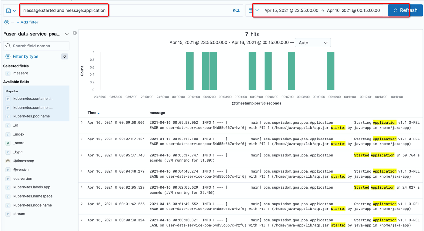
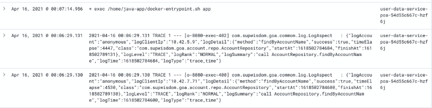
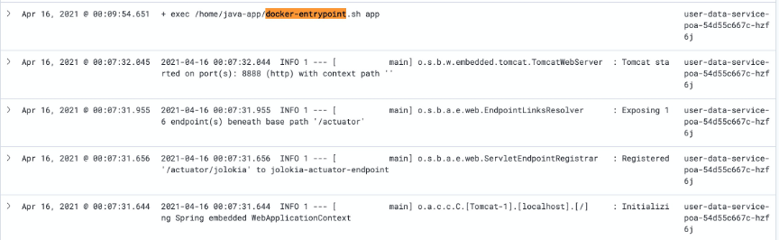
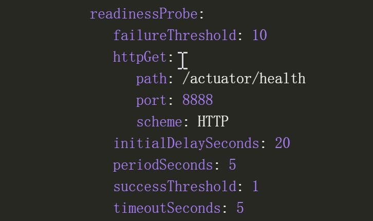

<!--more-->

## 现象

在公司自己研发的网关上观察到在每天的某段时间内API调用失败量剧增，之后又缓慢恢复的情况。

## 观察网关日志

查阅日志发现，在同一时间段内，发生与user-data-service（提供API的某个服务）通信失败的错误：

```bash
dial tcp xxx.xxx.xxx.xxx:8080: connect: no route to host
```

## 观察user-data-service的日志

看到这个情况就怀疑该服务存在重启，因此在日志中搜索 `started` 关键词，找到以下内容：



发现在同时间段内，发生过几次重启。

再观察重启前后的日志，发现几种情况：

情况一：重启前，没有异常日志



情况二：前一次重启未成功，然后发生了另一次重启



## 观察容器内的JVM日志文件

该服务的镜像提供了保存JVM GC、JVM崩溃日志的功能，但可惜部署的时候没有给日志目录挂载emptyDir卷，因此Pod重启之后内容就丢失了。

## 观察Deployment的设置

发现配置了ReadinessProbe：



但是ReadinessProbe在探测失败的时候，只会切断Service->Pod的流量，重启Pod。

内存配置的有点小，只有512Mi：


## 结果

把内存调整到1024Mi之后，观察一天，该问题消除。