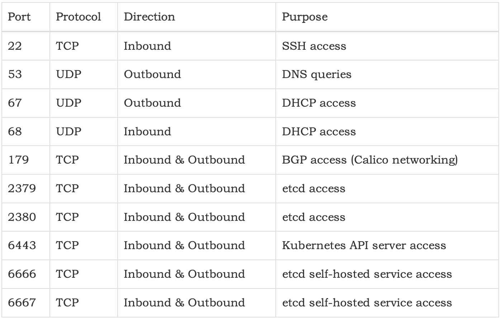

<!--more-->

本文介绍如何使用 calico 来给 k8s 节点设置防火墙规则。

为何使用 calico 是因为你直接在 iptables 上设置没用，因为 calico 会定期刷新规则。

如果你的 k8s 没有使用 calico 网络插件，那么忽略此文。

## 关闭内置防火墙

先关闭每个节点上的 ufw 和 firewalld 服务，当然默认应该是关闭的。

## 创建 GlobalNetworkSet

创建若干 GNS，你允许这些 GNS 来访问你的 k8s 节点。

下面是创建 yaml 模板：

```yaml
apiVersion: projectcalico.org/v3
kind: GlobalNetworkSet
metadata:
  name: <名字>
  labels:
    role: internal-net
spec:
  nets:
  - <ip/cidr>
  - <ip>
```

后面假设 GNS 的名字叫做 `allow-ips`。

## 配置 FelixConfiguration

```shell
kubectl patch FelixConfiguration default --type=merge --patch='{"spec": {"defaultEndpointToHostAction": "Accept"}}'
```

## 创建 GlobalNetworkPolicy

这里就是创建防火墙规则，规则不会生效，直到创建了 HostEndpoint 为止。

### 出站策略

允许所有 host 和容器的出站流量。

```yaml
apiVersion: projectcalico.org/v3
kind: GlobalNetworkPolicy
metadata:
  name: allow-outbound-external
spec:
  selector: has(kubernetes-host)
  order: 10
  egress:
    - action: Allow
```

### 入站策略

允许上述 GNS 分组 + K8S 本身的节点（见下面的“创建 HostEndpoint”），可以访问下列端口：

```
22/tcp
80/tcp
443/tcp
2376/tcp
2379/tcp
2380/tcp
6443/tcp
8472/udp
9099/tcp
10250/tcp
10254/tcp
30000:32767/tcp
30000:32767/udp
```

注意：上述端口是 Rancher 部署时需要的端口，如果现场部署安装时更改了这些默认端口号，这里的规则也要同步修改。

```yaml
apiVersion: projectcalico.org/v3
kind: GlobalNetworkPolicy
metadata:
  name: allow-inbound-cluster-internal
spec:
  selector: has(kubernetes-host)
  order: 10
  preDNAT: true
  applyOnForward: true
  ingress:
  - action: Allow
    protocol: TCP
    source:
      selector: has(kubernetes-host) || role == 'internal-net'
    destination:
      ports: [22,80,443,2376,2379,2380,6443,9099,10250,10254,30000:32767]
  - action: Allow
    protocol: UDP
    source:
      selector: has(kubernetes-host) || role == 'internal-net'
    destination:
      ports: [8472,30000:32767]
  - action: Allow
    protocol: ICMP
```

## 创建 HostEndpoint

给每个 K8S 节点，包括 master 和 worker，创建一个 Calico HostEndpoint。需要注意的是：

* 若一个节点没有对应的 HostEndpoint ，是没有任何防火墙规则的。
* 因此当新增节点的时候，也要对应的创建 HostEndpoint。
* 另外，因为前面防火墙规则的特殊性，如果不给新增节点创建 HostEndpoint，那么它和其他节点的通信是会有问题的。

先得到节点上网卡的名字，下例中 `eth0` 就是网卡的名字。

给所有 Node 加上 label：

```shell
kubectl label nodes --all kubernetes-host=
```

使用下面模版给每个 K8S 节点创建对应的 HostEndpoint：

```yaml
apiVersion: crd.projectcalico.org/v1
kind: HostEndpoint
metadata:
  labels:
    kubernetes-host: ""
  name: <节点的名字>
spec:
  expectedIPs:
  - <节点的IP>
  interfaceName: '<节点网卡的名字>'
  node: <节点的名字>
```

如果节点上有两个网卡，那么使用下面的模板：

```yaml
apiVersion: crd.projectcalico.org/v1
kind: HostEndpoint
metadata:
  labels:
    kubernetes-host: ""
  name: <节点的名字>
spec:
  expectedIPs:
  - <网卡1的IP>
  - <网卡2的IP>
  interfaceName: '*'
  node: <节点的名字>
```

## 其他

根据 Calico 的 [Protect hosts][1] ，下面这些端口及其出入站方向，是不受防火墙规则控制的，它们是完全放开的。

这是为了避免因为防火墙规则误配导致节点完全失联从而导致无法恢复。

你就算写一个完全拒绝 22 端口的防火墙规则，Callico 也不会阻拦。



如果你想对上述端口应用防火墙规则，你需要修改[Calico - Felix configuration][2] 的 `failsafeInboundHostPorts` 和 `failsafeOutboundHostPorts`，把默认值中的端口拿掉，修改的时候千万小心。

另外，虽然 calico 文档 [Protect Kubernetes nodes][4] 里提到可以全自动给 K8S 节点创建 HostEndpoint，但实践中发现了一些网络故障。

这个 [issue][5] 描述了这个问题。

## 参考文档

* [Calico - Protect hosts tutorial][3]
* [calico - Apply policy to forwarded traffic][6]
* [Calico - Felix configuration][2]

[1]: https://docs.tigera.io/archive/v3.17/security/protect-hosts#avoid-accidentally-cutting-all-host-connectivity
[2]: https://docs.tigera.io/archive/v3.17/reference/resources/felixconfig
[3]: https://docs.tigera.io/archive/v3.17/security/tutorials/protect-hosts
[4]: https://docs.tigera.io/archive/v3.17/security/kubernetes-nodes
[5]: https://github.com/projectcalico/calico/issues/4478
[6]: https://docs.tigera.io/archive/v3.17/security/host-forwarded-traffic