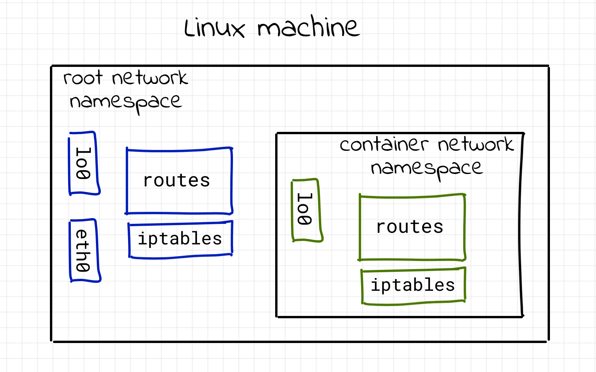
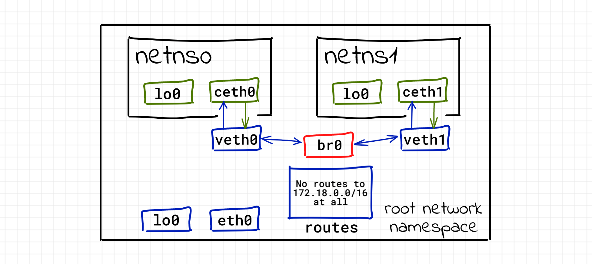
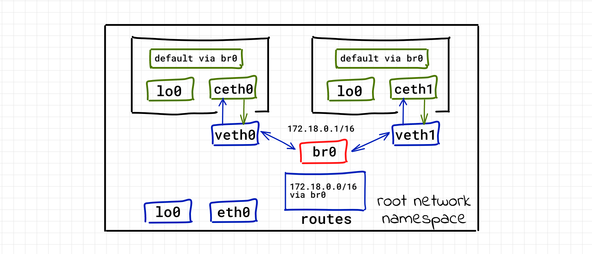

<!--more-->

本文通过模拟搭建容器网络来了解其原理。

## network namespace

众所周知，容器就是进程，只不过被隔离在 Linux 的各种 namespace中，关于网络的 namespace 就是 network namespace。

Host 上有一个 root network namespace，它有独立的路由表、iptables、网卡等。而容器的 network namespace 也有这些东西，如下图：



你可以新建一个 network namespace：

```shell
$ sudo ip netns add netns0
$ sudo ip netns show
netns0
```

新建的 network namespace 有一个对应的文件 `/var/run/netns/<namespace>` （不过 docker 不会创建文件），你可以通过 `nsenter` 进入来执行命令

```shell
$ sudo nsenter --net=/var/run/netns/netns0 bash
$ ip link
1: lo: <LOOPBACK> mtu 65536 qdisc noop state DOWN mode DEFAULT group default qlen 1000
    link/loopback 00:00:00:00:00:00 brd 00:00:00:00:00:00
# 记得 exit 来退出 namespace
$ exit
```

可以发现 namespace 中只有一张 loopback 网卡。

上述命令你也可以通过 `sudo ip netns exec <namespace> ...` 来达到同样效果。

```shell
$ sudo ip netns exec netns0 ip link
# 或者
$ sudo ip netns exec netns0 bash
$ ip link
```

## 容器连通容器

你可以新建两个容器（namespace），创建一个交换机（`bridge` 设备），给容器接一根网线（ `veth` 设备）到交换机上，这样他们就能够互相通信。




新建 `netns0` 容器，添加 `veth` （网线）设备：

```shell
$ sudo ip netns add netns0
$ sudo ip link add veth0 type veth peer name ceth0
$ sudo ip link set veth0 up
$ sudo ip link set ceth0 netns netns0
```

假想 `veth` 设备是一根网线，一头 `veth0` 在 root namespace，一头 `ceth0` 在 `netns0` namespace。

把容器内的 peer 拉起来，并分配一个 IP 地址：

```shell
$ sudo nsenter --net=/var/run/netns/netns0
$ ip link set lo up
$ ip link set ceth0 up
$ ip addr add 172.18.0.10/16 dev ceth0
$ exit
```

同理新建 `netns1` 容器，做上面类似的工作：

```shell
$ sudo ip netns add netns1
$ sudo ip link add veth1 type veth peer name ceth1
$ sudo ip link set veth1 up
$ sudo ip link set ceth1 netns netns1

$ sudo nsenter --net=/var/run/netns/netns1
$ ip link set lo up
$ ip link set ceth1 up
$ ip addr add 172.18.0.20/16 dev ceth1
$ exit
```

创建一个 `br0 bridge` 设备（交换机），并拉起来：

```shell
$ sudo ip link add br0 type bridge
$ sudo ip link set br0 up
```

把刚才创建的两个网线插到交换机上：

```shell
$ sudo ip link set veth0 master br0
$ sudo ip link set veth1 master br0
```

然后测试它们之间是否能互相 ping 通：

```shell
$ sudo nsenter --net=/var/run/netns/netns0
$ ping -c 2 172.18.0.20
PING 172.18.0.20 (172.18.0.20) 56(84) bytes of data.
64 bytes from 172.18.0.20: icmp_seq=1 ttl=64 time=0.259 ms
64 bytes from 172.18.0.20: icmp_seq=2 ttl=64 time=0.051 ms
```

```shell
$ sudo nsenter --net=/var/run/netns/netns1
$ ping -c 2 172.18.0.10
PING 172.18.0.10 (172.18.0.10) 56(84) bytes of data.
64 bytes from 172.18.0.10: icmp_seq=1 ttl=64 time=0.037 ms
64 bytes from 172.18.0.10: icmp_seq=2 ttl=64 time=0.089 ms
```

而它们也能发现彼此：

```shell
$ sudo nsenter --net=/var/run/netns/netns0
$ ip neigh
172.18.0.20 dev ceth0 lladdr 6e:9c:ae:02:60:de STALE
$ exit

$ sudo nsenter --net=/var/run/netns/netns1
$ ip neigh
172.18.0.10 dev ceth1 lladdr 66:f3:8c:75:09:29 STALE
$ exit
```

## 容器连通 root namespace

好了，通过前面的一番操作，两个容器之间的通信建立了。

但是你是无法 ping 通 host 的（root namespace `eth0` 网卡）的：

```shell
$ sudo nsenter --net=/var/run/netns/netns0
$ ping 10.0.2.15  # eth0 address
connect: Network is unreachable
```

而 host 也是无法 ping 通容器的：

```shell
$ ping -c 2 172.18.0.10
PING 172.18.0.10 (172.18.0.10) 56(84) bytes of data.
From 213.51.1.123 icmp_seq=1 Destination Net Unreachable
From 213.51.1.123 icmp_seq=2 Destination Net Unreachable
```


你需要给 `br0` 设备分配一个 IP 地址：

```shell
$ sudo ip addr add 172.18.0.1/16 dev br0
```

这条命令也会在 host 上添加一条路由规则，让前往 `172.18.0.0/16` 的 IP 包走 `br0` 出去：

```shell
$ ip route
# ... omitted lines ...
172.18.0.0/16 dev br0 proto kernel scope link src 172.18.0.1
```

然后就通了：

```shell
$ ping -c 2 172.18.0.10
PING 172.18.0.10 (172.18.0.10) 56(84) bytes of data.
64 bytes from 172.18.0.10: icmp_seq=1 ttl=64 time=0.036 ms
64 bytes from 172.18.0.10: icmp_seq=2 ttl=64 time=0.049 ms
```

但是容器 ping host 还是不通的，需要为其添加路由规则：

```shell
$ sudo nsenter --net=/var/run/netns/netns0
$ ip route add default via 172.18.0.1
$ ping -c 2 10.0.2.15
PING 10.0.2.15 (10.0.2.15) 56(84) bytes of data.
64 bytes from 10.0.2.15: icmp_seq=1 ttl=64 time=0.036 ms
64 bytes from 10.0.2.15: icmp_seq=2 ttl=64 time=0.053 ms
```

于是就形成了如下拓扑：



## 容器连通外界

到这里，你还是不能够从容器连通外部世界的：

```shell
$ sudo nsenter --net=/var/run/netns/netns0
$ ping 223.5.5.5
...
```

这是因为你的包虽然通过容器的路由表发给了 `br0`，而 `br0` 又通过 root namespace 的路由表发给了它的路由器，**但是**，响应的包是没有办法返回给容器的，因为容器的地址不在它们的路由表内，它压根就不知道容器的子网。

这个时候就需要为来自容器子网 `172.18.0.0/16` 的 IP 包做一次 Masquerade（还记得吗，这是 SNAT 的一种特殊形式）：

```shell
$ sudo iptables -t nat -A POSTROUTING -s 172.18.0.0/16 ! -o br0 -j MASQUERADE
```

然后你试试，这就通了：

```shell
$ sudo nsenter --net=/var/run/netns/netns0
$ ping -c 2 223.5.5.5
PING 223.5.5.5 (223.5.5.5) 56(84) bytes of data.
64 bytes from 223.5.5.5: icmp_seq=1 ttl=61 time=43.2 ms
64 bytes from 223.5.5.5: icmp_seq=2 ttl=61 time=36.8 ms
```

## 容器端口发布

现在模拟一下 docker 的端口发布，即通过 host 的端口访问到容器端口。

下面在容器内启动一个 http 服务器监听 5000 端口：

```shell
$ sudo nsenter --net=/var/run/netns/netns0
$ python3 -m http.server --bind 172.18.0.10 5000
```

你在 host 上访问是可以的：

```shell
# From root namespace
$ curl 172.18.0.10:5000
<!DOCTYPE HTML PUBLIC "-//W3C//DTD HTML 4.01//EN" "http://www.w3.org/TR/html4/strict.dtd">
# ... omitted lines ...
```

但是如果你访问 `<host ip>:5000` 是不可以的：

```shell
$ curl http://10.0.2.15:5000
curl: (7) Failed to connect to 10.0.2.15 port 5000: Connection refused
```

通过 iptables 发布端口：

```shell
# 为来自外部的流量做 DNAT
$ sudo iptables -t nat -A PREROUTING -d 10.0.2.15 -p tcp -m tcp --dport 5000 -j DNAT --to-destination 172.18.0.10:5000

# 为来自 host 自己的流量做 DNAT（因为本地流量不会经过 PREROUTING chain）
$ sudo iptables -t nat -A OUTPUT -d 10.0.2.15 -p tcp -m tcp --dport 5000 -j DNAT --to-destination 172.18.0.10:5000
```

然后再启用 `br_netfilter` 模块（iptables 可以拦截 bridge 流量了）：

```shell
sudo modprobe br_netfilter
```

最后测试一下，通了：

```shell
curl http://10.0.2.15:5000
<!DOCTYPE HTML PUBLIC "-//W3C//DTD HTML 4.01//EN" "http://www.w3.org/TR/html4/strict.dtd">
# ... omitted lines ...
```

## docker 网络模式

* `host` 模式：容器用的就是 root network namespace
* `none` 模式：在自己的 namespace 里，但是没有添加 `veth`
* `bridge` 模式：就是我们之前模拟的过程

## 参考资料

* [Container Networking Is Simple][cont-net-easy]
* [veth(4)][veth-man]
* [bridge(8)][bridge-man]

[cont-net-easy]: https://iximiuz.com/en/posts/container-networking-is-simple/
[veth-man]: https://man7.org/linux/man-pages/man4/veth.4.html
[bridge-man]: https://man7.org/linux/man-pages/man8/bridge.8.html