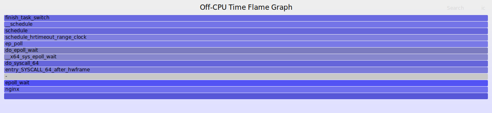
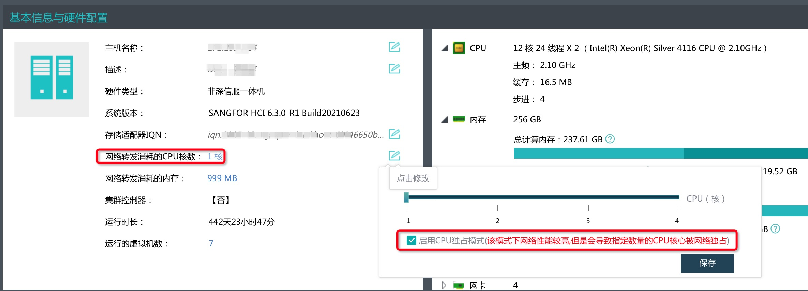
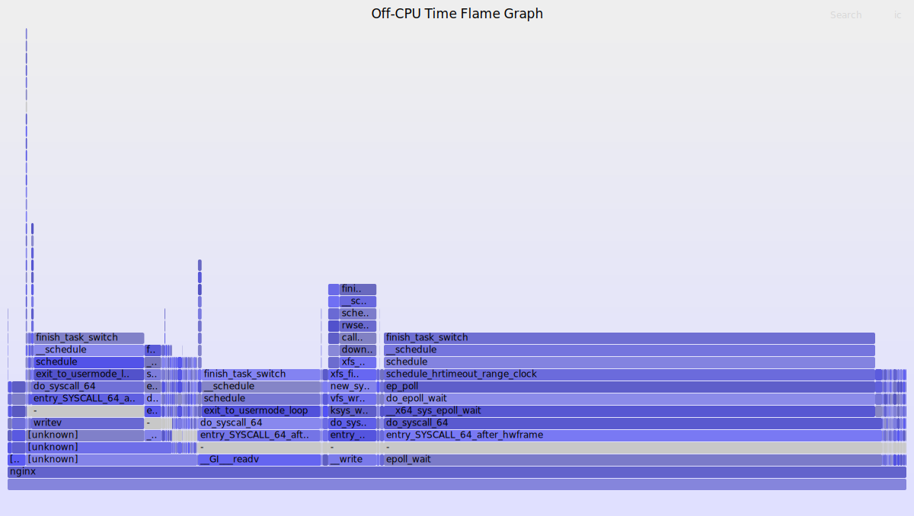

<!--more-->

## 环境

* 拓扑：`Wrk --> Nginx --> Tomcat`
* 三者是部署在同一个物理服务器上的 3 个虚拟机
* 三者都是 4c 4g配置
* 三者操作系统相同，都是 Anolis Linux 8.6
* 三者之间的带宽用 iperf3 测试过，可达 14~16Gbits/s

软件版本：

* [wrk](https://github.com/wg/wrk) master 最新版
* Nginx 1.23.3
* Tomcat 8.5.85，配置了 `-Xms2G -Xmx2G`，这个配置可以避免 Full GC
* 测试的是 Tomcat 下的 `/docs/config/filter.html` 地址，这个地址响应大小在 ~91K

测试脚本：

```shell
./wrk -c 500 -t 4 -d 1m --latency  http://<tomcat-ip>:8080/docs/config/filter.html
./wrk -c 500 -t 4 -d 1m --latency  http://<nginx-ip>:8080/docs/config/filter.html
```

nginx 配置：

```
user  nginx;
worker_processes  4;
worker_cpu_affinity 0001 0010 0100 1000;

worker_rlimit_nofile 30000;

error_log  /var/log/nginx/error.log notice;
pid        /var/run/nginx.pid;

events {
    use epoll;
    multi_accept on;
    worker_connections  7500;
}

http {
    include       /etc/nginx/mime.types;
    default_type  application/octet-stream;

    log_format  main  '$remote_addr - $remote_user [$time_local] "$request" '
                      '$status $body_bytes_sent "$http_referer" '
                      '"$http_user_agent" "$http_x_forwarded_for"';

    access_log  /var/log/nginx/access.log  main;

    sendfile        on;
    #tcp_nopush     on;

    keepalive_timeout  65;
    keepalive_requests 1000;

    proxy_connect_timeout 15s;
    proxy_read_timeout 10s;

    proxy_send_timeout 10s;
    proxy_buffering on;
    proxy_buffers 16 128k;
    proxy_busy_buffers_size 512k;
    proxy_socket_keepalive on;

    upstream tomcat_server {
        server <tomcat-ip>:8080 max_fails=20;
        keepalive 1000;
        keepalive_requests 10000;
        keepalive_time 1h;
        keepalive_timeout 60s;
    }
    
    server {
        listen       8080 reuseport;
        server_name  localhost;

        location / {
            proxy_set_header Host $host;
            proxy_set_header X-Forwarded-Proto $scheme;
            proxy_set_header X-Forwarded-Port $server_port;
            proxy_set_header X-Forwarded-For $proxy_add_x_forwarded_for;
            proxy_pass http://tomcat_server;
            proxy_http_version 1.1;
            proxy_set_header Connection "";
            proxy_read_timeout 900s;
        }
    }
}
```

## 现象

### 吞吐量损耗严重

直压 Tomcat：

```shell
  4 threads and 500 connections
  Thread Stats   Avg      Stdev     Max   +/- Stdev
    Latency    62.59ms   55.90ms 734.80ms   84.47%
    Req/Sec     2.30k   426.21     4.09k    75.95%
  Latency Distribution
     50%   47.14ms
     75%   91.74ms
     90%  128.89ms
     99%  264.21ms
  548199 requests in 1.00m, 47.64GB read
Requests/sec:   9122.52
Transfer/sec:    811.76MB
```

压 Nginx：

```shell
  4 threads and 500 connections
  Thread Stats   Avg      Stdev     Max   +/- Stdev
    Latency   118.55ms  117.78ms   1.60s    87.93%
    Req/Sec     1.27k   257.82     2.09k    70.84%
  Latency Distribution
     50%  101.58ms
     75%  175.02ms
     90%  256.53ms
     99%  525.25ms
  303731 requests in 1.00m, 26.40GB read
Requests/sec:   5056.02
Transfer/sec:    449.97MB
```

发现吞吐量的性能损失在 (9122 - 5056) / 9122 = 44% 左右。同时延迟也有显著的增加。

### CPU 空闲

看 top，发现压测期间 Nginx 服务器的 CPU 使用率只有 50% 左右：

```
top - 10:02:00 up 1 day, 18:49,  1 user,  load average: 1.45, 0.91, 0.45
Tasks: 154 total,   4 running, 150 sleeping,   0 stopped,   0 zombie
%Cpu(s):  6.5 us, 16.5 sy,  0.0 ni, 48.8 id,  0.0 wa,  0.0 hi, 27.4 si,  0.8 st
MiB Mem :   3708.1 total,   1912.4 free,    272.5 used,   1523.2 buff/cache
MiB Swap:   4032.0 total,   4032.0 free,      0.0 used.   3206.9 avail Mem

    PID USER      PR  NI    VIRT    RES    SHR S  %CPU  %MEM     TIME+ COMMAND
3379959 nginx     20   0   81668  12272   4432 R  30.6   0.3   1:04.68 nginx
3379958 nginx     20   0   82336  13072   4432 R  29.9   0.3   0:59.11 nginx
3379957 nginx     20   0   80680  11552   4432 R  25.9   0.3   0:52.61 nginx
3379956 nginx     20   0   81240  11972   4428 S  25.2   0.3   0:53.03 nginx
```

看 pidstat 查看 Nginx 进程的 CPU 利用率和进程上下文切换情况，发现存在较高的 %wait，以及比较稳定的 cswch/s：

```shell
pidstat -G nginx -u -w 1

10时05分17秒     USER       PID    %usr %system  %guest   %wait    %CPU   CPU  Command
10时05分18秒    nginx   3379956    5.00   18.00    0.00   16.00   23.00     0  nginx
10时05分18秒    nginx   3379957    6.00   20.00    0.00   16.00   26.00     1  nginx
10时05分18秒    nginx   3379958    5.00   23.00    0.00   18.00   28.00     2  nginx
10时05分18秒    nginx   3379959    6.00   24.00    0.00   16.00   30.00     3  nginx

10时05分17秒     USER       PID   cswch/s nvcswch/s  Command
10时05分18秒    nginx   3379956    938.00      0.00  nginx
10时05分18秒    nginx   3379957    969.00      0.00  nginx
10时05分18秒    nginx   3379958    802.00      0.00  nginx
10时05分18秒    nginx   3379959    827.00      0.00  nginx
```

关于 %wait 和 cswch/s 的解释：

> %wait: Percentage of CPU spent by the task while waiting to run.
> 
> cswch/s: Total number of voluntary context switches the task made per second.  A voluntary context switch occurs when a task blocks because it requires a resource that is unavailable.

### Off CPU 时间较多

针对 %wait 较高这个现象，使用 bcc offcputime 来采样 Off-CPU 事件，采样 30 秒：

```shell
/usr/share/bcc/tools/offcputime -df -p $(pgrep -nx nginx) 30 > offcpu.stacks \
&& /root/FlameGraph/flamegraph.pl --color=io --title="Off-CPU Time Flame Graph" --countname=us < offcpu.stacks > /usr/share/nginx/html/offcpu.svg
```

发现 Off CPU 的时间高达 16.8s 左右（[点击此处进入交互界面](origin-offcpu.svg)）：



要特别注意的是，这里采集的是单个 nginx 进程（总共有 4 个）所绑定的 CPU 的 Off CPU 时间，也就是说在 30s 时间内，这颗 CPU 有 16.8s 超过 50% 的时间是闲着的。

## 解决办法

试了很多解决办法，找了很多工具，调了很多参数，但是都没有效果。

最终在深信服的 aCloud 管理后台里看到了这个参数：



尝试将其改成 4 核独占之后，性能有显著提升。

## 优化之后

### 吞吐量损耗降低且整体吞吐量提升明显

压 Tomcat 的结果：

```shell
  4 threads and 500 connections
  Thread Stats   Avg      Stdev     Max   +/- Stdev
    Latency    60.17ms  105.13ms   1.03s    86.99%
    Req/Sec     6.42k     1.18k   10.03k    76.11%
  Latency Distribution
     50%   13.72ms
     75%   38.80ms
     90%  208.72ms
     99%  471.67ms
  1507277 requests in 1.00m, 130.93GB read
Requests/sec:  25082.70
Transfer/sec:      2.18GB
```

压 Nginx 的结果：

```shell
  4 threads and 500 connections
  Thread Stats   Avg      Stdev     Max   +/- Stdev
    Latency    48.61ms   77.76ms 827.67ms   87.91%
    Req/Sec     5.65k     1.03k    8.53k    77.67%
  Latency Distribution
     50%   16.63ms
     75%   35.39ms
     90%  150.32ms
     99%  360.11ms
  1329066 requests in 1.00m, 115.50GB read
Requests/sec:  22138.86
Transfer/sec:      1.92GB
```

首先，吞吐量整体提升有明显提升，直压 Tomcat 从 9122 QPS 提升到了 25082 QPS，压 Nginx 从 3959 QPS 提升到了 22138 QPS。

同时，吞吐量性能损失降低明显，从原来的 44% 的损失降低到了现在的 (25082 - 22138) / 25082 = 11%。

### CPU 利用率提升

pidstat 方面也有显著提升： 

* CPU 利用率显著提升，从原来的 ~30% 提升到了 ~80%
* `%wait` 的比例从原来的 ~16% 降到了 ~4%
* cswch/s（自愿上下文切换）从原来的 ~800 降到了 ~500 左右
* 不过 nvcswch/s (非自愿上下文切换）从原来的 0 升到了 ~30，这说明 CPU 繁忙了存在调度切换，是正常现象。

```shell
平均时间:   UID       PID    %usr %system  %guest   %wait    %CPU   CPU  Command
平均时间:   990   3515387   13.01   67.56    0.00    3.36   80.57     -  nginx
平均时间:   990   3515388   13.82   68.24    0.00    3.42   82.07     -  nginx
平均时间:   990   3515389   13.01   65.38    0.00    4.55   78.39     -  nginx
平均时间:   990   3515390   13.64   67.25    0.00    3.61   80.88     -  nginx

平均时间:   UID       PID   cswch/s nvcswch/s  Command
平均时间:   990   3515387    435.74     28.70  nginx
平均时间:   990   3515388    359.90     31.63  nginx
平均时间:   990   3515389    527.46     38.17  nginx
平均时间:   990   3515390    418.62     32.13  nginx
```

### Off CPU 时间减少

再用 bcc offcputime 采样 30 秒内的 off cpu 时间：

```shell
/usr/share/bcc/tools/offcputime -df -p $(pgrep -nx nginx) 30 > offcpu.stacks \
&& /root/FlameGraph/flamegraph.pl --color=io --title="Off-CPU Time Flame Graph" --countname=us < offcpu.stacks > /usr/share/nginx/html/offcpu.svg
```

发现显著总体时间显著减少，只有 2.5s 左右（[点击此处进入交互界面](optimized-offcpu.svg)）：



对比之前的 16.8s 有显著的降低。

## 结论

分配给物理机用于处理网络转发的 CPU 数量对于虚拟机内的网络性能存在显著影响，适当增加 CPU 数量对性能有显著的好处。

## 题外话

在优化前后都使用 iperf3 做了测试，测试结果没有明显的差别，这里应该是 iperf3 和 wrk 压测机制不同有关。

也许 iperf3 只能用来测试带宽，无法测试网络的并发处理性能或者网络包的转发性能？

