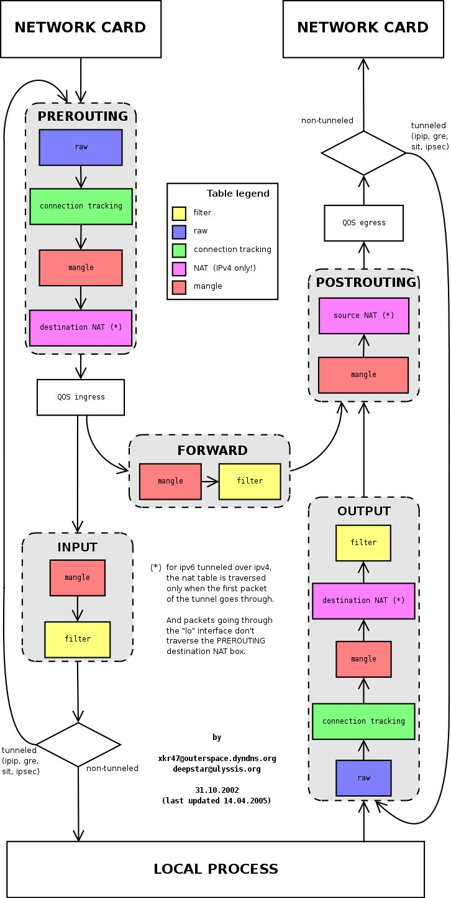
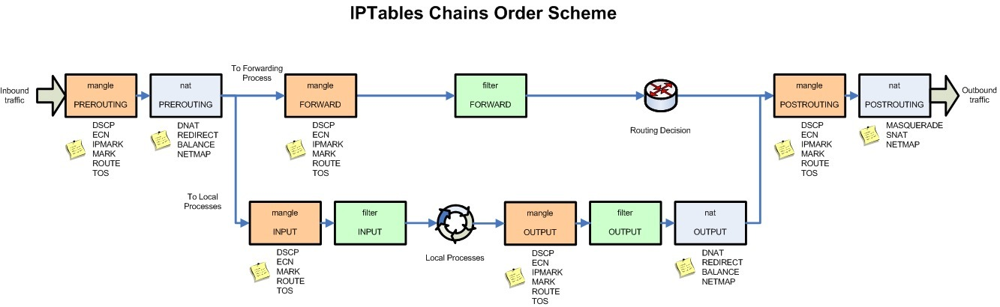

<!--more-->

[iptables][ipt] 是 [netfilter][nf-site] 的一个子项目，在 Linux 内核 3.13 之后 推出了 [nftables][nft] 作为 iptables 的后继项目。

在较新的 RHEL 发行版中，iptables 依然存在，只不过其 backend 已经切换成了 nftable：

```shell
iptables -V
iptables v1.8.4 (nf_tables)
```

## 规则结构

iptables 的可以用于对 IP 包（IP 协议的包）进行过滤、转发、修改，最常见的用途是作为防火墙，但是它的功能不仅仅局限于此。

iptables 的执行依赖于一系列规则，结构是：Table > Chain > Rule > Target

* Table：
  * 内置 Table 有 filter、nat、mangle、raw。
  * 不允许用户自定义 table。
* Chain：
  * 内置 Chain：INPUT、FORWARD、PREROUTING、POSTROUTING、OUTPUT。
  * 用户也可以自定义 Chain。
  * 每个 Table 能使用的内置 Chain 不同。
  * Chain 下面有一系列 Rule 列表。
  * IP 包进入 Chain 后按照顺序匹配 Rule。
  * 把所有 Rule 都过了一遍之后没有找到 Target，那么 Chain 的 Policy 就是 Target。
* Rule：
  * IP 包匹配规则，并决定 Target。
  * 如果匹配，把 IP 包交给设定的 Target。
  * 如果匹配但是没有设定 Target，则 Chain 会继续执行后面的 Rule。
* Target：
  * 决定 IP 包的去向。
  * 可以是内置 Target，比如 ACCEPT、DROP、SNAT、DNAT、MASQUERADE。
  * 也可以用户自定义 Chain。
  * 内置 Target 的使用受限于当前在哪个 Table 和哪个 Chain。

## 内置 Table

iptables 内置了 4 大 table：`raw`、`filter`、`nat`、`mangle`。

每个内置 table 所内置的 Chain 不同，看下表：

| Chain       | raw | filter | nat | mangle |
|------------:|:---:|:------:|:---:|:------:|
| PREROUTING  |  Y  |        |  Y  |   Y    |
| INPUT       |     |   Y    |     |   Y    |
| OUTPUT      |  Y  |   Y    |  Y  |   Y    |
| POSTROUTING |     |        |  Y  |   Y    |
| FORWARD     |     |   Y    |     |   Y    |

## Chain 的顺序

下图从内置 Chain 的角度出发，描述了 IP 包如何进入、流出 Chain 的过程，以及 Table 和 Chain 的关系。

比如 Chain `PREROUTING` 在 Table `raw`、`mangle`、`nat` 中存在：




## Chain 对应 Target

下图从另一个角度描述了 IP 包如何经过内置 Chain 和 Table，以及允许的内置 Target。

比如 Table `nat` 的 Chain `PREROUTING`，的可用 Target 有 `DNAT`、`REDIRECT`、`BALANCE`、`NETMAP`。



## 基本命令

iptables 的基本命令结构如下：

```shell
iptables -t <table> <cmd> <chain> ...
```

* `-t <table>` 代表操作的是哪个 table，如果不指定则默认是 `filter` table。
* `cmd` 代表对 chain 的操作，比如新建、删除、添加规则、插入规则 等等，后面会讲。
* `<chain>` 代表是对哪个 chain 进行操作。

**列出规则：**

```shell
# 列出所有 chain 的规则（-n 避免 DNS 解析）
iptables -t <table> -n -L
# 列出某个 chain 的规则
iptables -t <table> -n -L <chain>
# 显示规则拦截的包的数量和字节数 -v 
iptables -t <table> -nv -L <chain>
# 列出规则的序号
iptables -t <table> -nv -L <chain> --line-numbers
```

**清空 chain 的包和字节计数：**

```shell
# 清空所有 chain 的包和字节计数
iptables -t <table> -Z
# 清空某个 chain 的包和字节计数
iptables -t <table> -Z <chain>
```

**追加规则**，在 chain 的尾部添加新规则：

```shell
iptables -t <table> -A <rule>
```

**插入规则**，在 chain 的某个位置插入规则：

```shell
# 先用 -L --line-numbers 确定要插入的位置
iptables -t <table> -I <rulenum> <rule>
```

**删除规则：**

```shell
# （推荐）根据 rule 的定义来删除
iptables -t <table> -D <chain> <rule>
# （不推荐）根据 rule 的位置来删除，容易误操作
# 先用 -L --line-numbers 确定要删除的规则的位置
iptables -t <table> -D <chain> <rulenum>
```

**替换规则：**

```shell
# 先用 -L --line-numbers 确定要替换的规则的位置
iptables -t <table> -R <chain> <rulenum> <rule>
```

**设置 chain 的 policy：**

```shell
iptables -t <table> -P <chain> <target>
```

## 规则定义

规则的定义是由参数组成的，举个例子：

```shell
iptables -t filter -L INPUT -A -s 172.19.0.1 -j DROP
```

上面的 `-s 172.19.0.1 -j DROP` 就是规则，意思是 `DROP` 来自 `172.19.0.1` 的包，两个参数的意思是：

* `-s`：来源 IP 地址
* `-j`：jump 到哪个 target，大多数规则都会有 `-j` 这个参数


规则还可以用 `!` 取反，`DROP` **不是**来自 `172.19.0.1` 的包，比如：

```shell
-s ! 172.19.0.1 -j DROP
```

### 基本参数

下面将几个 iptables 规则的基本参数：

`-p, --protocol [!] protocol`

协议，比如 `tcp`、`udp`、`icmp`、`all`。注意 `!` 取反标记的位置。下同。

`-s, --source [!] address[/mask]`

来源 IP 地址，可以是具体某个 IP （前面看到过了），也可以是子网，比如 `192.168.0.0/16`。

`-d, --destination [!] address[/mask]`

目标 IP 地址。

`-j, --jump target`

结果 Target，可以是内置 Target `ACCPET`、`DROP`、`REJECT` 也可以是用户自定义 Chain。

`-i, --in-interface [!] name`

流入包的网卡名字。比如 `-i eth0`。用在 ingress 流量上。

`-o, --out-interface [!] name`

流出包的网卡名字。用在 egress 流量上。

更多参数可以在 [iptables(8)][ipt-man] 里找到。

### 扩展模块

如果想拒绝 `192.168.0.0` 访问本机的 `tcp/80` 端口：

```shell
iptables -t filter -L INPUT -A -p tcp --dport 80 -s 192.168.0.0 -j DROP
```

上面的 `--dport` 就是扩展参数。

> 只有当加载某个**扩展匹配模块**的时候才可以使用扩展参数。

在使用 `-p, --protocol` 的时候会隐式地加载**扩展匹配模块**，也可以使用 `-m, --match <module>` 来显式地加载**扩展匹配模块**。

你可以通过 `iptables -p <protocol> -h` 或者 `iptables -m <module> -h` 来查看**扩展匹配模块** 有哪些参数可以使用。

比如 `iptables -p tcp -h` 或者 `iptables -m tcp -h`：

```shell
...
# 基本参数和命令说明
...
# 最后才是 tcp 扩展匹配模块的参数
tcp match options:
[!] --tcp-flags mask comp	match when TCP flags & mask == comp
				(Flags: SYN ACK FIN RST URG PSH ALL NONE)
[!] --syn			match when only SYN flag set
				(equivalent to --tcp-flags SYN,RST,ACK,FIN SYN)
[!] --source-port port[:port]
 --sport ...
				match source port(s)
[!] --destination-port port[:port]
 --dport ...
				match destination port(s)
[!] --tcp-option number        match if TCP option set
```

又比如 `iptables -m set -h`：

```shell
...
set match options:
 [!] --match-set name flags [--return-nomatch]
   [! --update-counters] [! --update-subcounters]
   [[!] --packets-eq value | --packets-lt value | --packets-gt value
   [[!] --bytes-eq value | --bytes-lt value | --bytes-gt value
		 'name' is the set name from to match,
		 'flags' are the comma separated list of
		 'src' and 'dst' specifications.
```

下面举几个例子：

```shell
# tcp 模块
-p udp --sport 8080 ! --dport 9090
# ipset 模块
-m set --match-set cluster_nodes src
# udp 模块也可以通过 -m 加载，同时又加载了 comment 扩展模块
-m udp --sport 8080 --dport 9090 -m comment --comment "规则注释"
```

扩展模块的清单可以在 [iptables-extensions(8)][ipt-ext] 里找到。

## 参考资料

* [Understanding Iptables][und-ipt]
* [iptables(8)][ipt-man]
* [iptables-extensions(8)][ipt-ext]
* [Netfilter - Linux 2.4 Packet Filtering HOWTO][nf-pf-howto]


[nf-site]: https://www.netfilter.org/
[ipt]: https://www.netfilter.org/projects/iptables/index.html
[nft]: https://www.netfilter.org/projects/nftables/index.html
[ipt-man]: https://man7.org/linux/man-pages/man8/iptables.8.html
[ipt-ext]: https://man7.org/linux/man-pages/man8/iptables-extensions.8.html
[und-ipt]: https://jimmysong.io/en/blog/understanding-iptables/
[nf-pf-howto]: https://www.netfilter.org/documentation/HOWTO/packet-filtering-HOWTO.html#toc9