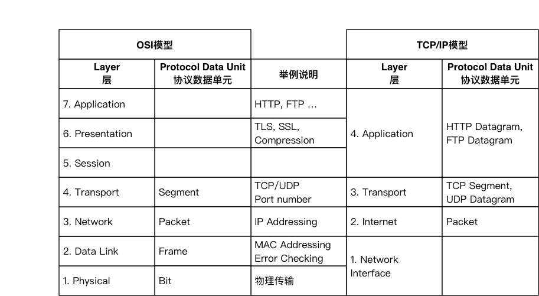
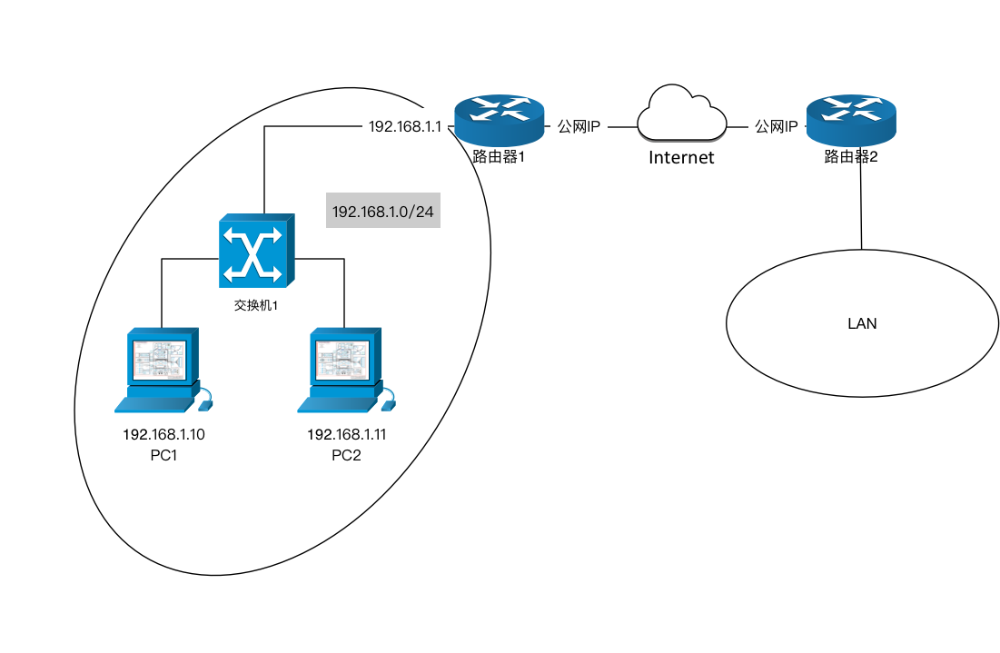

<!--more-->

## 网络分层模型

相信所有的程序员都听说过网络分层模型，那我们说说最常提到的OSI参考模型与TCP/IP模型。

很多人常说的7层网络就是指OSI参考模型，其模型一共分为7层，自下而上分别是：物理连接层、数据链路层、网络层、传输层、会话层、表现层、应用层。

而TCP/IP模型可以被认为是对OSI参考模型的简化，其一共有4层，自下而上分别是：网络接入层、网际互联层、传输层、应用层。

下图对这两种模型做了一个比较：



下面简单讲一下2-4层PDU所包含的关键信息（不是所有信息）：

1. L2：Data Link，PDU：Frame，包含：源MAC地址、目标MAC地址
2. L3：Network，PDU：Packet，包含：源IP地址、目标IP地址
3. L4：Transport，PDU：Segment，包含：源端口、目标端口

见下图：


## 网络设备

用于建网的网络设备一般有交换机（Switch）和路由器（Router）。其中交换机工作在OSI模型第二层，所以也被称为二层设备（L2 Device），路由器工作在OSI模型第三层，所以也称为三层设备（L3 Device）。

### 交换机

回顾上图，L2有一个用途是MAC Addressing，所谓MAC Addressing即MAC寻地，每一块网卡（NIC）都有一个MAC地址，比如在Linux运行``ifconfig``能够看到NIC的MAC地址，注意看下面的HWaddr：

```
ens33     Link encap:Ethernet  HWaddr 00:0b:29:2b:25:10
          inet addr:192.168.1.246  Bcast:192.168.1.255  Mask:255.255.255.0
          inet6 addr: fe80::20c:29ff:fe2b:2510/64 Scope:Link
          UP BROADCAST RUNNING MULTICAST  MTU:1500  Metric:1
          RX packets:5253258 errors:0 dropped:0 overruns:0 frame:0
          TX packets:6680389 errors:0 dropped:0 overruns:0 carrier:0
          collisions:0 txqueuelen:1000
          RX bytes:2384306523 (2.3 GB)  TX bytes:9150388800 (9.1 GB)
```

MAC地址是网卡的物理地址，该地址理论上是全世界唯一的，不过现实生活中只需要保证在同一个LAN（局域网，或称二层网络）中唯一即可。

交换机是一个工作在L2的设备，即它是依靠MAC地址来使处于同一个LAN中的两个NIC相互通信的。

交换机是一个有很多端口（Port）的设备，每个NIC通过网线连接到其中的一个端口，比如PC-1（假设只有一个网卡）连接在Port-1、PC-2（假设只有一个网卡）连接在Port-2。交换机内部会维护一张“MAC地址表”，它存储来MAC地址->Port的对应关系。

交换机在某个端口收到数据后，会查看Frame（上图中Data Link层的PDU）中的**目的地MAC地址**，然后根据“MAC地址表”找到对应端口，然后将数据转发到这个端口。

但是我们在现实生活中从来没有使用MAC地址来通信对不对？我们都是使用IP来通信的，比如：``ping 192.168.1.20``。这是因为操作系统会使用[ARP协议][arp-protocol]来获知`192.168.1.20`的MAC地址，而交换机在此过程中会学习到这个信息，并且记录到“MAC地址表”中（具体过程本文不做详述）。

关于ARP协议、以及交换机的其他功能细节本文不做详述，读者朋友只需知道交换机是一个二层设备，它维护了一张“MAC地址表”并运用此表让处于同一个二层网络的两个网卡通信就可以了。


### 路由器

交换机只能让处于同一个二层网络的两个网卡进行通信，如何让处于不同二层网络的设备是通信呢？

答案是使用路由器（Router），路由器是一个三层设备（L3 Device），它的作用是将两个二层网络连接起来，使其能够互相通信。

下图是一个将两个二层网络连接起来的例子：


在这张图中可以看到有两个子网——192.168.1.0/24和192.168.2.0/24（如果你不知道这是什么，不要紧张，我们会在[子网分割][subnetting]章节详细讲解），它们是两个独立的二层网络。路由器1有两个端口，一个端口连接在交换机1上，IP是192.168.1.1；另一个端口连接在交换机2上，IP是192.168.2.1。

当PC1要和PC3通信的时候，比如``ping 192.168.2.10``，它会发现PC3和自己不在同一个子网中（究竟是如何知道的你现在不用关心，我们会在[子网分割][subnetting]章节中详细讲解），那它数据交给路由器1，路由器1它会读取Packet（Network层的PDU）中的目的地IP地址，发现是192.168.2.10，结合其内部的路由表（关于路由表本文不做讲解）决定将其转发到交换机2，交换机2再转发到PC3.

我们再考虑一个更贴近现实的问题，我们的电脑是如何访问到``baidu.com``的呢？

实际上当访问``baidu.com``的时候你的数据是经过多层路由器，最终到达baidu服务器的，如下图：



你也许会问，路由器是一个L3设备，它是通过IP来转发数据的，那它是怎么知道``baidu.com``的IP地址呢？实际上路由器并不知道``baidu.com``的IP地址，操作系统在发送请求的时候会将``baidu.com``转化为IP地址放到Packet中传递给路由器。关于这个我们会在[DNS][dns]章节中做详细说明。

## 为何程序不能获得源MAC地址？

实际上这个问题本身存在一个错误的假设，我们已经知道在同一个二层网络中是直接通过MAC地址来通信的，在这种情况下我们是可以获得MAC地址的。但这只是极少的一种情况，因为大部分时候我们都必须经过路由器才能访问网络的。

我们再来看这张图：


在列出详细步骤前先补充一个知识：路由器的每个端口都是一个独立的网卡，有独立的MAC地址。

如果PC1要和PC3通信，其详细步骤是这样的：

1. PC1发送数据
   1. 封装Packet P，源IP地址：PC1的IP地址，目标IP地址：PC3的IP地址
   2. 封装Frame F1，源MAC地址：PC1的MAC地址，目标MAC地址：路由器1左侧端口的MAC地址，它的载荷是P
2. 路由器1转发数据
   1. 左侧接口收到数据，提取P，获得目标IP地址
   2. 查找路由表，发现应该将数据转发到右侧端口
   3. 封装Frame F2，源MAC地址：路由器1右侧端口的MAC地址，目标MAC地址：PC3的MAC地址，它的载荷是P
3. PC3收到数据

所以当PC3收到数据的时候，它收到的Frame已经不是PC1当初发出的Frame了，但是Packet还是PC1发出的Frame。因此PC3是不可能获取PC1的MAC地址的，它能收到的只是路由器1右侧端口的MAC地址。


## 参考资料

* [OSI模型][osi]
* [Calico - About Networking][calico]
* [NetworKing CCNA: OSI - TCP/IP Model][networking-ccna-osi-tcp-ip-model]
* [ARP协议][arp-protocol]
* [Address Resolution Protocol (ARP) in less than 5 minutes][arp-youtube]
* [Packet Traveling][packet-traveling-youtube]
* [鳥哥的Linux私房菜 - 基礎網路概念][vbird-network-basics]

[osi]: https://zh.wikipedia.org/wiki/OSI%E6%A8%A1%E5%9E%8B
[calico]: https://projectcalico.docs.tigera.io/about/about-networking
[networking-ccna-osi-tcp-ip-model]: https://www.youtube.com/watch?v=l_OPR2yh2co
[arp-protocol]: https://zh.wikipedia.org/wiki/%E5%9C%B0%E5%9D%80%E8%A7%A3%E6%9E%90%E5%8D%8F%E8%AE%AE
[dns]: dns.md
[subnetting]: subnetting.md
[arp-youtube]: https://www.youtube.com/watch?v=QPi5Nvxaosw
[packet-traveling-youtube]: https://www.youtube.com/watch?v=rYodcvhh7b8
[vbird-network-basics]: http://linux.vbird.org/linux_server/0110network_basic.php