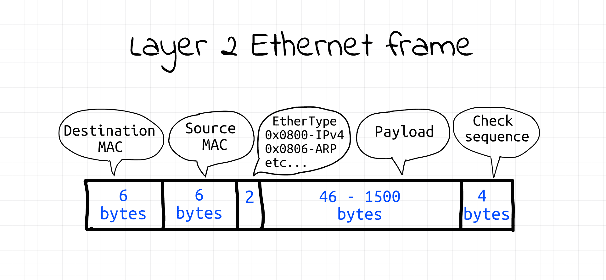
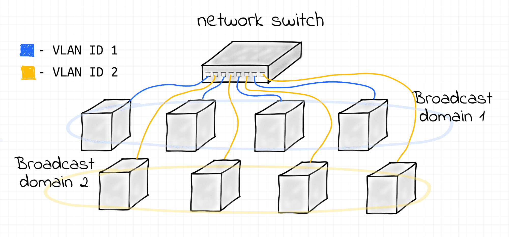
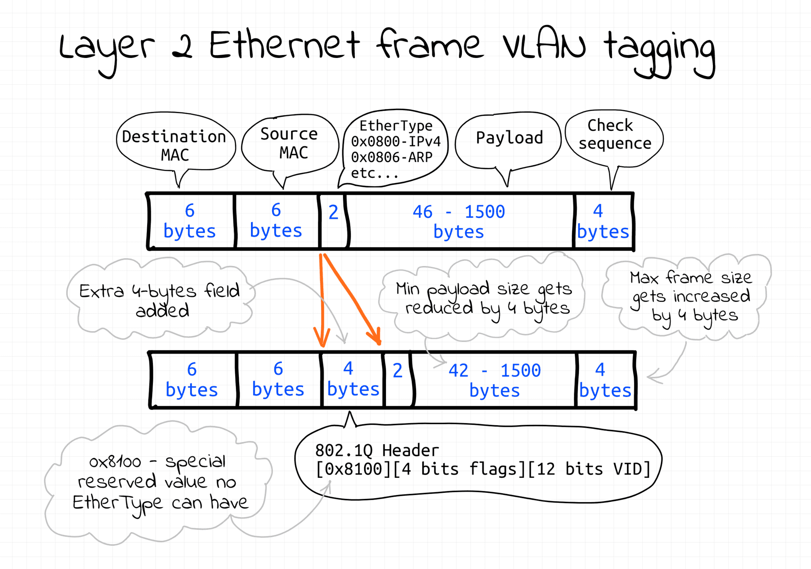
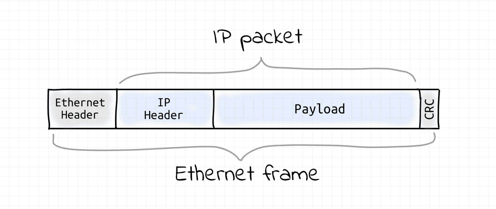
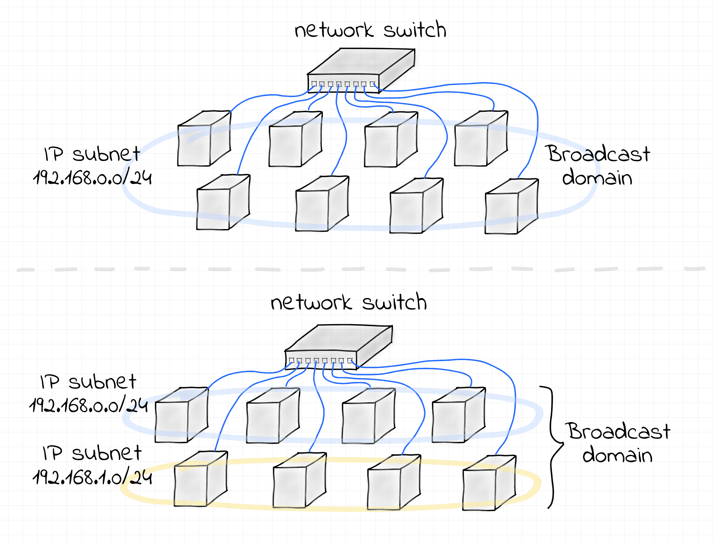
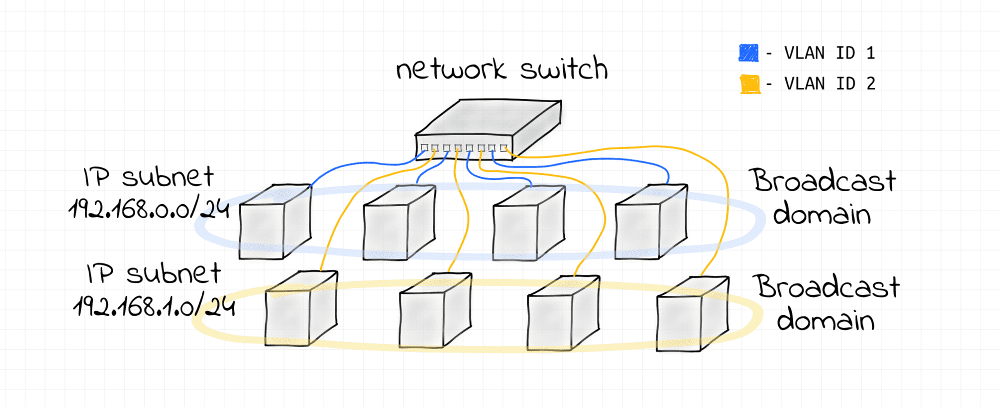
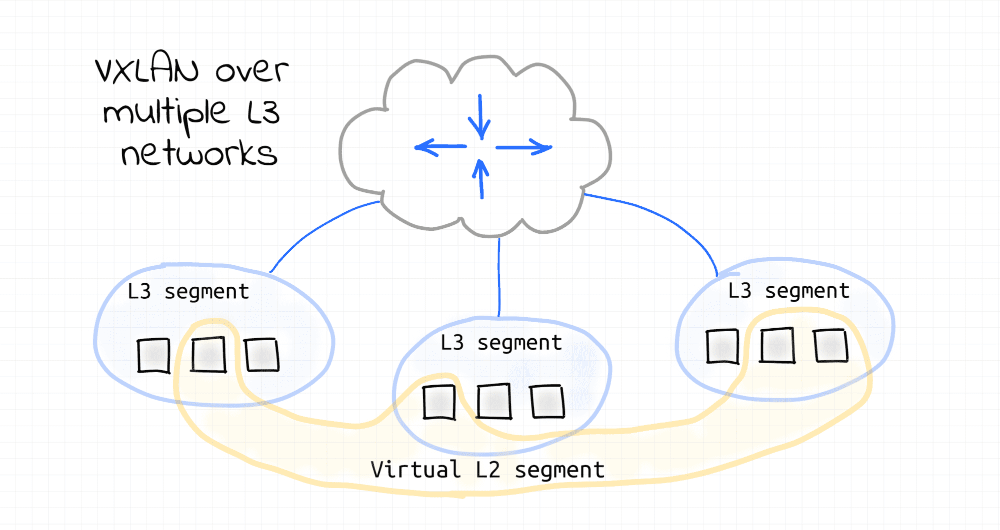
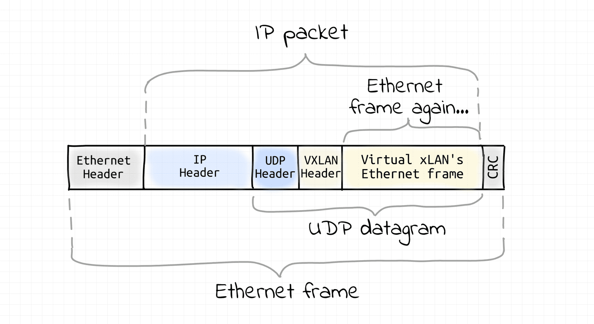
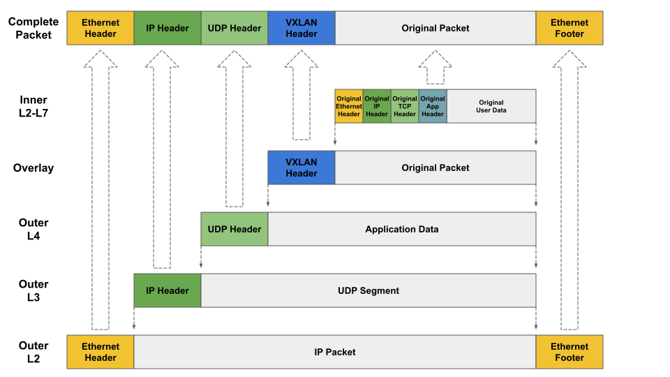

<!--more-->

## VLAN

[回忆一下](../network-model-and-devices)，交换机是一个 L2 设备，插在同一个交换机的网络设备组成了一个 L2 网络，L2 网络之间通过 MAC 地址通信，同时这个 L2 网络也是一个广播域。

看一下 L2 Ethernet Frame 的样子：

VLAN 则是一项把 L2 网络再做分区隔离的技术，简单来说就好像把一个交换机拆成了多个交换机：

上图可以看到交换机在接口上设置了两个 VLAN，ID 分别是 1 和 2，两个同时也分割出了 2 个广播域。因为这种分割是虚拟的不是物理的，所以叫做 Virtual LAN。

实现 VLAN 的方式则是在 L2 Ethernet Frame 上扩展了 VLAN ID 的字段，如下图：

在头部加了 4 字节的 VID 字段，同时减少了 Playload 4 个子节。

## IP 网段

IP 网段，又称为 L3 Segment，也称 IP 子网。

IP 包的样子是这样的：

可以看到 IP 包是包在 Ethernet frame 内部的，Ethernet frame 的头我们前面已经看到过了，上图中的 IP header 和 Playload 就是 Ethernet frame 中的 Payload。

你可以把连接在同一个交换机的设备组成一个子网，也可以组成多个子网，注意下图的广播域：

上面的这种方式隔离并不严格，因为两个子网共享同一个广播域。

你也可以使用 VLAN 做更严格的隔离：

注意，跨 L3 Segment 的通信需要用到路由器。

## VXLAN

VXLAN 是基于 L3 网络构建的虚拟 L2 网络，它是一种 Overlay network，见下图：

图中可以看到有 3 个 L3 网络（3 个 IP 子网），这 3 个子网内各挑了几个网络设备，使用 VXLAN 组成了一个虚拟的 L2 网络。

在任何一个 VXLAN 的节点上，出站 L2 Ethernet frame 都会被捕获，然后被塞进一个 UDP datagram 中，然后通过 L3 网络发给 VXLAN 的目标节点。

当 L2 Ethernet frame 到达 VXLAN 节点时，他会从 UDP datagram 把原本的 Ethernet frame 提取出来，然后塞给目标设备的 NIC 中。

下面看 VXLAN 的网络包结构：

最大的 Ethernet frame 是网卡实际发出去的数据，而 UDP datagram 里则包含了真正的 Payload。

下面一张图更清晰地展示了 VXLAN 的数据结构：

## 参考资料

* [Computer Networking Introduction - Ethernet and IP (Heavily Illustrated)][net-101]
* [Calico Project - About Networking][cali-net]

[net-101]: https://iximiuz.com/en/posts/computer-networking-101
[cali-net]: https://projectcalico.docs.tigera.io/about/about-networking
