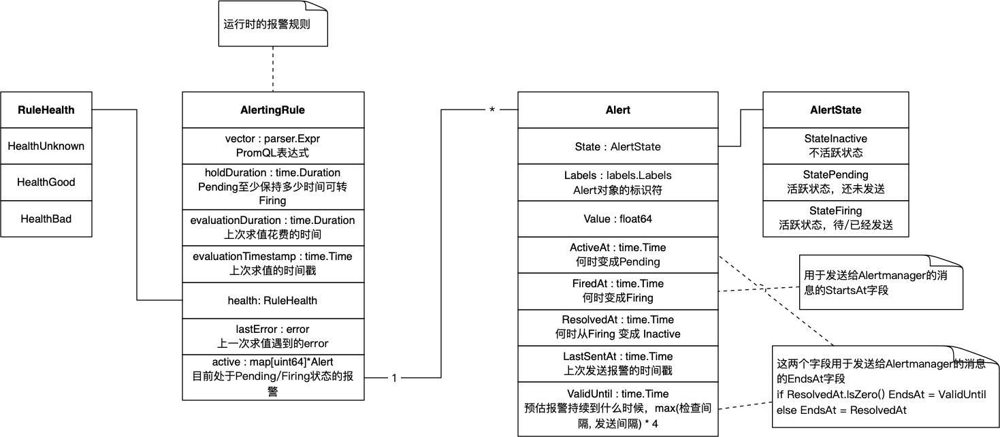
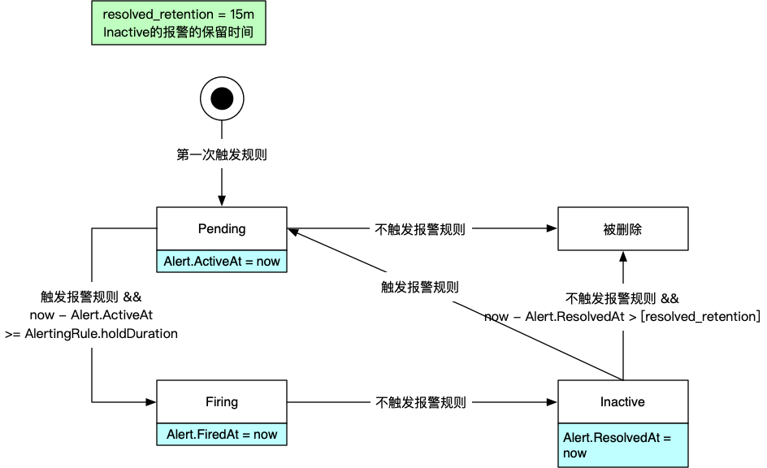

<!--more-->

本文分析Prometheus的[Alerting Rule][1]的执行逻辑。

## 领域模型

在Prometheus的定义中，告警规则由AlertingRule来描述，而AlertingRule则被归到[Group][p8s-group]中，比如下面的配置文件例子：

```yaml
groups:
- name: example
  interval: 30s
  rules:
  - alert: HighRequestLatency
    expr: job:request_latency_seconds:mean5m{job="myjob"} > 0.5
    for: 10m
    labels:
      severity: page
    annotations:
      summary: High request latency
```

每个AlertingRule在运行时还维护具体的告警对象（Alert）。

下面是领域模型：



## 告警逻辑

Prometheus会根据`group.interval` (下图的 `check_interval`）定时执行AlertingRule（执行Eval方法），然后发送告警到Alertmanager，最后再更新AlertingRule的状态、Group的状态。


### 规则执行逻辑

上图已经说明了，执行告警规则第一步是执行表达式（`expr`属性），然后是根据表达式执行结果，管理Alert对象，逻辑如下：



Alert对象有三个状态：

* **Pending**：活跃但是还未发送给 Alertmanager，是所有 Alert 对象的初始状态。
* **Firing**：告警发送中，特指发送到 Alertmanager。
* **Inactive**：未激活，这类告警会保留 `resolved_retension` 规定的时间 (程序常量 15 分钟），而不是马上删除。
* 虚拟状态“被删除”，处于 Inactive 状态的告警超过 `resolved_retention` 规定的时间之后，就会被删除。

三种状态的迁移逻辑：

**Pending -> Firing**

Alert 对象当前处于 Pending，Eval 结果是 true，且距离初次活跃时间（`Alert.ActiveAt`）超过`<for>`（`AlertingRule.holdDuration`）的时长，那么这个Alert对象就会变成 **Firing** 状态。

**Pending -> 被删除**

Alert 对象当前处于 Pending 状态，Eval 结果是 false，那么这个 Alert 对象就直接被删除。

**Firing -> Inactive**

Alert 对象当前处于 Firing 状态，Eval 结果是 false，那么这个 Alert 对象会变成 **Inactive状态**。

**Inactive -> Pending**

Alert 对象当前处于 Inactive状态，Eval 结果是 true，那么这个 Alert 对象会重置为 **Pending** 状态。

**Inactive -> 被删除**

Alert对象当前处于Inactive状态，且保持超过了 `resolved_retention` （p8s里写死 15 分钟），则被删除。

### 告警发送的逻辑

AlertingRule 执行之后，会把 Firing / Inactive 状态的 Alert 发送出去，逻辑如下：

```go
func (a *Alert) needsSending(ts time.Time, resendDelay time.Duration) bool {
	if a.State == StatePending {
		return false
	}

	// if an alert has been resolved since the last send, resend it
	if a.ResolvedAt.After(a.LastSentAt) {
		return true
	}

	return a.LastSentAt.Add(resendDelay).Before(ts)
}
```

代码中的连个参数：

* ts，是当前时间
* resendDelay，是程序启动参数 `--rules.alert.resend-delay` 规定的，默认 `1m`。

Alert 发送之后会更新 `LastSentAt` 和 `ValidUntil` 字段：

```go
Alert.LastSentAt = ts
Alert.ValidUntil = ts + max([check_interval], [resend_delay]) * 4
```

`ValidUntil` 字段是一个预估的告警有效时间，超过这个时间点告警会被认为已经解除，具体逻辑见下文。

#### Prometheus -> Alertmanager 机制

当告警变成 `Firing` 时，发送给 Alertmanager 的消息如下，可以看到 `startsAt` 就是当前时间，而 `endsAt` 则是 `ValidUntil`：

```json
ts = 2022-06-08 14:41:14.199515 +0800 
[
  {
    "annotations": { ... },
    "startsAt": "2022-06-08T06:41:14.185Z",
    "endsAt": "2022-06-08T06:45:14.185Z",
    "generatorURL": "...",
    "labels": { ... }
  }
]
```

当告警 Inactive 后，发送给 Alertmanager 的消息如下， `endsAt` 就是当前时间，而 `startsAt` 和原来一样：

```json
ts = 2022-06-08 14:41:29.195836 +0800 
[
  {
    "annotations": { ... },
    "startsAt": "2022-06-08T06:41:14.185Z",
    "endsAt": "2022-06-08T06:41:29.185Z",
    "generatorURL": "...",
    "labels": { ... }
  }
]
```

如果告警一直 Firing，那么 Prometheus 会在 `resend_dealy` 的间隔重复发送，而 `startsAt` 保持不变， `endsAt` 跟着 `ValidUntil` 变：

```json
ts = 2022-06-08 14:48:34.197001 +0800
[
  {
    "annotations": { ... },
    "startsAt": "2022-06-08T06:48:34.185Z",
    "endsAt": "2022-06-08T06:52:34.185Z",
    "generatorURL": "...",
    "labels": { ... }
  }
]
ts = 2022-06-08 14:49:39.195611 +0800 
[
  {
    "annotations": { ... },
    "startsAt": "2022-06-08T06:48:34.185Z",
    "endsAt": "2022-06-08T06:53:39.185Z",
    "generatorURL": "...",
    "labels": { ... }
  }
]
```

#### Alertmanager -> webhook 机制

第一次收到 Firing 的告警消息，Alertmanager 发给 webhook 的消息如下，则可以看到 status=firing，当前时间戳比 startsAt 晚一些，endsAt 没有提供（忽略了 Prometheus 提供的信息）：

```json
ts = 2022-06-08 14:55:49.201768 +0800 
{
  "receiver": "webhook",
  "status": "firing",
  "alerts": [
    {
      "status": "firing",
      "labels": { ... },
      "annotations": { ... },
      "startsAt": "2022-06-08T06:55:44.185Z",
      "endsAt": "0001-01-01T00:00:00Z",
      "generatorURL": "...",
      "fingerprint": "3ec2d9fb9c4f7f1a"
    }
  ],
  "groupLabels": {
    "alertname": "mock2"
  },
  "commonLabels": { alerts 数组里的共同 label },
  "commonAnnotations": { alerts 数组里的共同 annotation },
  "externalURL": "...",
  "version": "4",
  "groupKey": "{}:{alertname=\"mock2\"}",
  "truncatedAlerts": 0
}
```

收到 Inactive 的消息（`endsAt` <= 当前时间），Alertmanager 发给 webhook 的消息如下，可以看到 status=resolved，当前时间戳比 endsAt 晚一些，startsAt 则保持不变：

```json
ts = 2022-06-08 14:56:19.201334 +0800 
{
  "receiver": "webhook",
  "status": "resolved",
  "alerts": [
    {
      "status": "resolved",
      "labels": { ... },
      "annotations": { ... },
      "startsAt": "2022-06-08T06:55:44.185Z",
      "endsAt": "2022-06-08T06:56:04.185Z",
      "generatorURL": "...",
      "fingerprint": "3ec2d9fb9c4f7f1a"
    }
  ],
  "groupLabels": {
    "alertname": "mock2"
  },
  "commonLabels": { alerts 数组里的共同 label },
  "commonAnnotations": { alerts 数组里的共同 annotation },
  "externalURL": "<alertmanager 的URL>",
  "version": "4",
  "groupKey": "{}:{alertname=\"mock2\"}",
  "truncatedAlerts": 0
}
```

**注意：Alertmanager 里必须有 Inactive 消息所对应的告警，否则是会被忽略的**。换句话说如果一个告警在 Alertmanager 里已经解除了，再发同样的 Inactive 消息，Alertmanager 是不会发给 webhook 的。

Prometheus 需要 **持续** 的将 Firing 告警发送给 Alertmanager，遇到以下一种情况，Alertmanager 会认为告警已经解决，发送一个 resolved：

1. Prometheus 发送了 Inactive 的消息给 Alertmanager，即 `endsAt=当前时间` 
2. Prometheus 在上一次消息的 `endsAt` 之前，一直没有发送任何消息给 Alertmanager

不用担心 Alertmanager 会将告警消息重复发送给 webhook，`route.repeat_interval` ([文档][2]) 会避免这个问题。

对于第二种情况，Alertmanager 发送给 webhook 的消息如下，status=resolved，当前时间戳比 endsAt 稍晚一些，startsAt 则保持不变：：

```json
ts = 2022-06-08 15:34:27.167246 +0800 
{
  "receiver": "webhook",
  "status": "resolved",
  "alerts": [
    {
      "status": "resolved",
      "labels": { ... },
      "annotations": { ... },
      "startsAt": "2022-06-08T07:25:58Z",
      "endsAt": "2022-06-08T07:34:00Z",
      "generatorURL": "...",
      "fingerprint": "3ec2d9fb9c4f7f1a"
    }
  ],
  "groupLabels": {
    "alertname": "mock2"
  },
  "commonLabels": { alerts 数组里的共同 label },
  "commonAnnotations": { alerts 数组里的共同 annotation },
  "externalURL": "<alertmanager 的URL>",
  "version": "4",
  "groupKey": "{}:{alertname=\"mock2\"}",
  "truncatedAlerts": 0
}
```

另外两个细节：

* 如果 `startsAt` 没有提供，则自动等于当前时间
* 如果 `endsAt` 没有提供，则自动等于 `startsAt + resolve_timeout(默认 5m)`

### 更新AlertingRule规则

最后更新AlertingRule的状态，逻辑如下：


[1]: https://prometheus.io/docs/prometheus/latest/configuration/alerting_rules/
[p8s-group]: https://prometheus.io/docs/prometheus/2.25/configuration/recording_rules/#rule_group
[2]: https://prometheus.io/docs/alerting/latest/configuration/#route