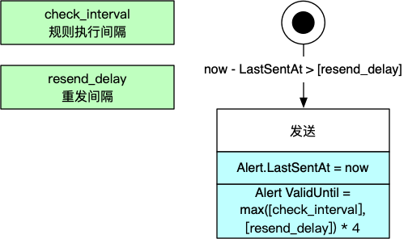

<!--more-->

本文分析Prometheus的[Alerting Rule][1]的执行逻辑。

## 领域模型

在Prometheus的定义中，报警规则由AlertingRule来描述，而AlertingRule则被归到[Group][p8s-group]中，比如下面的配置文件例子：

```yaml
groups:
- name: example
  interval: 30s
  rules:
  - alert: HighRequestLatency
    expr: job:request_latency_seconds:mean5m{job="myjob"} > 0.5
    for: 10m
    labels:
      severity: page
    annotations:
      summary: High request latency
```

每个AlertingRule在运行时还维护具体的报警对象（Alert）。

下面是领域模型：


## 报警逻辑

Prometheus会根据`group.interval`规定的时间，定时来执行AlertingRule（执行Eval方法），然后发送报警到Alertmanager，最后再更新AlertingRule的状态、Group的状态。


### 规则执行逻辑

上图已经说明了，执行报警规则第一步是执行表达式（`expr`属性），然后是根据表达式执行结果，管理Alert对象，逻辑如下：


Alert对象有三个状态：

* **Pending**：活跃但是还未发送给Alertmanager，是Alert对象的初始状态。
* **Firing**：长发送到Alertmanager。
* **Inactive**：不活跃，即当前没有触发报警。
* 虚拟状态“被删除”

三种状态的迁移逻辑：

**Pending -> Firing**

Alert对象当前处于Pending，触发报警规则，且距离初次活跃时间（`Alert.ActiveAt`）超过`<for>`（`AlertingRule.holdDuration`）的时长，那么这个Alert对象就会变成**Firing**状态。

**Pending -> 被删除**

Alert对象当前处于Pending状态，不触发报警规则，那么这个Alert对象就直接被删除。

**Firing -> Inactive**

Alert对象当前处于Firing状态，不触发报警规则，那么这个Alert对象会变成**Inactive状态**。

**Inactive -> Pending**

Alert对象当前处于Inactive状态，触发报警规则，那么这个Alert对象会重置为Pending状态。

**Inactive -> 被删除**

Alert对象当前处于Inactive状态，且保持超过了`resolved_retention`时长，则被删除。

### 报警发送的逻辑

AlertingRule执行之后，会把Firing状态的Alert发送出去，逻辑如下：



### 更新AlertingRule规则

最后更新AlertingRule的状态，逻辑如下：


[1]: https://prometheus.io/docs/prometheus/2.25/configuration/alerting_rules/
[p8s-group]: https://prometheus.io/docs/prometheus/2.25/configuration/recording_rules/#rule_group