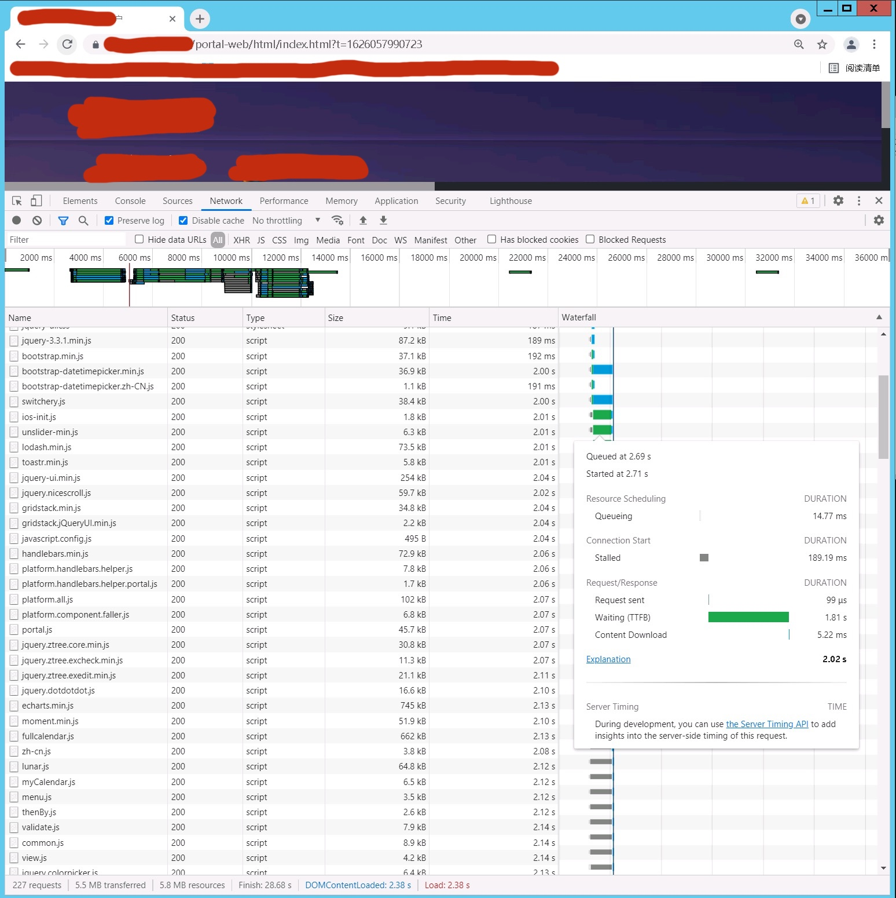
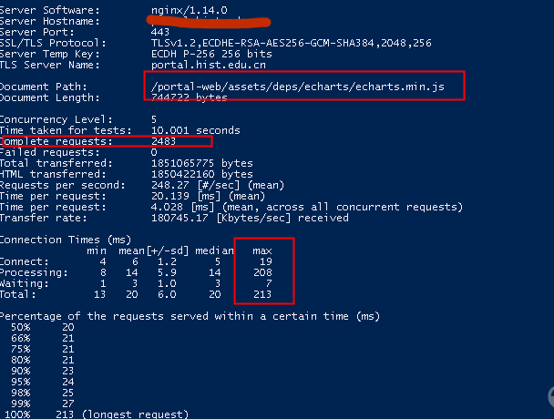
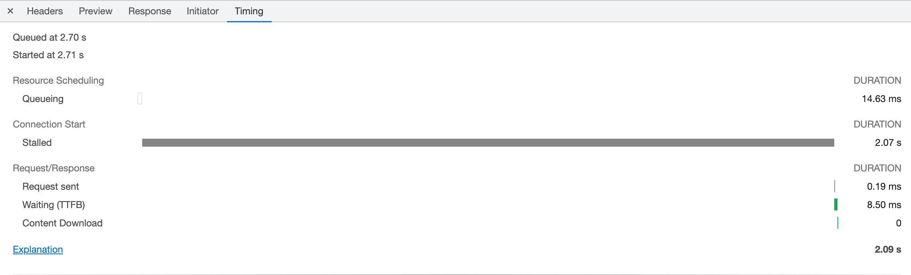
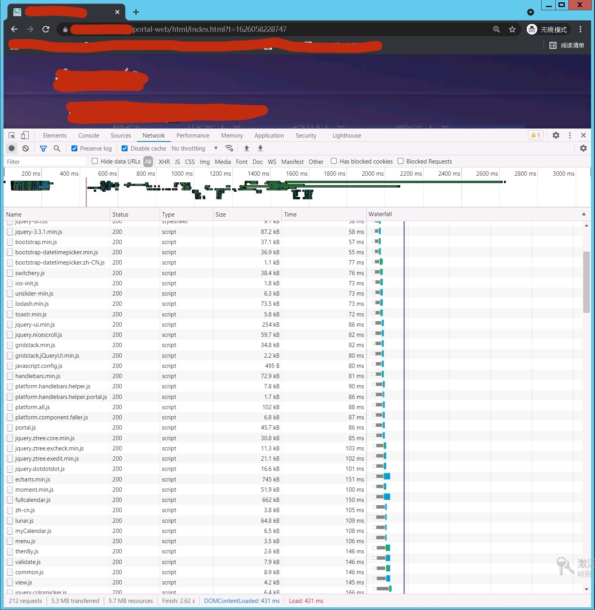
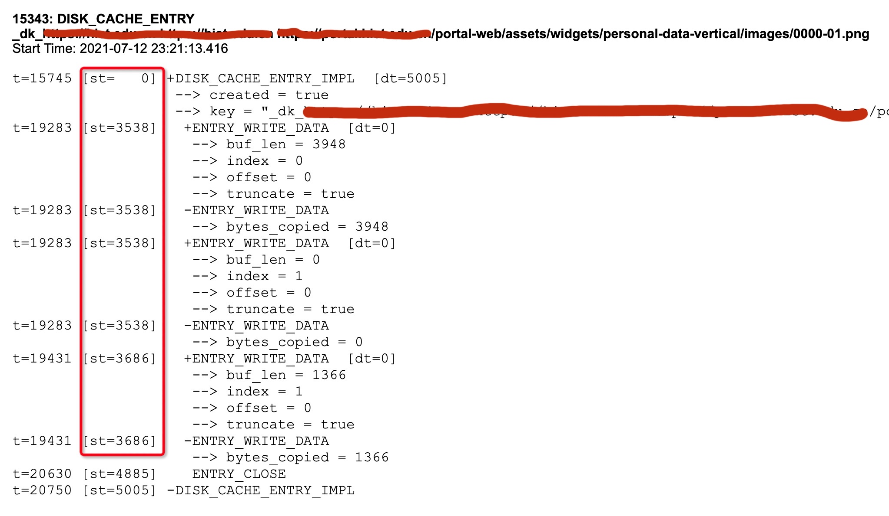
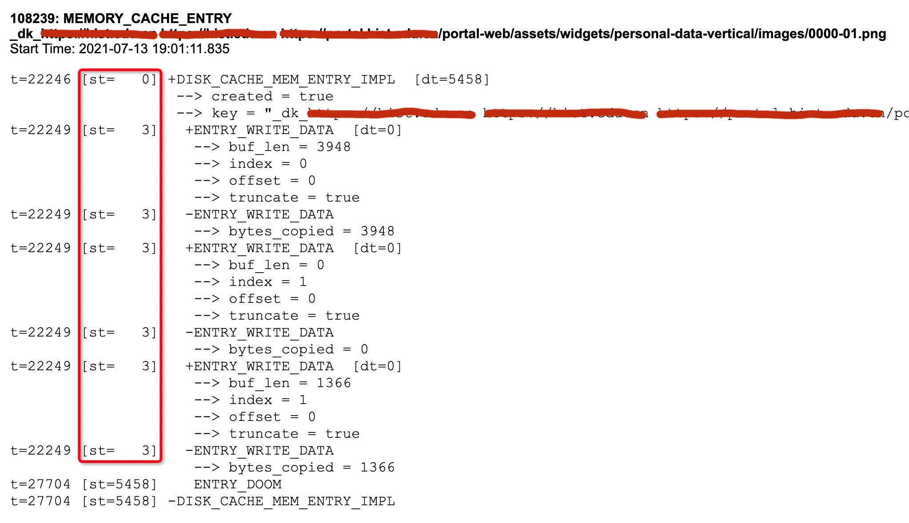

<!--more-->

## 现象

在清空浏览器缓存的情况下，访问 某网站 网页加载很慢，长达20～30秒。

下图只显示了10秒左右，但这个只是个别情况，大多数情况在20～30秒左右：

据开发人员称，之前做了一些优化：

* 调整了Tomcat的连接池和一些timeout
* 调整了Nginx的work数量和CPU affinity（这个其实多余的）

## 排查JVM

在访问门户网站的时候，用jstack导出线程堆栈，传到 fasttread.io 上看，发现1000个tomcat http线程都闲着，并没有在工作。

用`jstat -gcutil`查看JVM的垃圾收集情况，访问期间并发生FCG。

小节：JVM工作正常。

## 排查CPU

查看Nginx服务器和Tomcat服务器的CPU，CPU利用率都很低。

小节：没有异常。

## 用ab压测

找了一个静态资源，用ab做压力测试（5线程，时间10秒，`-c 5 -t 10`），10秒内完成了2483个请求，最大响应时间213ms：

## 陷入僵局

总结一下目前的情况：

* Nginx服务器CPU没问题
* Tomcat服务器CPU没问题
* JVM没问题
* 用ab做压测，结果非常好，比浏览器访问快多了

## 排查网络请求

打开Chrome的开发者模式采集网络请求，看到整个网站的请求数量多达200+个，且大多数请求都是下载小尺寸资源。

和开发人员沟通后表示，同版本网站在另一个客户打开时间只需要2-3秒，且同样是在内网环境。

仔细查看每个请求的Timing，发现Stalled的时间非常长，有的光Stalled就有 > 2秒。

根据Chrome对于**Stalled**的[解释][1]，有三个原因：

- There are higher priority requests.
- There are already six TCP connections open for this origin, which is the limit. Applies to HTTP/1.0 and HTTP/1.1 only.
- The browser is briefly allocating space in the disk cache

分析一下这三个原因：

* 第一个原因不成立，因为并不存在更高优先级的请求
* 第二个原因不成立，因为ab用的是5线程，chrome用6线程，ab结果比chrome好太多，应该不是这个原因
* 第三个原因牵涉到浏览器缓存落磁盘，这个应该不是瓶颈。

小节：再次陷入僵局。

## 奇怪的无痕模式

在无意中发现，Chrome无痕模式下访问速度很快，可以在2-3秒内完成。

### 对比Stalled

发现下载相同的资源无痕模式下Stalled只有~100ms，比正常模式的~2s快好多，这个结果也接近ab测试的结果：

### 对比请求

难道是无痕模式和正常模式的请求不一样，导致nginx/tomcat/程序走了不一样的逻辑？

对比发现，请求头一模一样。

同时查看nginx配置文件也没发现特别之处。

同时也可以排除防火墙的原因，因为请求都一模一样，防火墙不可能做出不一样的策略的。

### 对比tcpdump

在Nginx对做tcpdump，看看无痕模式的抓包和正常模式的抓包有何区别。

结果是没有发现特别之处。

### chrome://net-export

Chrome打开chrome://net-export ，正常模式下访问门户时抓网络事件。

然后使用 https://netlog-viewer.appspot.com/#import 打开。

没有发现特别的地方。

## PC的磁盘

回顾根据Chrome关于**Stalled**的[解释][1]，有三个原因：

- There are higher priority requests.
- There are already six TCP connections open for this origin, which is the limit. Applies to HTTP/1.0 and HTTP/1.1 only.
- The browser is briefly allocating space in the disk cache

前两个原因已经排除，默非真的是因为PC的磁盘不给力？

在google搜索`The browser is briefly allocating space in the disk cache incognito`在Chromium的[wiki][2]中发现无痕模式的Cache采用的是内存实现，普通模式采用的是磁盘实现：

> Chromium has two different implementations of the cache interfaces: while the main one is used to store info on a given disk, there is also a very simple implementation that doesn’t use a hard drive at all, and stores everything in memory. The in-memory implementation is used for the *Incognito* mode ...

### 再次查看网络事件

再次查看 chrome://net-export 导出的网络事件，发现正常模式下的Disk Cache还真的是很慢，比如下面这个图片，写Disk缓存的用了3686ms：

### 再次用ab来测试

之前的ab之所以快怀疑是因为ab也把下载的文件写到内存而不是磁盘，但是查看ab的文档后，并不存在可以把下载结果写到磁盘的参数。

### 抓无痕模式下的网络事件

再次用 chrome://net-export 抓无痕模式下的网络事件。

## 总结

在排除一切可能性之后，目前最大的可能是PC的磁盘不给力，导致了这个现象。

后续工作：找一台配置更好的PC来访问网站看看，验证一下这个结果。

[1]: https://www.chromium.org/developers/design-documents/network-stack/disk-cache#TOC-Implementation-Notes
[2]: https://www.chromium.org/developers/design-documents/network-stack/disk-cache#TOC-Implementation-Notes

