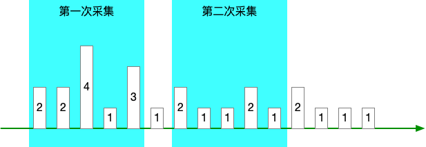
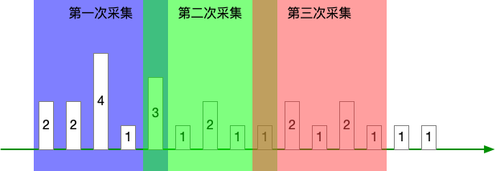
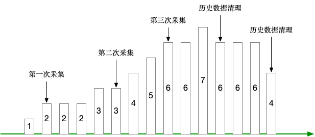
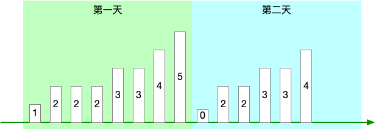
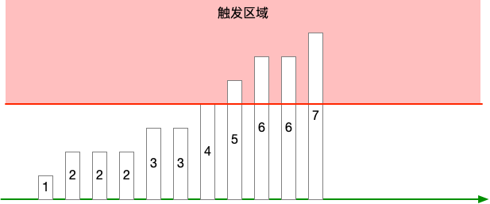
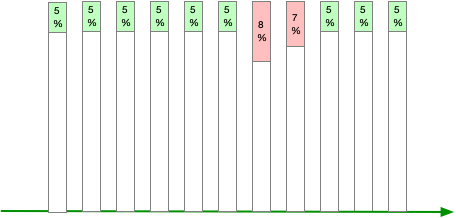
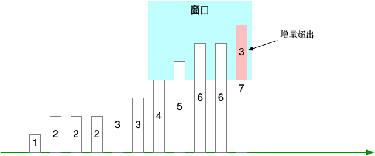

<!--more-->

假设现需要对某一种事件的发生次数做一个指标统计，
事件可以是故障发生次数、报错次数这类“坏事”，
也可以是访问次数、使用人次这类“中性事件”，
也可以是成功次数、完成次数这类“良性事件”。

那么如何设计指标以及使用什么告警规则？本文提供了3种方式，并分析其优缺点。

## 指标设计

### 方法一：指标提供近1小时内的事件计数

可以是近30分钟，也可以是近24小时，具体由提供指标的第三方决定。

Prometheus 进行采集时，该指标代表的含义是 [now - 1h, now] 区间内的事件发生次数。

即 1 小时是一个滑动的时间窗口，随着采集的动作向后滑动。

如果我们把 Prometheus 采集间隔定为 1h，是无法做到两次采集窗口之间完全收尾相接的，导致的问题是：

* 采集窗口之间的数据丢失
* 进而无法计算累计计数

看下图：

产生这个问题的原因有两个：

* Prometheus 的采集定时存在一定误差，可能会提前一点 —— 造成两次采集窗口重叠，可能会延后一点 —— 造成采集窗口断开
* Prometheus 可能会宕机，那么采集窗口的断开将变得更大

如果我们把采集间隔 < 1h，比如 10m，让采集窗口重叠，那么就会带来另外的问题：

* 你无法知道真实增量，看图中非重叠部分
* 因连真实增量都计算不出，那么也无法知道累计计数

看下图：

同时无论采集窗口是否重叠/断开，“近1小时” 这个时间窗口尺寸是第三方控制的，如果要改，就很麻烦，甚至不可能，进而限制了你想做规则运算这类操作的可能性。

总结来说问题有 3 个：

* 要么采集窗口断开，计数丢失，无法知道累计计数
* 要么采集窗口重叠，计数重复计算，无法知道累计计数
* 时间窗口的大小由第三方决定，规则运算存在限制

### 方法二：指标提供事件累计计数

每次采集时，指标提供方都对历史上所有的事件做一个计数。

那么这个就是 Prometheus 的 counter 类型了，单调递增的累计。

这种方式可以避免前一种方式的问题了，但是它存又有其他问题了。

应用不可能永久保存历史事件数据，这里就假定为日志吧，日志总要清理吧，那么一清理，就不是单调递增了，反而变成递减，看下图：

Prometheus 文档说了：

> A counter is a cumulative metric that represents a single monotonically increasing counter whose value can only increase or be reset to zero on restart

counter 类型只支持重置为0，不支持递减。

你说，应用可以自己维护一个计数器，但这会给应用带来复杂性：

* 怎么保证计数器+1的动作和业务动作在同一个事务里完成
* 事务的引入会对应用造成性能损耗

### 方法三：指标提供当日事件累计计数

对前一个方法做了一些改进，指标提供方只对采集时间所在当日的事件做一个累计计数。

比如采集时间是 5月4日 10:14:15 ，那么就提供 5月4日 [00:00:00, 10:14:15] 之间的事件的计数，如下图：

当然，这个“当日”也是根据业务调整的，比如“当周”、“当月”、“当年”。

它可以避免前一个方法里历史日志被清理导致指标递减的问题，因为反正在第二天这个数值就清零了，重新开始计算了。

注意，确保第二天的第一次采集值是 0，有些业务在 0点 就是没有的，可以很自然地达到这个目的。

如果你想知道近7天的累计值，你可以通过 `max_over_time(指标[2h] @ now) + max_over_time(指标[2h] @ 昨天23:59:59) + ...` 这种方式来计算。

这个算法的意思是把每天的最大值都累加起来，其实每天的最大值也就是每天的总累计值。

## 告警规则设计

那么现在使用的是 “指标提供当日事件累计计数” 这个设计方法，那么接下来看看使用哪种告警规则比较合适。

### 方法一：指标值 > X

直接看指标当前值，如果超过阈值 X，就报警，如下图：

又这么几个问题：

* 因为指标是单调递增的，所以一旦触发，那就会一直触发，除非到第二天清零
* 如果在一天的末尾 23:59:59 触发，然后就会突然清零

总的来说，这个告警无论是否解除，都无法体现故障是否修复。

### 方法二：百分比 > X

想办法把指标值转换成百分比，比如 `报错累计计数 / 累计总计数 = 报错%`。

阈值 X 需要根据业务情况做调整。

这个方法会存在虚假解除报警的问题，从公式可以看出，如果分母变大的斜率超出分子变大的斜率，那么报错率就会下降。

假设你有 A、B、C 三个报错指标，现在 A 指标触发阈值，然后 B 和 C 增加，结果导致 A 指标低于阈值，告警解除。

### 方法三：指标增量[窗口] > X

利用 range selector，计算“窗口”范围内的指标增量，比如 `increase(指标[1h]) > 10` 这种。

使用这种方式的时候需要注意，“窗口”尺寸不宜太小，如果太小 1）比较难以触发阈值，2）触发之后又很容易解除。

同时阈值 X 也需要根据业务情况做调整，太小则太敏感，太大则不容易触发。

## 总结

事件发生次数类指标宜采用“当日事件累计计数”的方式设计。

对应的告警规则则适合 “指标增量[窗口] > X” 这种方式。

