<!--more-->

本文介绍怎么基于 Prometheus 做二次开发，以及怎么利用 github action 和 circle ci 发布镜像。

涉及到的项目有 [prometheus/pometheus][gh-prom] 和 [prometheus/blackbox_exporter][gh-bb]，其余项目可举一反三。

## 先导知识

Prometheus 的官方项目使用了两种 CI 平台：

* Github Actions，配套可复用的配置库 [prometheus/promci][gh-prom-action]
* 配套 和 CircleCI，配套可复用配置库 [prometheus/circleci][gh-prom-circleci]

如果需要个性化 CI 配置，可从上述配置库中理解运作原理。

构建工具：

* [prometheus/promu][gh-promu]，它可以来构建各平台二进制、构建各平台 Docker 镜像、源码打包、更新 Github Release 信息等。

## 准备工作

### 准备Github Token

1）到你的个人设置页的 “Developer Settings - Personal access tokens - Fine-grained tokens”（[点击此处][gh-token-set]进入）：

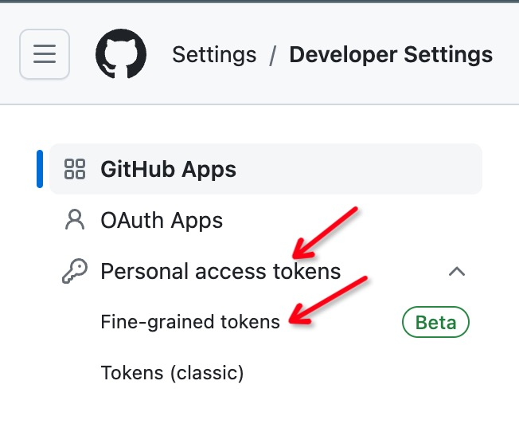

2）点击 “Generate new token”

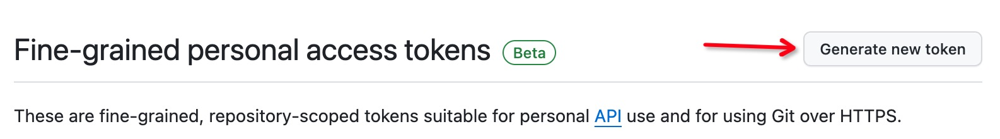

3）设置好 Token 的名字，过期日期，在 “Repository access” 部分选择 “Only select repositories”。

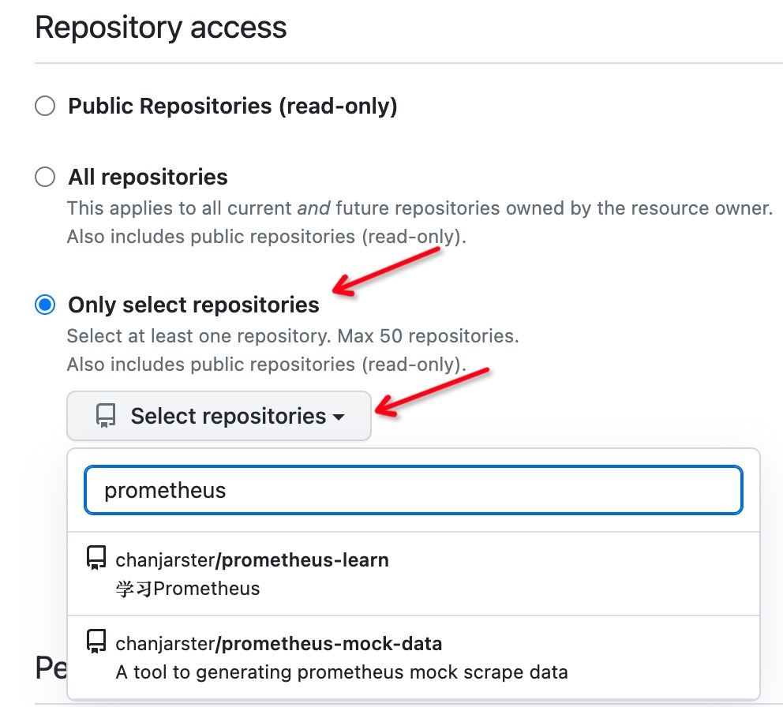

3.1）如果在这一步还没有 fork 好仓库没关系，事后可以通过点击 Token

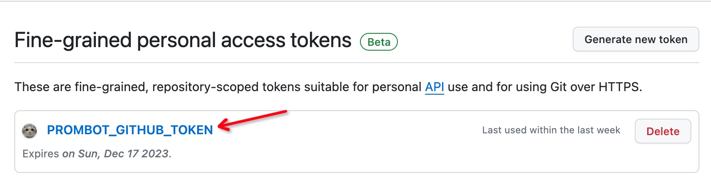

进入 Token 详情页面，点击 “Edit” 按钮配置仓库：

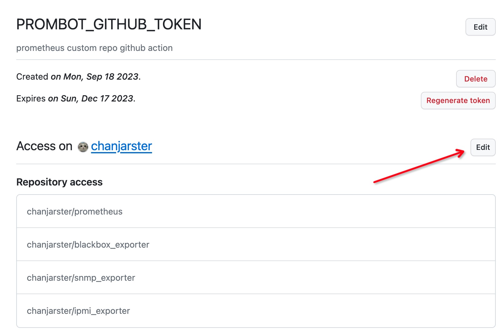

4）设置 “Permissions - Repository permissions”：

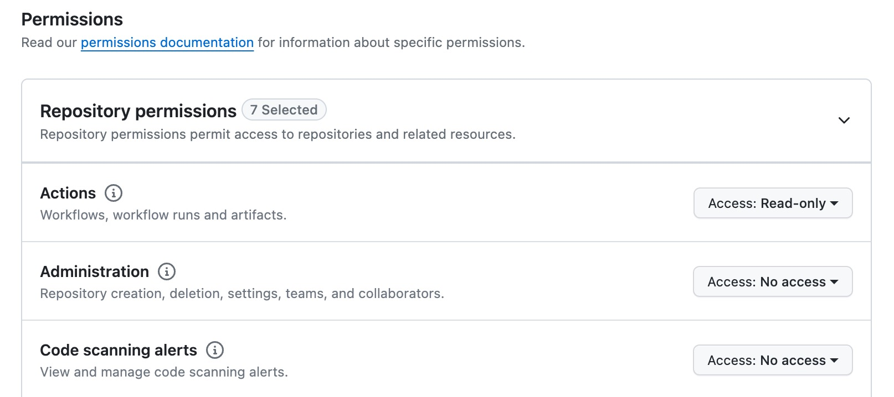

设置这么几个权限（也许没必要这么多，但我就是这么设置的）：

* Actions, Read-only
* Commit statuses, Read-only
* Contents, Read and write
* Metadata, Read-only
* Pull requests, Read-only
* Secrets, Read-only
* Variables, Read-only

同样的，这些权限也可以事后修改。

5）最后生成 Token，把 Token 复制下来妥善保存，这个后面要用到：

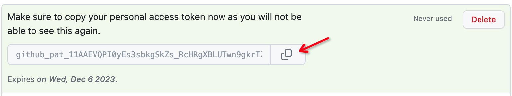

### 注册 Docker hub 账号

到 [Docker hub](https://hub.docker.com) 上注册账号，因为之后你要将镜像推送到这个账号下面。

### 注册 CircleCI 账号

1）到 https://circleci.com/signup/ 注册 CircleCI 账号。

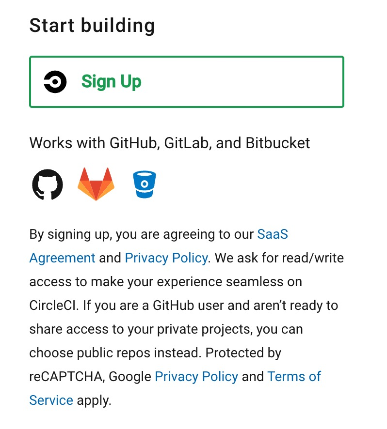

2）开通对 Github 账号对访问权限。

登陆 CircleCI，进入 https://app.circleci.com/settings/user ，在 “Account Integrations” 里对 GitHub 点击 Connect，然后按照提示操作

> 这里具体步骤就不展开了，可以参考[文档][circleci-gh-int]

只要你正确地在 Github 上给 CircleCI 授予了权限，那么在 Github [Settings - Applications][gh-set-app] 里可以看到：

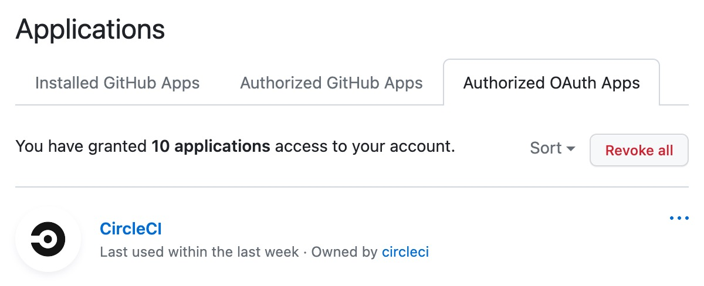

而在 CircleCI 里就可以看到：

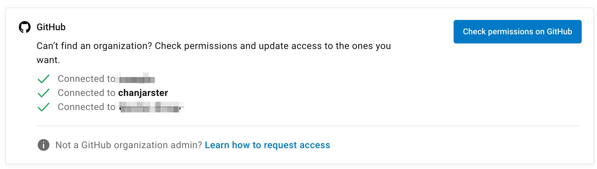

## 配置项目的 CI

### Prometheus

> 官方 Prometheus 项目使用的是 Github Actions CI 平台。

1）把 [prometheus/pometheus][gh-prom] fork 到自己的仓库里。

2）根据下文的 “分支开发规范” 切出一个分支

在该分支中修改 `.github/workflows/ci.yml` ，修改 `publish_main` 部分

把 `needs` 里的 `test_windows` 去掉，在 `steps` 的 `with` 里添加 `docker_hub_organization`：

```yaml
  publish_main:
    name: Publish main branch artifacts
    runs-on: ubuntu-latest
    needs: [test_ui, test_go, test_windows, golangci, codeql, build_all]
    if: github.event_name == 'push' && github.event.ref == 'refs/heads/main'
    steps:
      - uses: actions/checkout@v3
      - uses: prometheus/promci@v0.1.0
      - uses: ./.github/promci/actions/publish_main
        with:
          docker_hub_login: ${{ secrets.docker_hub_login }}
          docker_hub_password: ${{ secrets.docker_hub_password }}
          quay_io_login: ${{ secrets.quay_io_login }}
          quay_io_password: ${{ secrets.quay_io_password }}
          docker_hub_organization: docker hub 用户名
```

同样的套路修改 `publish_release`。

3）进入仓库，点击 “Actions” 页签，点击 “启用 Action”，如下图：

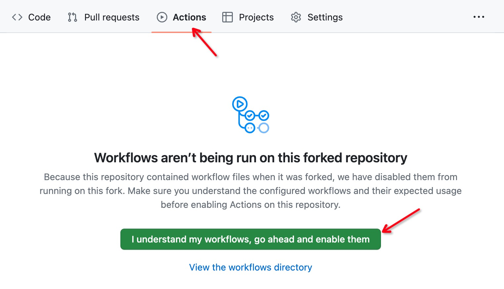

4）进入项目的 “Settings - Secrets and variables - Actions” 页面，点击 “New repository secret”

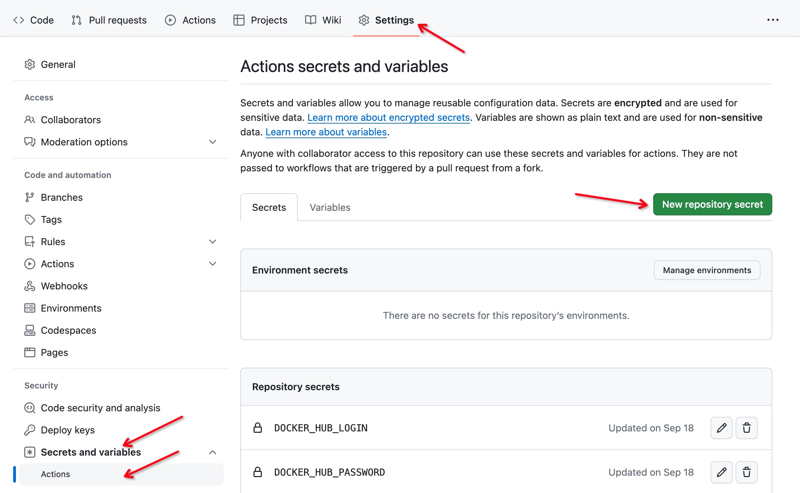

新建以下几个仓库密钥：

* `DOCKER_HUB_LOGIN`，Docker hub 的账号
* `DOCKER_HUB_PASSWORD`，Docker hub 的密码
* `PROMBOT_GITHUB_TOKEN`，之前生成的 Github Token

5）如此，当你对二次开发项目提交代码的时候，就会触发 Github Action。

### Blackbox Exporter

> 官方 Blackbox Exporter 项目使用的是 CircleCI 平台。

1）把 [prometheus/blackbox_exporter][gh-bb] fork 到自己的仓库里。

2）根据下文的 “分支开发规范” 切出一个分支

在该分支中修改 `.circleci/config.yml`，对 `prometheus/publish_release` 部分添加以下内容：

```yaml
...
- prometheus/publish_release:
    docker_hub_organization: docker hub 用户名
    quay_io_organization: ""
    ...
```

3）进入 CircleCI 的 Dashboard 页面（[点此进入][circleci-dashboard]） ，进入 “Projects” 页面，对 blackbox_exporter 项目点击 “Set Up Project”：

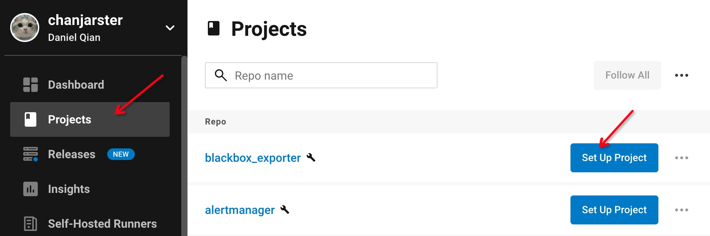

如图配置好之后，点击 “Set Up Project”：

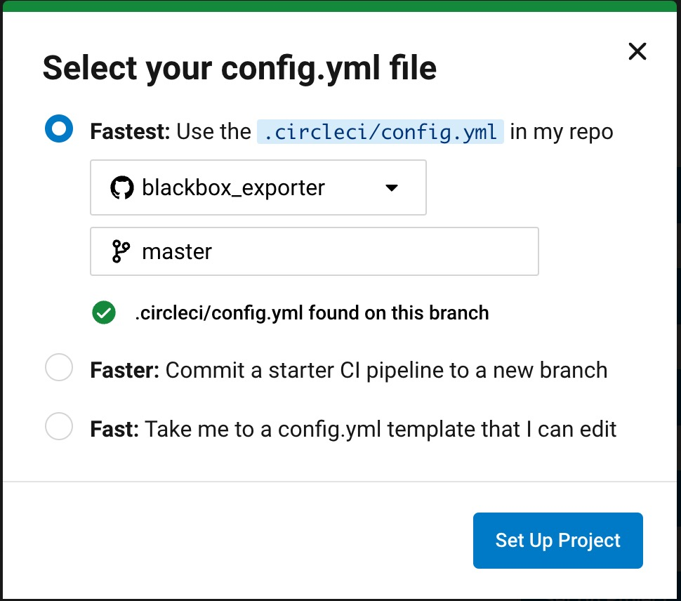

4）配置环境变量。

还是在 “Projects” 页面，点击 blackbox_exporter 右边的 三个圆点，点击 “Project Settings”：

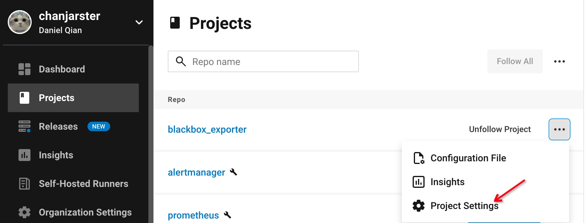

进入 “Environment Variables” 页面，配置环境变量：

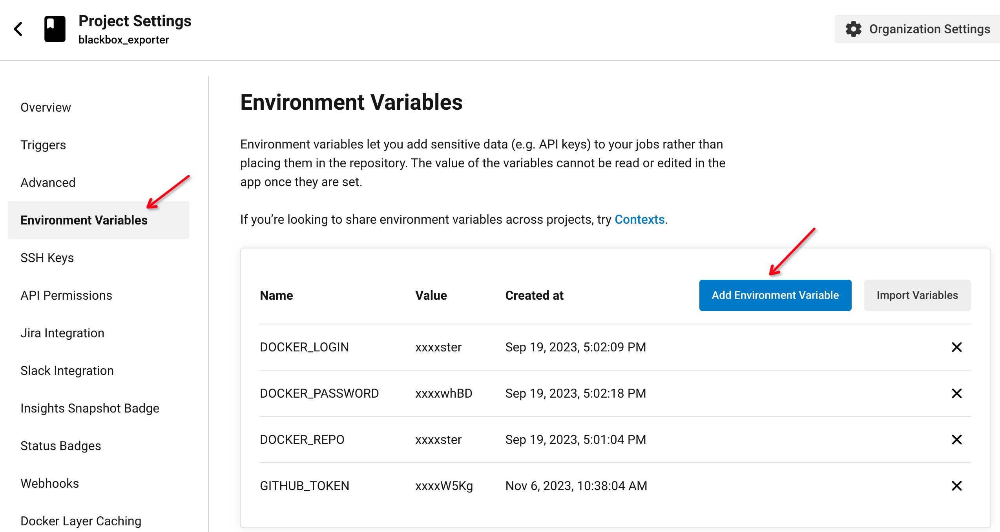

要配置以下变量：

* `DOCKER_LOGIN`，Docker hub 账号
* `DOCKER_PASSWORD`，Docker hub 密码
* `DOCKER_REPO`，Docker hub 账号
* `GITHUB_TOKEN`，之前创建的 Github Token

## 开发规范

### 和上游保持同步

随时和上游仓库保持一致，可以通过 Github 的 Sync fork 功能做到：

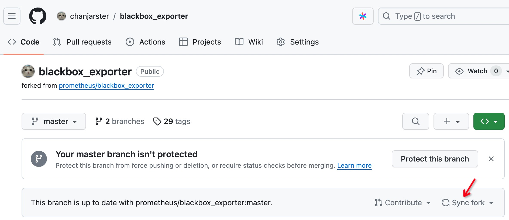

### 不要动上游分支

上游仓库的分支在你的 Fork 仓库里有一个副本，所以**千万不要去修改官方的任何分支**，如果你修改了，Sync fork 就会出问题。

### 分支开发规范

因官方的 Tag 肯定都是稳定的且发布的版本，所以从官方 Tag 做二次开发是一个比较安全的选择。

比如下面这个命令就是从官方的 `v2.47.0` Tag 切出了一个 `mod/v2.47.0` 分支：

```shell
git checkout -b mod/v2.47.0 v2.47.0
```

然后定下二次开发的版本号，比如`v2.47.0-mod.1` 代表基于官方 `v2.47.0` 的第一个 `mod` 版本。

然后注意这么几点：

* 对应修改项目中的 `VERSION` 文件，设置为你的二次开发版本号
* 编写项目中的 `CHANGELOG.md` 文件 ，添加上对应的变更说明（版本和 `VERSION` 保持一致），格式正确则参照官方的写法，比如：
  ```
  ## 0.24.0-mod.1 / 2023-05-16
  
  * [CHANGE] provide a custom mod version
  ```
* 打 Git Tag 时，版本号和 `VERSION` 保持一致

如果有一个没有正确完成，那么 Github Action / CircleCI 就无法正常工作，导致版本发布失败。

如果你正确做到了，那么 Github 仓库的 Release 里就会有你的二次开发版本，比如：

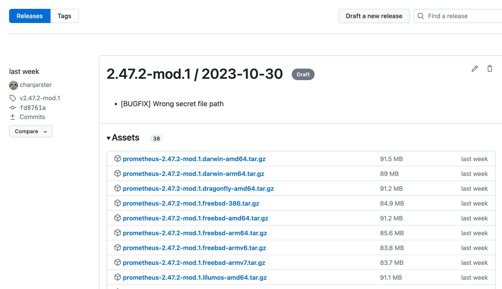

而你的 Docker hub 账户下也会有二次开发版本的镜像，比如：

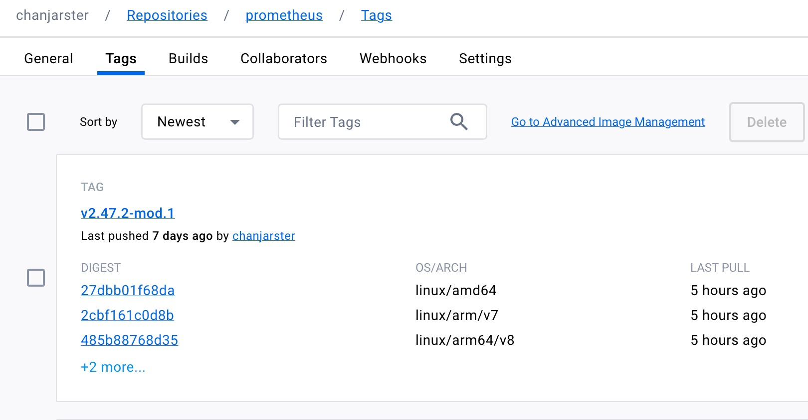

### 跟随上游升级

上游发布了新版本（Tag），那么你就得和前面的一样，切出一个新的二开 `mod/**` 分支，然后把之前二开分支的提交弄到新的二开 `mod/**` 分支上。

方法一：通过 `git cherry-pick`

1. 在 `mod/v0.2.0` 上执行 `git cherry-pick <commit>`，把 `mod/v0.1.0` 的 commit 一个个弄过来。

方法二：通过 `git rebase`

1. 从官方新 Tag（假设 `v0.2.0`） 切出一个临时分支，比如 `git checkout -b tmp/v0.2.0 v0.2.0`
2. 从 `mod/v0.1.0` 上切出一个 `mod/v0.2.0` 分支
3. 在 `mod/v0.2.0` 分支上执行 `git rebase tmp/v0.2.0`

当然如果存在代码冲突则需要自行解决。

[gh-prom]: https://github.com/prometheus/prometheus
[gh-bb]: https://github.com/prometheus/blackbox_exporter
[gh-promu]: https://github.com/prometheus/promu
[gh-prom-action]: https://github.com/prometheus/promci
[gh-prom-circleci]:  https://github.com/prometheus/circleci
[gh-token-set]: https://github.com/settings/tokens?type=beta
[gh-set-app]: https://github.com/settings/applications
[circleci]: https://circleci.com/
[circleci-gh-int]: https://circleci.com/docs/github-integration/
[circleci-dashboard]: https://app.circleci.com/dashboard