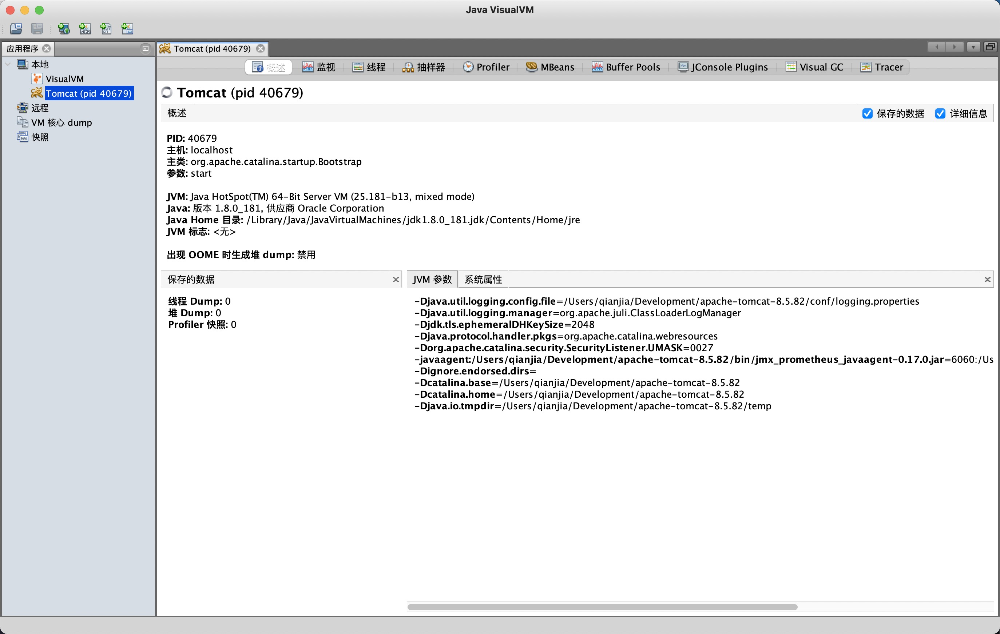
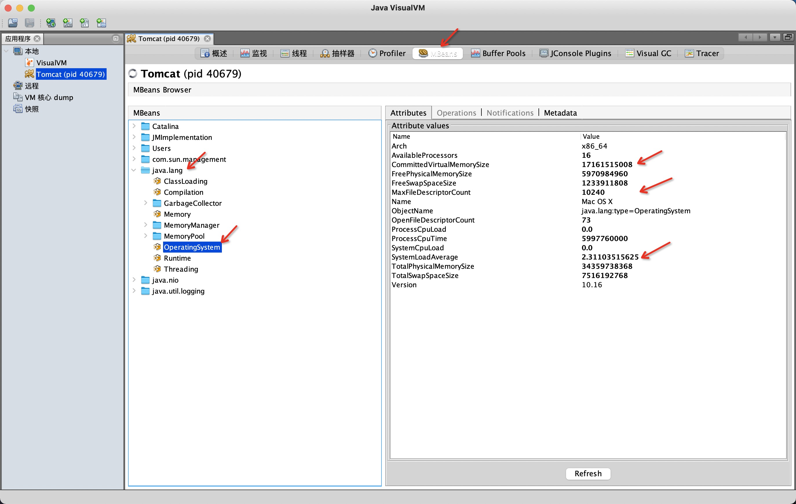
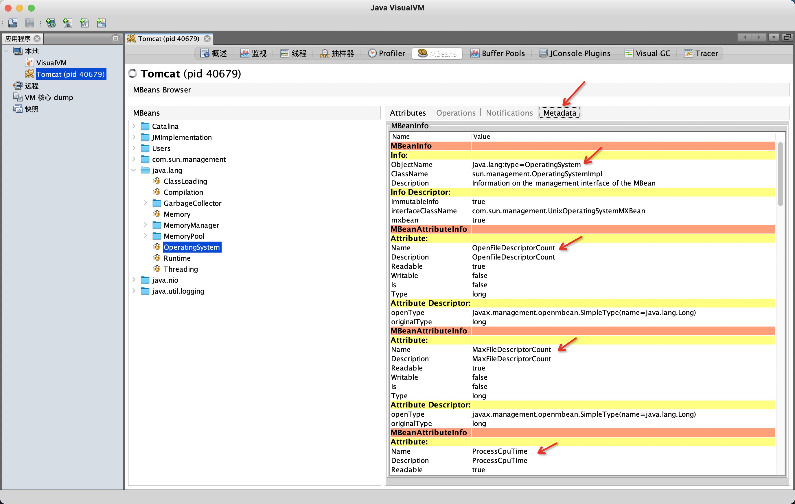
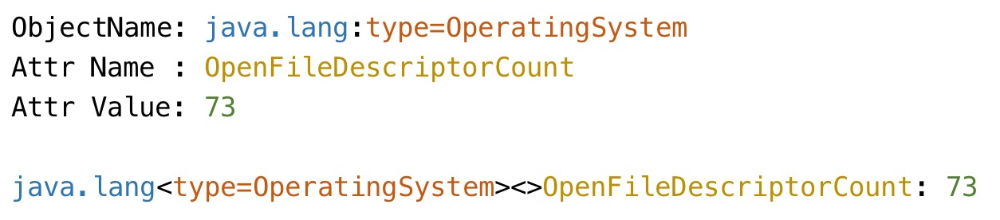
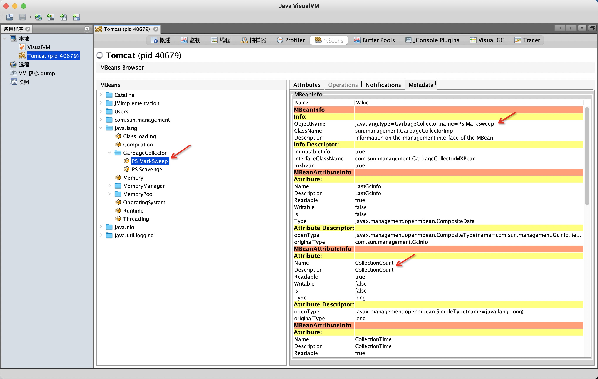
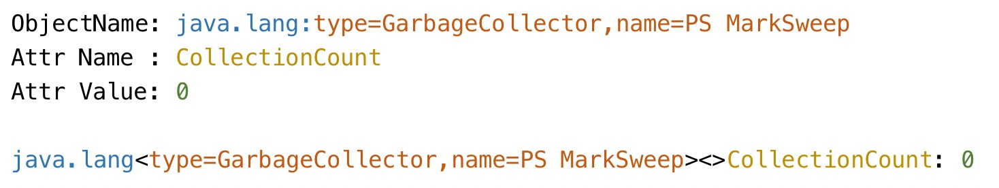
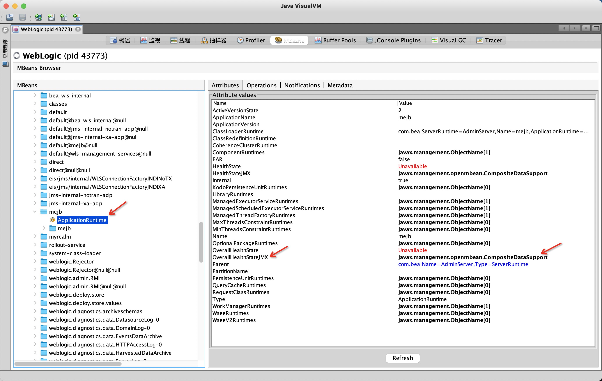
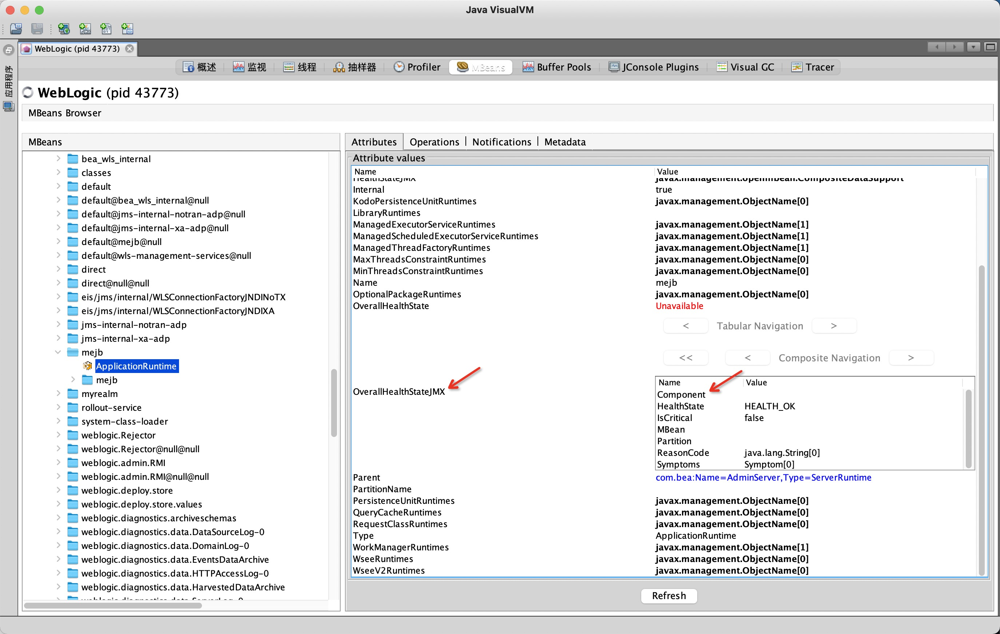
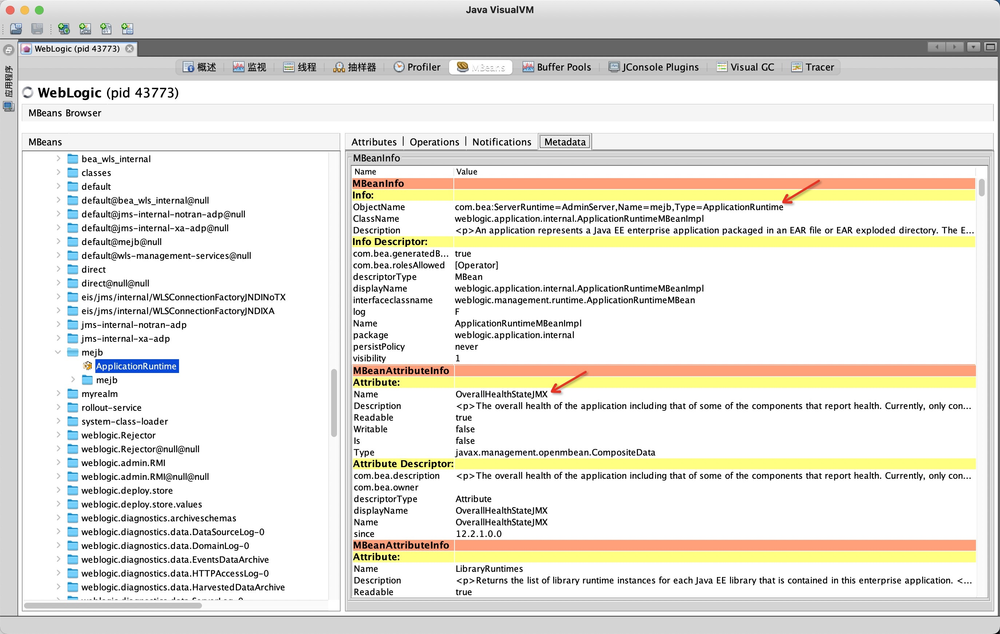
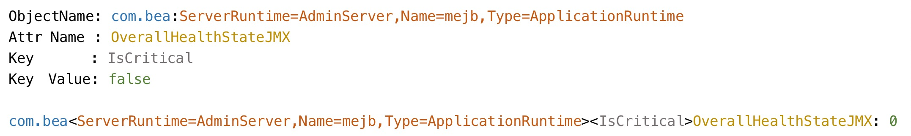

<!--more-->

[JMX Exporter][0] 是 Prometheus 官方提供的一种无侵入的，将 JMX MBean 信息转换成 Prometheus 指标数据的工具。

其配置使用具有一定的门槛，这篇文章介绍怎样看懂、会写配置文件。

## 浏览 MBean

在你的电脑上打开 jvisualvm，下图里连接了 Tomcat 程序。



切换到 MBeans Tab，可以看到屏幕左边是 MBeans 清单，选择一个 MBean 之后在右侧可以看到它的属性。




## MBean 属性转换规则

下面通过三个例子来介绍 JMX Exporter 是如何转换 MBean 信息的，这很重要，如果没有掌握就无法编写 JMX Exporter 配置文件。

### 例子一

选中一个 MBean 之后，点击右侧的 Metadata Tab 可以看到各种元信息：



这里我们关注 MBeanInfo 的 ObjectName 信息，和 MBeanAttributeInfo 的 Name 信息，见下图：



图中的最后一行就是 JMX 的转换结果，在 JMX Exporter 里：

* 把 ObjectName 中 `:` 前面的部分被当作 domain
* 把 ObjectName 中 `:` 后面的部分被当作 bean property name/value
* 然后跟上一个空的 `<>`，这个在第三个例子里有解释
* 然后跟上属性名
* 然后跟一个 `: `（注意后面有空格）
* 最后跟上值

### 例子二

我们换一个 MBean ，可以看到它有多个属性：



转换过程：



注意：转换后的 bean property name/value 的顺序和原始顺序是一致的。

### 例子三

下面讲当 MBean 的某个属性是 [`CompositeData`][2] 或者 `TabularData` 时怎么转换。

下图中 `ApplicationRuntime` 这个 MBean 的 `OverallHealthStateJMX` 属性是 `CompositeDataSupport` 类型：



双击点开 `OverallHealthStateJMX` 属性可以看到它有这么些 Key：



那么进入 Metadata Tab 观察 MBeanInfo 的 ObjectName：



那么 JMX Exporter 会做如下的转换：



注意：前两个例子中的空的 `<>` 里面有了 `IsCritical` 属性。

### 总结转换规则

再来核对[官方文档][1]的描述：

> domain<beanPropName1=propValue1, beanPropName2=propValue2, ...><key1, key2, ...>attrName: value

Part     | Description
---------|------------
domain   | Bean name. This is the part before the colon in the JMX object name.
beanPropName/Value | Bean properties. These are the key/values after the colon in the JMX object name.
keyN     | If composite or tabular data is encountered, the name of the attribute is added to this list.
attrName | The name of the attribute. For tabular data, this will be the name of the column. If `attrNameSnakeCase` is set, this will be converted to snake case.
value    | The value of the attribute.

翻译一下就是：

* 把 ObjectName 中 `:` 前面的部分被当作 domain
* 把 ObjectName 中 `:` 后面的部分被当作 bean property name/value
* 当 MBean 属性 是 [`CompositeData`][2] 或者 `TabularData` 时，会跟上 `<key>`，key 是 MBean 属性数据里的 key
  * 如果不是，则跟上一个空的 `<>`
* 然后跟上属性名
* 然后跟一个 `: `（注意后面有空格）
* 最后跟上值

## 配置文件说明

知道了 JMX Exporter 会把 MBean 转换成什么样，那么就容易理解配置文件的其他部分了：

结合下面的配置文件例子来说：

```yaml
---
lowercaseOutputName: false
lowercaseOutputLabelNames: false
whitelistObjectNames: ["org.apache.cassandra.metrics:*"]
blacklistObjectNames: ["org.apache.cassandra.metrics:type=ColumnFamily,*"]
rules:
  - pattern: 'org.apache.cassandra.metrics<type=(\w+), name=(\w+)><>Value: (\d+)'
    name: cassandra_$1_$2
    value: $3
    valueFactor: 0.001
    labels: {}
    help: "Cassandra metric $1 $2"
    cache: false
    type: GAUGE
    attrNameSnakeCase: false
```

Name     | Description
---------|------------
lowercaseOutputName | 把结果指标名转小写，指标名字是 `rules[*].name` 指定。
lowercaseOutputLabelNames | 把结果指标的 label 名转小写，label 由 `rules[*].labels` 指定。
whitelistObjectNames | JMX MBean [Object Name][3]（格式详咨文档）白名单，默认是所有 MBean。
blacklistObjectNames | JMX MBean [Object Name][3]（格式详咨文档）黑名单，优先级比白名单高，默认是空。
rules      | MBean 属性转换规则数组。对于每个 MBean 属性，遇到第一个匹配的规则后处理流程就结束。没有匹配到的 MBean 属性 则会被丢弃。如果规则数组没提供，则按照默认规则处理所有 MBean 属性。
pattern           | 匹配 MBean 属性转换结果的正则表达式，可以使用 capture，默认是匹配任何字符串。注意匹配的是 `attrNameSnakeCase` 之后的结果。
attrNameSnakeCase | 在 MBean 属性转换过程中，是否对属性名转换成 snake case，比如 `anAttrName` 转换成 `an\_attr\_name`，默认是 false。
name              | 指标名字，可以使用 `pattern` 中的 capture group。默认为默认格式（就是前面提到的转换规则）。如果结果是空，则丢弃。
value             | 指标值，可以是静态值，也可以从 `pattern` 的 capture group 提取，默认为 MBean 属性的值。
valueFactor       | 可选的 `value` 的乘数，比如把毫秒值转换成秒值。
labels            | 一个 label 的 map（名字 -> 值），可以使用 `pattern` 的 capture group。
help              | 指标的 help 信息，可以使用 `pattern` 的 capture group，默认是 MBean 属性的描述、domain、属性名。
cache             | Whether to cache bean name expressions to rule computation (match and mismatch). Not recommended for rules matching on bean value, as only the value from the first scrape will be cached and re-used. This can increase performance when collecting a lot of mbeans. Defaults to `false`.
type              | 指标数据类型，可以是 `GAUGE`、`COUNTER` 或者 `UNTYPED`（默认值）。

另外，指标名和 label 名字都被清洗过的，不在`[a-zA-Z0-9:_]`内的字符统统都会被替换成 `_`，连续的多个 `_` 会被压缩成一个 `_`。

JMX Exporter 还提供了很多 [配置文件样例][4]，从 tomcat 到 kafka 都有。

[0]: https://github.com/prometheus/jmx_exporter
[1]: https://github.com/prometheus/jmx_exporter#pattern-input
[2]: https://docs.oracle.com/cd/E19698-01/816-7609/openmbean-4/index.html
[3]: https://docs.oracle.com/javase/6/docs/api/javax/management/ObjectName.html
[4]: https://github.com/prometheus/jmx_exporter/tree/main/example_configs