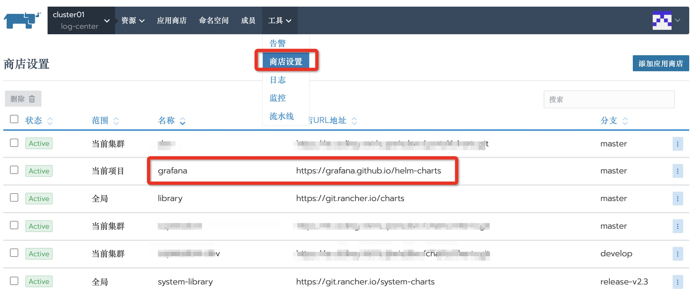
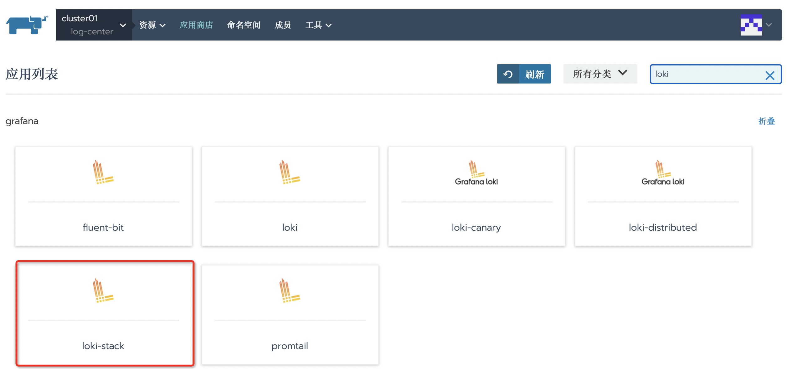
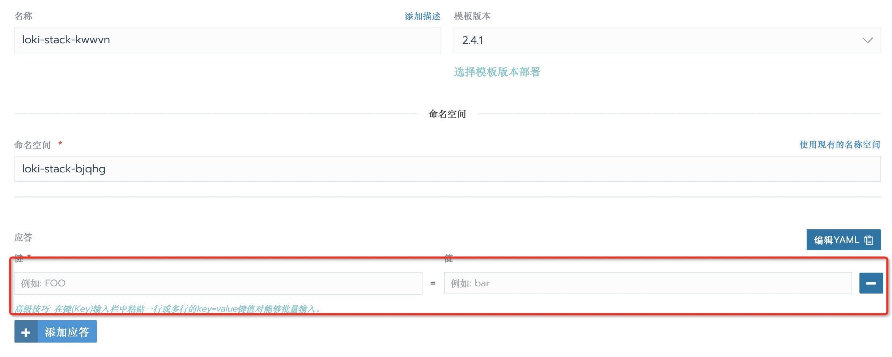
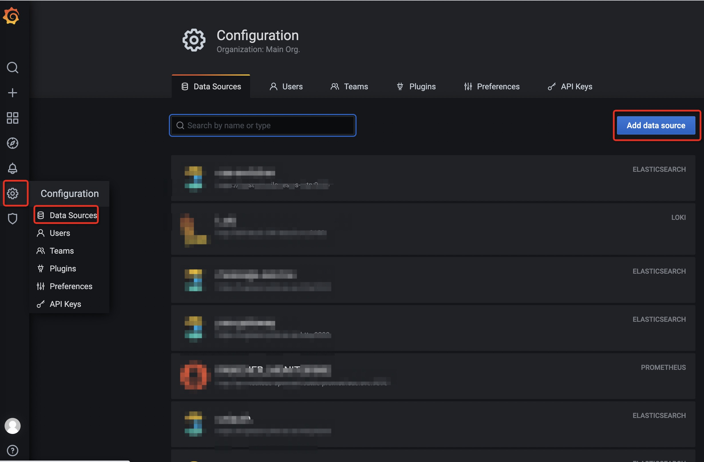
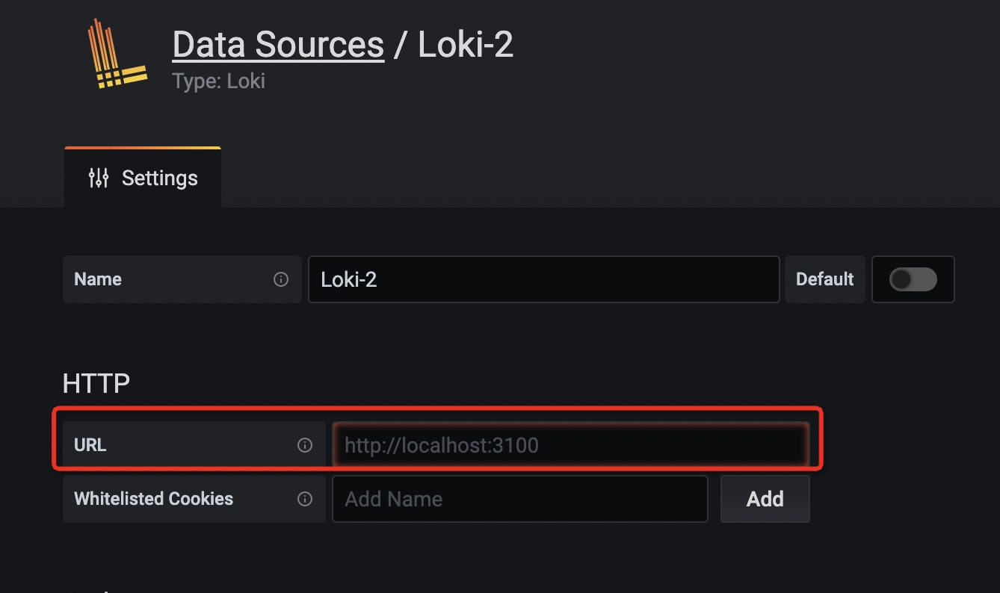
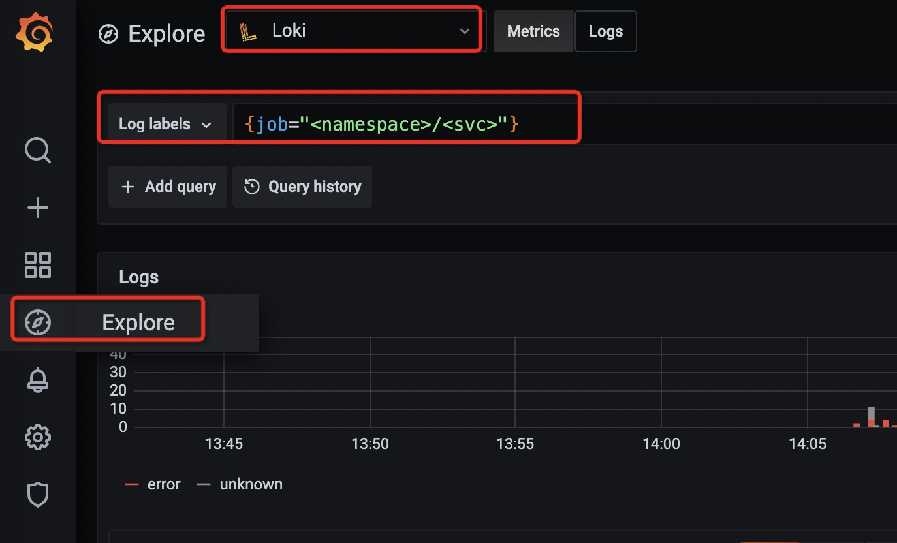

<!--more-->

## 步骤

在Rancher中添加Grafana应用商店：https://grafana.github.io/helm-charts

部署loki-stack

在应答中配置参数

下面是一个参数参考列表

| 参数                                 | 说明                        | 参考值            |
| ------------------------------------ | --------------------------- | ----------------- |
| grafana.enabled                      | 是否安装Grafana             | true              |
| grafana.ingress.enabled              | Grafana是否部署Ingress      | true              |
| grafana.ingress.hosts                | Grafana Ingress域名         | {grafana.xxx.com} |
| grafana.persistence.enabled          | Grafana是否启用持久卷       | true              |
| grafana.persistence.storageClassName | Grafana持久卷的StorageClass |                   |
| loki.persistence.enabled             | Loki是否启用持久卷          | true              |
| loki.persistence.size                | Loki持久卷的大小            | 5Gi               |
| loki.persistence.storageClassName    | Loki持久卷的StorageClass    |                   |
| prometheus.enabled                   | 是否安装Prometheus          | false             |
| prometheus.alertmanager.enabled      | 是否安装Alertmanager        | false             |

访问Grafana：访问 `grafana.ingress.hosts` 配置的值。使用`admin/admin`账号登录。

在Rancher的服务发现中找到loki的Service

Grafana中配置Loki数据源：

选择Loki数据源，配置Loki的地址为：`http://<loki-svc>:3100`

搜索日志（要学习[LogQL][2]）：

## 参考文档

* [Helm安装Grafana Loki](https://grafana.com/docs/loki/latest/installation/helm/)
* [LogQL][2]

[2]: https://grafana.com/docs/loki/latest/logql/

