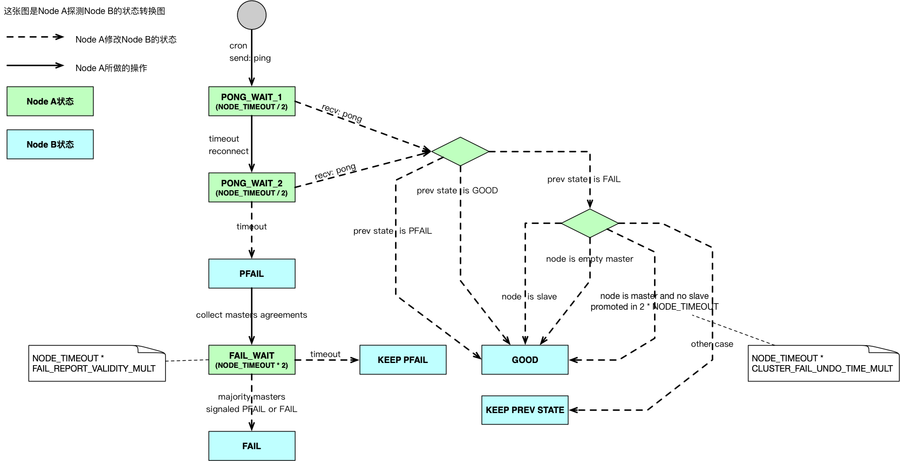

本笔记是对[Redis Cluster Spec - Failure Detection][redis-cluster-spec-fail-det]的归纳总结

<!--more-->

## 状态转换图

- 每个Node在本地维护了一张其他Node的状态表，并根据Failure Detection算法更新这张表里的Node的状态
- 修改Node状态表里的Node的状态为GOOD（在文档中称之为Clear Flags）、PFAIL，不需要共识（大多数Master Node同意）。
- 修改Node状态表里的Node的状态为FAIL则需要共识，一旦设置成功要将这个消息传播给所有能连接的Node，其他Node收到这个信息后也要更新本地Node状态表，将对应Node的状态更新为FAIL。

下面是状态转换图，例举的是Node A观察Node B的例子：

## 少数派和多数派

多数派：拥有多数Master的一方，可含有Slave。

少数派：拥有少数Master的一方，可含有Slave。

### 少数派视角

少数派只会看到大多数Master处于PFAIL/FAIL状态，0-所有Slave处于PFAIL/FAIL状态。

### 多数派视角

多数派只会看到少数Master处于PFAIL/FAIL状态，0-所有Slave处于PFAIL/FAIL状态。

不会存在以下情况：多数派看到大多数Master处于FAIL状态，因为大多数Master处于FAIL就意味着活着的Master们变成了少数派，这就矛盾了。

## 一些自问自答

Q：为何少数派能够看到Master处于FAIL状态？不是说要大多数Master同意才能变成FAIL状态吗？
A：考虑这个情况，在Partition发生的前一秒某些Master被决定为FAIL，随即Partition发生，那么在少数派眼里这些Master依然是处于FAIL状态的。

Q：这里的每个Node是Slave还是Master呢？
A：随便，只要是Node就行。

Q：既然每个Master独占的负责Slots，那么少数派继续工作为啥不可以，反正各自管各自的。
A：因为在多数派方，这个Master有可能会被Slave顶替，如果允许少数派继续工作，那么就会形成两个Master，造成split brain

Q：少数派节点是如何知道自己应该停止工作的？
A：它发现大多数Master变成了PFAIL / FAIL 状态时，就知道自己不能工作了，[Redis源码里是这么写的][src-1]。

Q：多数派节点时如何知道自己应该停止工作的？
A：如果这个Cluster要求所有Slots被覆盖，那么当有一个Master处于FAIL状态时，便停止工作，见[源码][src-2]。如果不要求，则继续工作，只不过部分Slots的操作会报错。

[redis-cluster-spec-fail-det]: https://redis.io/topics/cluster-spec#failure-detection
[src-1]: https://github.com/antirez/redis/blob/fc0c9c8097/src/cluster.c#L3786-L3813
[src-2]: https://github.com/antirez/redis/blob/fc0c9c8097/src/cluster.c#L3770-L3779