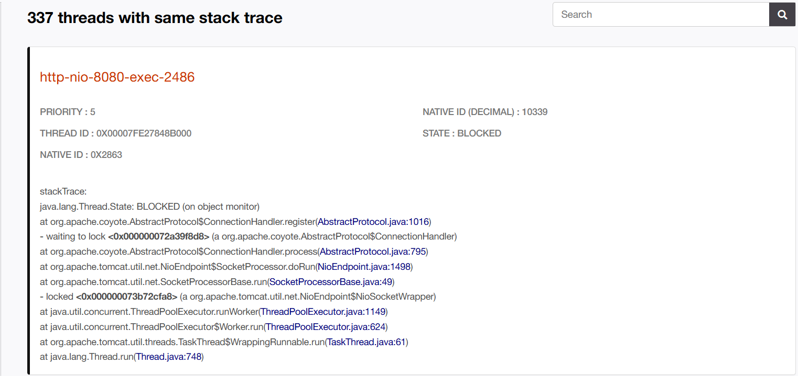
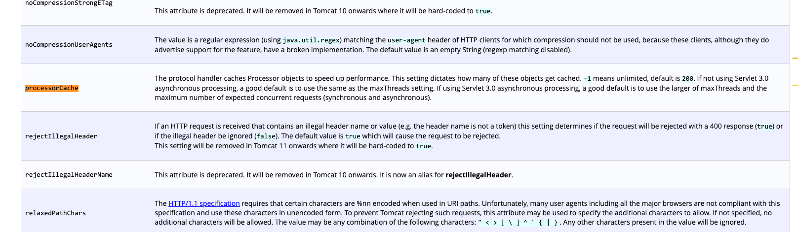
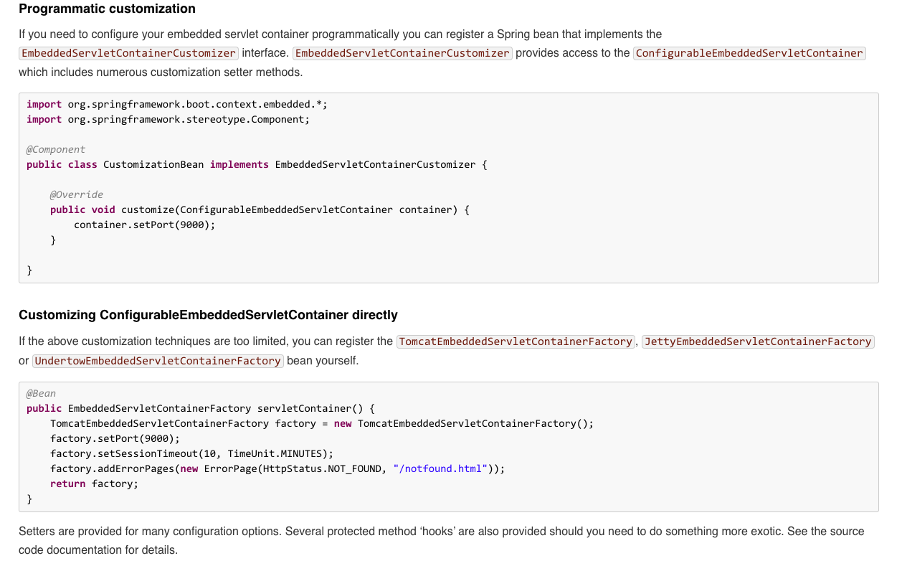
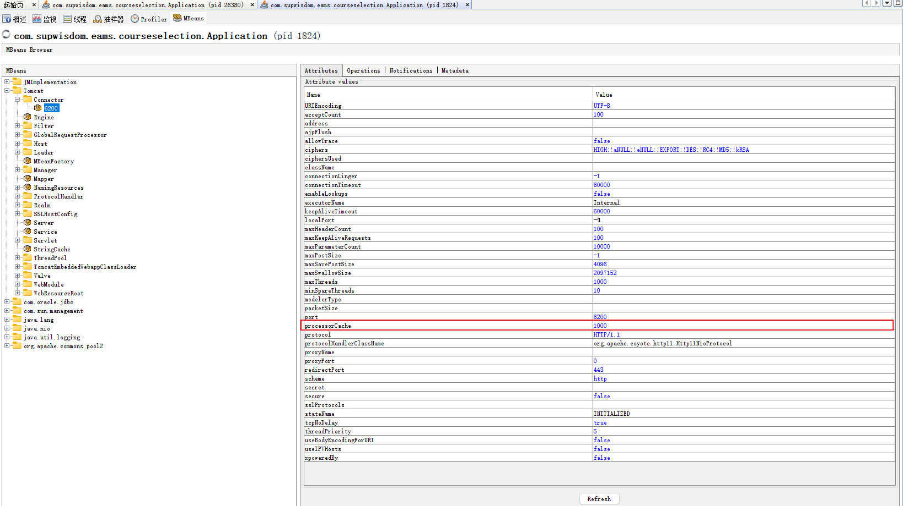

<!--more-->

## 现象

分析 jstack 堆栈时，发现相当多线程阻塞在此处：



查看源码发现 Tomcat 彼时在创建 Processor。

## 分析

创建 Processor 是很正常的逻辑，但发生大量线程 BLOCK 在这个位置，说明 Tomcat 在处理请求时，在频繁的创建 Processor，也就是说明 Processor 数量不够。

根据 [Tomcat 文档][1] ，processorCache至少应该等于 maxThreads，而项目上 maxThreads=1000，processorCache 没有设置，即默认值为 200。




## 解决

项目是 SpringBoot 项目，processorCache 没有办法通过 application.properties 来配置，但是可以通过 EmbeddedServletContainerCustomizer 来配置，[文档见此][2]：



所以提供这段代码：

```java
import org.springframework.boot.context.embedded.ConfigurableEmbeddedServletContainer;
import org.springframework.boot.context.embedded.EmbeddedServletContainerCustomizer;
import org.springframework.boot.context.embedded.tomcat.TomcatEmbeddedServletContainerFactory;
import org.springframework.stereotype.Component;

@Component
public class TomcatCustomizationBean implements EmbeddedServletContainerCustomizer {

  @Override
  public void customize(ConfigurableEmbeddedServletContainer container) {

    if (TomcatEmbeddedServletContainerFactory.class.equals(container.getClass())) {
      TomcatEmbeddedServletContainerFactory tomcatContainer = (TomcatEmbeddedServletContainerFactory) container;
      tomcatContainer.addConnectorCustomizers(connector -> connector.setProperty("processorCache", "1000"));
    }
  }
}
```

## 验证

可通过 jvisualvm 查看 Tomcat 的 MBean 看到此参数设置正确。



[1]: https://tomcat.apache.org/tomcat-8.5-doc/config/http.html
[2]: https://docs.spring.io/spring-boot/docs/1.5.14.RELEASE/reference/htmlsingle/#boot-features-programmatic-embedded-container-customization