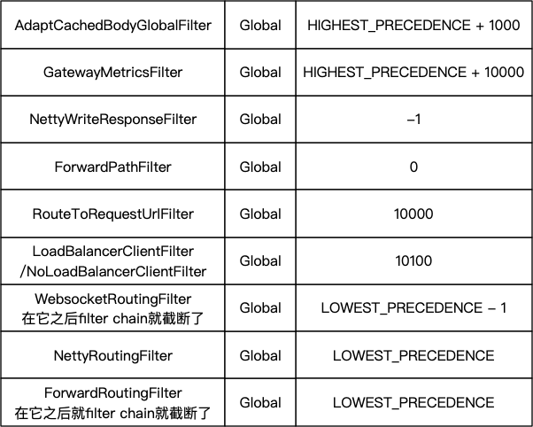
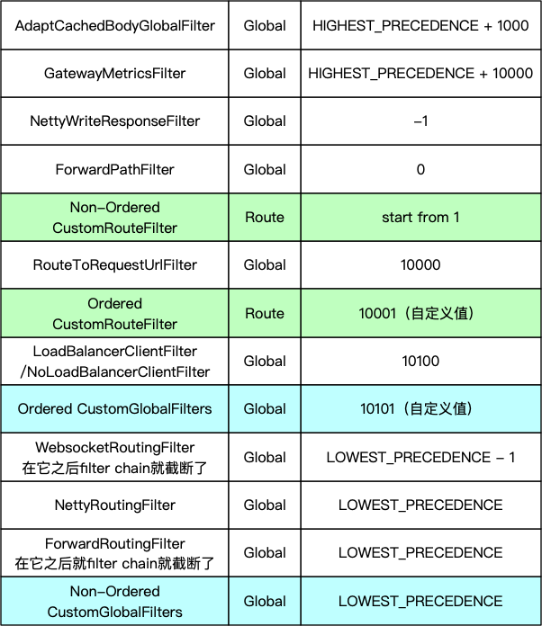
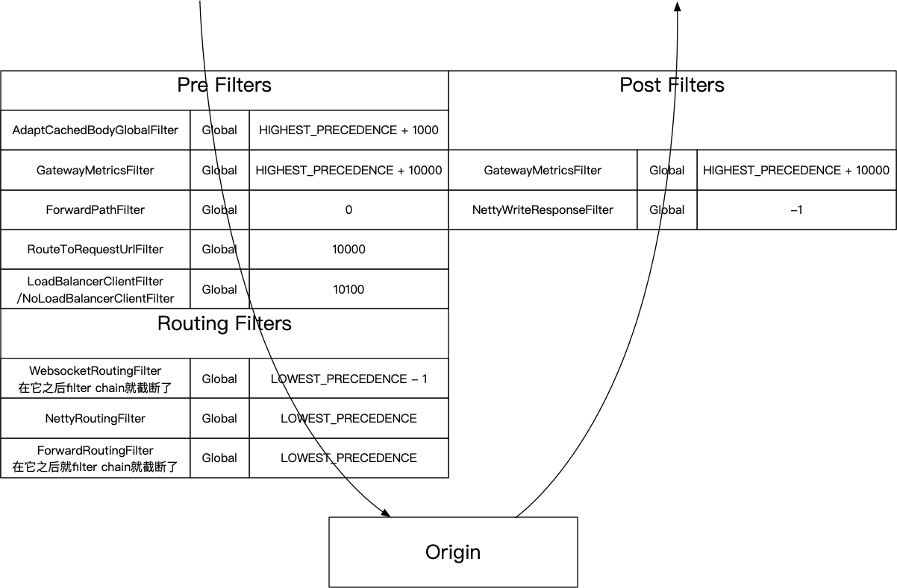

<!--more-->

本文基于Spring Cloud Gateway 2.1.1.RELEASE。

在讲SCG的Filter的排序问题之前得先比较一下Spring Cloud Gateway在对待Filter的方面与Zuul2有着哪些不同。

## Filter的Scope

* SCG采用的是Global Filter和Route Filter相结合的方式
* Zuul2则都是Global Filter

SCG所谓Route Filter就是像下面这样的：

```yaml
spring:
  cloud:
    gateway:
      routes:
        - id: tomcat_route
          uri: http://tomcat:8080
          predicates:
            - Path=/tomcat/docs
          filters:
            - StripPrefix=1
            - RemoveRequestHeader=X-Request-Foo
```

上面的`StripPrefix`和`RemoveRequestHeader`就是Route Filter，而SCG的Global Filter则是隐式的，无需显式配置，它们会在请求过来的时候被SCG调用。

也就是说你可以配置不同的Route，然后为每个Route配置不同的Route Filter，这一切都是在配置阶段就决定下来的。

而Zuul2则都是Global Filter，因此你得运行时在每个Filter内部自己决定是否要干活，除此之外，发送到Origin（被代理的服务）的url也得你自己设置，下面是一个例子（来自[Zuul2 Sample][zuul2-sample]）：

```java
public class Routes extends HttpInboundSyncFilter {
  @Override
  public boolean shouldFilter(HttpRequestMessage httpRequestMessage) {
    // ...
    return true;
  }
  @Override
  public HttpRequestMessage apply(HttpRequestMessage request) {
    // ...
    // Route healthchecks to the healthcheck endpoint.;
    context.setEndpoint(ZuulEndPointRunner.PROXY_ENDPOINT_FILTER_NAME);
    context.setRouteVIP("tomcat");

    return request;
  }
}
```

## Filter的角色

* 在SCG概念中只有一种Filter（撇开Global和Route的区别），它用代码来区分Pre Filter、Post Filter。在文档中还提到了Routing Filter，其实也是Pre Filter。
* Zuul2在代码中显示得提供了InboundFilter（负责进来的请求）、OutboundFilter（负责出去的响应）、ProxyEndpoint（负责请求到Origin，串起Inbound和Outbound）。

下面是SCG的Pre Filter（裁剪自官方例子[12.2 Writing Custom GatewayFilter Factories][scg-custom-filters]）：

```java
public class PreGatewayFilterFactory extends AbstractGatewayFilterFactory {
	@Override
	public GatewayFilter apply(Config config) {
		return (exchange, chain) -> {
            // business logic
            return chain.filter();
		};
	}
}
```

Post Filter的例子：

```java
public class PostGatewayFilterFactory extends AbstractGatewayFilterFactory {
	@Override
	public GatewayFilter apply(Config config) {
		return (exchange, chain) -> {
			return chain.filter(exchange).then(/* business logic */);
		};
	}
}
```

在Zuul2里，你则得分别实现`HttpInboundSyncFilter`和`HttpOutboundSyncFilter`，`ProxyEndpoint`不需要你自己实现。

## SCG Filter的问题

SCG的优点很明显，它做了Zuul2不做的事情：

1. 替你决定进来的请求转发到哪个Origin。在Zuul2里这个交给你自己来实现。
1. 在配置上就决定了这个Route会应用哪些Filter。在Zuul2里这个交给你自己来判断。

但是随着对SCG的深入了解，发现了关于Filter的执行顺序存在一些坑，如果不了解清楚会容易出错。

### Filter的排序

前面讲了，SCG在执行过程中Global Filter和Route Filter是一起执行的，那么它们的order是怎样的？

先来看看Global Filter，你可以访问`/actuator/gateway/globalfilters`（见[文档][scg-doc-1]）得到Global Filter的排序：



那么如果你写了一个自定义 Global Filter，那么它的order是什么呢？这个要看情况：

* 如果你的自定义Global Filter实现了`Ordered`接口或者写了`@Order`注解，那么它的order就是它自己设定的值
* 否则，它就没有order

关于这点可以看[FilteringWebHandler.java的源代码][scg-code-1]。

再来看看Route Filter，这也分两种情况：

* 如果RouteFilter实现了`Ordered`接口或者写了`@Order`注解，那么它的order就是它自己设定的值。
* 否则，它的order则是从1开始，按照Route中定义的顺序依次排序。

关于这点可以看[RouteDefinitionRouteLocator.java的源代码][scg-code-2]。

最后SCG把它们两个结合起来，做一个排序，对于没有order的Filter，它的order则默认为`Ordered.LOWEST_PRECEDENCE`。关于这点可以看[FilteringWebHandler.java的源代码][scg-code-3]。

用一张图做总结：



### Filter的执行顺序

先看SCG文档[3. How It Works][scg-doc-3]中的这张图：


这张图大概告诉你了SCG的调用过程，可以看到经过了一堆Filters，但是并没有告诉你Filter的执行顺序。然后在SCG的[6.1 Combined Global Filter and GatewayFilter Ordering][scg-doc-2]提到了：

> As Spring Cloud Gateway distinguishes between "pre" and "post" phases for filter logic execution (see: How It Works), the filter with the highest precedence will be the first in the "pre"-phase and the last in the "post"-phase.

也就是说意思如果这个Filter是Pre Filter，那么执行顺序和排序顺序相同，如果这个Filter是Post Filter则执行顺序和排序顺序相反。我整理了一下SCG自带GlobalFilter的执行顺序：

 

可以看到GatewayMetricsFilter既是Pre Filter也是Post Filter。

## 总结

* 执行某个Route的时候，SCG会将Global Filter和Route Filter结合起来并排序：
  * 没有给order的Global Filter则保持order为null去排序
  * 没有给order的Route Filter的order则从1开始，根据Route中定义的顺序给值
  * 排序逻辑见[AnnotationAwareOrderComparator][spring-AnnotationAwareOrderComparator]
* 对于Pre Filter，执行顺序同排序顺序
* 对于Post Filter，执行顺序与排序顺序相反
* 如果你要自定义Global Filter，那么一般来说：
  * 自定义的Global Pre Filter要在Routing Filter之前执行
  * 自定义的Global Post Filter要在Routing Filter之后执行或者NettyWriteResponseFilter之后执行
* 如果你要自定义Route Filter，那么一般来说：
  * 自定义Route Pre Filter要在`ForwardPathFilter`和`RouteToRequestUrlFilter`之间，而且不需要实现`Ordered`接口或添加`@Order`注解
  * 自定义的Route Post Filter比较少见，放在Routing Filter或者NettyWriteResponseFilter之后执行


[scg-custom-filters]: https://cloud.spring.io/spring-cloud-static/spring-cloud-gateway/2.1.1.RELEASE/single/spring-cloud-gateway.html#_writing_custom_gatewayfilter_factories
[scg-doc-1]: https://cloud.spring.io/spring-cloud-static/spring-cloud-gateway/2.1.1.RELEASE/single/spring-cloud-gateway.html#_global_filters_2
[scg-code-1]: https://github.com/spring-cloud/spring-cloud-gateway/blob/v2.1.1.RELEASE/spring-cloud-gateway-core/src/main/java/org/springframework/cloud/gateway/handler/FilteringWebHandler.java#L58-L67
[scg-code-2]: https://github.com/spring-cloud/spring-cloud-gateway/blob/v2.1.1.RELEASE/spring-cloud-gateway-core/src/main/java/org/springframework/cloud/gateway/route/RouteDefinitionRouteLocator.java#L183-L192
[scg-code-3]: https://github.com/spring-cloud/spring-cloud-gateway/blob/v2.1.1.RELEASE/spring-cloud-gateway-core/src/main/java/org/springframework/cloud/gateway/handler/FilteringWebHandler.java#L75-L82
[scg-doc-2]: https://cloud.spring.io/spring-cloud-static/spring-cloud-gateway/2.1.1.RELEASE/single/spring-cloud-gateway.html#_combined_global_filter_and_gatewayfilter_ordering
[scg-doc-3]: https://cloud.spring.io/spring-cloud-static/spring-cloud-gateway/2.1.1.RELEASE/single/spring-cloud-gateway.html#gateway-how-it-works
[zuul2-sample]: https://github.com/Netflix/zuul/tree/2.1/zuul-sample
[spring-AnnotationAwareOrderComparator]: https://docs.spring.io/spring/docs/5.1.6.RELEASE/javadoc-api/org/springframework/core/annotation/AnnotationAwareOrderComparator.html
[spring-OrderComparator]: https://docs.spring.io/spring/docs/5.1.6.RELEASE/javadoc-api/org/springframework/core/OrderComparator.html

