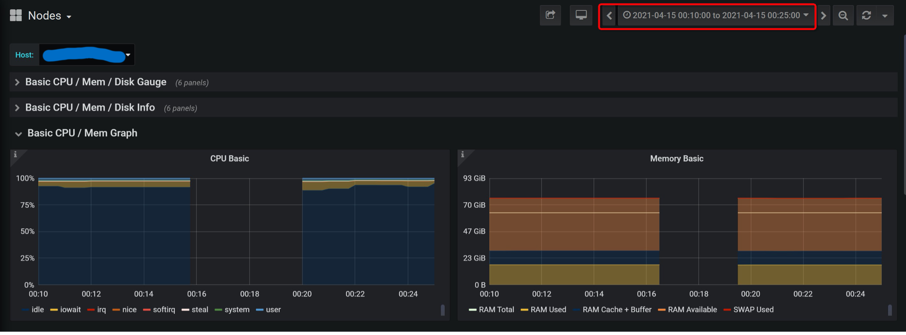

<!--more-->

## 现象

在公司自己研发的网关上观察到在每天的某段时间内API调用失败量剧增，之后又缓慢恢复的情况。

## 观察网关日志

查阅日志发现，在同一时间段内，发生与redis通信失败的错误：

```bash
dail tcp xxx.xxx.xxx.xxx:6379: i/o timeout
```

## 观察Redis日志

在这段时间内Redis没有错误日志。且Redis没有重启过。

## 观察K8S节点情况

在Rancher的监控管理里，观察Redis所在节点的情况：



发现在这个时间段内的指标信息都缺失了。再查看其他节点的监控，同样的情况。

因此怀疑，在这段时间内整个K8S集群遇到了网络故障。

## 结果

因为这个情况每天都会有，于是与客户沟通，得到的反馈是每天这个时间段在对虚拟化平台的所有虚拟机做磁盘快照，让客户修改了快照策略后，问题消除。